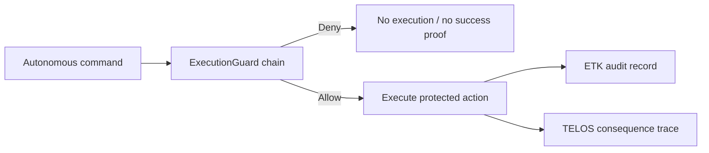

# Annexure - 2

Preferably on Company's letterhead (if available)

# 1. Proposed Technical Solution (Detailed)

## Technical Architecture & Approach

NEXUS Guard wraps protected autonomous actions in a mandatory execution request. The request carries identity, action type, policy context, mission metadata, and consequence class. The ExecutionGuard chain evaluates the request before execution. If any guard denies, execution stops. If all guards allow, the runtime executes the action and emits ETK-compatible audit evidence.

## Official Problem Alignment and Scope Boundary

This proposal maps to ADITI 4 autonomy problem areas and DISC 14 autonomy/UAS problem areas where autonomous software can invoke protected command paths. It is intentionally separate from the existing ADITI PS24 space-domain submission. The technical scope here is the execution-governance layer: guard checks, denial behavior, consequence accounting, and audit evidence.

Core components:

| Component | Role |
| --- | --- |
| Command adapter | Converts agent, robot, or mission commands into guarded requests |
| ExecutionGuard chain | Applies first-deny-wins authorization and safety policy |
| TELOS consequence gate | Tracks bounded autonomy and high-impact action budgets |
| ETK audit exporter | Records allowed execution evidence |
| PQC identity/audit profile | Uses `nexus-pcu` hybrid Ed25519 plus ML-DSA path for selected identity/audit records |
| Denial path | Blocks unauthorized commands and avoids success proof/cache generation |

## Innovation

The innovation is pre-execution governance rather than post-event logging. NEXUS Guard combines first-deny-wins guard semantics, consequence budgeting, and audit evidence into one execution kernel. The denied path is intentionally separated from the successful proof path, reducing ambiguity during review.

## Implementation & Feasibility

The implementation will package existing Rust execution-guard code into a defence prototype with policy profiles, command adapters, and reviewer-visible red-team tests. The current code has red-team denial tests. The iDEX work will add scenario templates, PQC-enabled identity/audit signing, latency characterization, evidence export, CI validation, and integration hardening.

## Challenges & Mitigation

| Challenge | Mitigation |
| --- | --- |
| Guard bypass through direct integration | Freeze protected interfaces and require protected actions to enter through the guard path |
| Added latency | Measure latency by policy class and provide mission-specific profiles |
| Policy ambiguity | Provide explicit policy templates and reason codes |
| Readiness overclaim | State current TRL 3-4; claim TRL 5 only after relevant-environment and PQC verification evidence is complete |

## Visuals & Supporting Data

## Any Other Relevant Details

Primary evidence is in `nexus-executor` red-team execution tests, `nexus-pcu` PQC tests, and the shared pre-submission test report. Current evidence is software-subsystem level; TRL 5 requires relevant-environment validation under the iDEX work.
