# IDEX OPEN CHALLENGE SUBMISSION

# Annexure-4

Supporting evidence and screenshots checklist

| CIN | PAN | TAN |
| --- | --- | --- |
| U62011AP2025PTC120239 | ABQCS7152R | VPNS31351F |

| Applicant Entity | Contact |
| --- | --- |
| Syntriass Labs Private Limited | kattanaga5555@gmail.com |
| 12-50, SLV Market, 12 Ward, Dharmavaram, Ananthapur - 515671, Andhra Pradesh, India | +91 88864 68060 |

# Supporting Evidence and Screenshots

## Company Identification Details

| Field | Details |
| --- | --- |
| Legal Entity Name | Syntriass Labs Private Limited |
| CIN | U62011AP2025PTC120239 |
| PAN | ABQCS7152R |
| TAN | VPNS31351F |
| Registered Office | 12-50, SLV Market, 12 Ward, Dharmavaram, Ananthapur - 515671, Andhra Pradesh, India |
| Contact Email | kattanaga5555@gmail.com |
| Contact Phone | +91 88864 68060 |
| GitHub Repository | https://github.com/richardrich999888-rgb/NEXUS |
| Submission Date | 17 May 2026 |

## 1. Applicant Resume Format

| Field | Details |
| --- | --- |
| Applicant | K. Naga Sri Ganesh |
| Role | Founder / Inventor |
| Company | Syntriass Labs Private Limited |
| Relevant Focus | Governed autonomy, execution control, autonomous systems security, cryptographic audit, defence proposal development |
| Current Project | NEXUS governed-autonomy stack |
| Problem 1 Product | NEXUS Guard: governed execution layer for unauthorized autonomous action prevention |

### Relevant Experience

- Development of NEXUS execution-control, governance, proof, audit, and safety components.
- Design of pre-execution guard interfaces for autonomous software systems.
- Preparation of defence-focused evidence packages for iDEX-style evaluation.
- Software prototype validation using Rust and Python test suites.

## 2. Prototype Evidence List

| Evidence Item | Current Status | Notes |
| --- | --- | --- |
| NEXUS Guard concept package | Prepared | Located under `docs/idex-open-challenge-2026/01-nexus-guard/`. |
| ExecutionGuard source path | Available | `nexus-executor/src/guard.rs`. |
| Composite guard source path | Available | `nexus-executor/src/guards/composite.rs`. |
| Executor source path | Available | `nexus-executor/src/executor.rs`. |
| Red-team execution test | Available | `cargo test -p nexus-executor --test red_team_execution -- --nocapture`. |
| Shared test report | Available | `docs/IDEX_PRE_SUBMISSION_TEST_REPORT.md`. |
| Defence capability audit | Available | `docs/DEFENCE_CAPABILITY_AUDIT.md`. |
| iDEX package evidence file | Available | `docs/idex-open-challenge-2026/01-nexus-guard/evidence.md`. |
| GitHub repository | Available | `https://github.com/richardrich999888-rgb/NEXUS`. |

## 2A. Official Problem Alignment Evidence

| Evidence Item | Reviewer Use | Location / Source |
| --- | --- | --- |
| Open Challenge fit | Confirms the proposal is submitted as a standalone applicant-defined prototype rather than a duplicate named problem statement response. | iDEX Open Challenge route; local package under `docs/idex-open-challenge-2026/01-nexus-guard/`. |
| ADITI 4 adjacency | Shows why autonomous-platform problem areas need execution authorization and auditability. | Alignment summarized in Annexure 1 and Annexure 2; PS24 boundary stated explicitly. |
| DISC 14 adjacency | Shows relevance to autonomy/UAS and multi-agent command paths where protected action calls need policy checks. | Alignment summarized in Annexure 1 and Annexure 2; technical evidence in `nexus-executor/`. |
| PS24 non-duplication | Helps reviewers separate this Open Challenge product from the already submitted ADITI PS24 space-domain application. | This package is scoped to governed execution control, not space-domain training, surveillance, or operations. |

## 3. Architecture Screenshots List

Screenshots generated for this Annexure from the local repository and current test output:

| Screenshot | Purpose |
| --- | --- |
| ExecutionGuard interface | Shows mandatory guard contract before protected execution. |
| Composite first-deny-wins flow | Shows that any guard denial blocks execution. |
| Red-team test output | Shows unauthorized execution denial tests. |
| ETK audit evidence flow diagram | Shows allowed execution evidence generation. |
| TELOS consequence-budget trace | Shows consequence accounting for high-impact actions. |
| NEXUS Guard dashboard mock/screen | Shows blocked actions, reason codes, and audit review. |

## 4. Demo Evidence List

| Demo Step | Evidence To Capture |
| --- | --- |
| Start NEXUS Guard demo runtime | Terminal output or dashboard screenshot showing runtime ready. |
| Submit unauthorized protected action | Request payload and policy context. |
| Show guard denial | Denial reason, guard name, and blocked execution status. |
| Verify no success proof/cache | Output showing no success artifact for denied path. |
| Submit authorized protected action | Request payload with valid authority and policy context. |
| Show allowed execution | Execution result and ETK-compatible audit record. |
| Show TELOS consequence update | Consequence tier and remaining budget trace. |
| Export evidence packet | Audit or replay file generated for evaluator review. |

## 5. Technical Validation Material

### Required Pre-Submission Test Command

```bash
cargo test -p nexus-executor --test red_team_execution -- --nocapture
```

### Recorded Pre-Submission Evidence

The shared test report records NEXUS execution red-team validation as passing at software-subsystem level. The command should be rerun immediately before portal upload and the latest output should be added to this Annexure as screenshot or terminal capture.

### Validation Scope

| Validation Area | Status |
| --- | --- |
| Unauthorized execution denial | Software test evidence available |
| No success proof/cache on denied path | Software test evidence available |
| Allowed execution audit evidence | Prototype evidence path available |
| TELOS consequence accounting | Supporting module evidence available |
| Hardware-in-loop validation | Proposed work, not claimed completed |
| Field deployment | Not claimed |

## 6. Future Deployment Scope

| Phase | Scope |
| --- | --- |
| Lab Evaluation | Run red-team denial demos against simulated autonomous actions and tool calls. |
| Integration Pilot | Wrap selected mission software, agent tool router, or robot command path with NEXUS Guard. |
| Edge / On-Premise Trial | Deploy local guard runtime, policy bundle, and audit store without external cloud dependency. |
| Hardware-in-Loop Validation | Connect to target robotic or cyber-physical testbed and measure latency, denial reliability, and evidence integrity. |
| Operational Hardening | Add service-specific policy packs, secure key custody, monitoring, and evaluator-approved deployment procedures. |

## 7. Readiness and Caveats

- Current readiness should be stated as software subsystem TRL 3-4.
- TRL 5 is an iDEX exit target, not a current claim.
- PQC hardening will use the `nexus-pcu` hybrid Ed25519 plus ML-DSA path for selected identity/audit records.
- No physical military hardware validation is claimed in the current package.
- No operational deployment claim is made.
- Human approval, command policy, and service-specific safety rules must be integrated before operational use.
- Latency, resilience, and hardware-in-loop testing are part of the proposed iDEX work.

## 8. Evidence Checklist Before Portal Upload

| Item | Status |
| --- | --- |
| Insert final contact and signatory details | Pending final review |
| Rerun red-team execution test | Pending final pre-upload run |
| Capture screenshots of source paths and test output | Pending |
| Export Annexure files to PDF under portal size limits | Pending |
| Add dashboard/demo screenshots if available | Pending |
| Conduct legal/export-control/security review | Pending |
| Confirm portal challenge title and category | Pending |

```{=typst}
#pagebreak()
```

## Evidence Page 5 - Evidence Register Overview

This Annexure is structured to mirror the AIRON evidence-packet format by reserving page-level slots for source evidence, test evidence, demo evidence, screenshots, validation plans, and readiness caveats.

Evidence categories:

- Source code screenshots.
- Test command screenshots.
- Terminal output screenshots.
- Runtime demo screenshots.
- Audit export screenshots.
- Deployment and API screenshots.
- Readiness and caveat statements.

Status: repository reference screenshot embedded; final portal pass should confirm the link is still accessible.

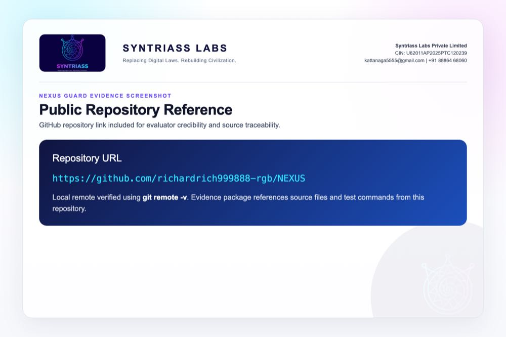

```{=typst}
#pagebreak()
```

## Evidence Page 6 - ExecutionGuard Interface

Evidence source: `nexus-executor/src/guard.rs`

Purpose: show the frozen guard contract used for pre-execution authorization.

Expected capture:

- `ExecutionGuard` trait.
- `check(&self, pcu: &PCU, ctx: &ExecutionContext)`.
- `GuardDecision` return path.
- File path visible in editor or terminal.

Status: source evidence available; screenshot embedded.

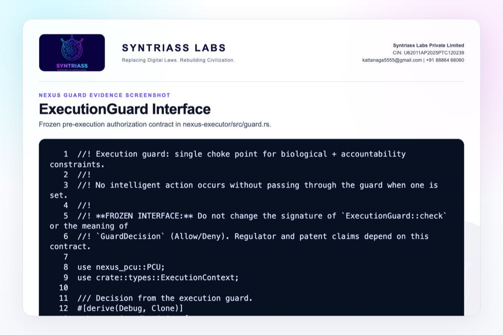

```{=typst}
#pagebreak()
```

## Evidence Page 7 - Composite First-Deny-Wins Guard

Evidence source: `nexus-executor/src/guards/composite.rs`

Purpose: show that layered guards block execution when any guard returns Deny.

Expected capture:

- Guard iteration.
- `GuardDecision::Allow` continuation.
- `GuardDecision::Deny(reason)` early return.
- File path visible.

Status: source evidence available; screenshot embedded.


```{=typst}
#pagebreak()
```

## Evidence Page 8 - Execution Engine Path

Evidence source: `nexus-executor/src/executor.rs`

Purpose: show where guarded execution connects to the execution engine.

Expected capture:

- Request intake.
- Guard check before execution.
- Execution or denial branch.
- Proof/cache behavior if visible in source.

Status: source evidence available; screenshot embedded.

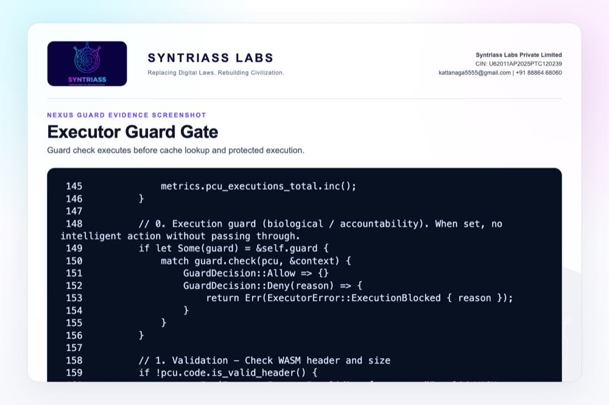

```{=typst}
#pagebreak()
```

## Evidence Page 9 - Red-Team Test File

Evidence source: `nexus-executor/tests/red_team_execution.rs`

Purpose: show that explicit bypass/denial-path tests exist.

Expected capture:

- Test names.
- Unauthorized execution cases.
- Denied path expectations.
- No proof/cache expectation if present.

Status: test source available; screenshot embedded.

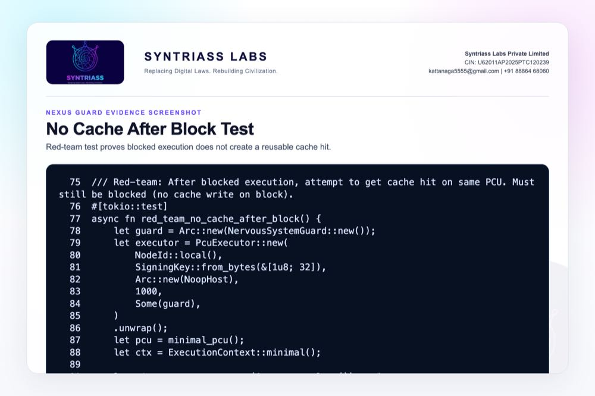

```{=typst}
#pagebreak()
```

## Evidence Page 10 - Red-Team Test Command

Required command before portal upload:

```bash
cargo test -p nexus-executor --test red_team_execution -- --nocapture
```

Expected capture:

- Command visible in terminal.
- Passing test count.
- Any denial-path diagnostic output.
- Timestamped terminal or saved log.

Current status: rerun completed on 17 May 2026; screenshot embedded below.

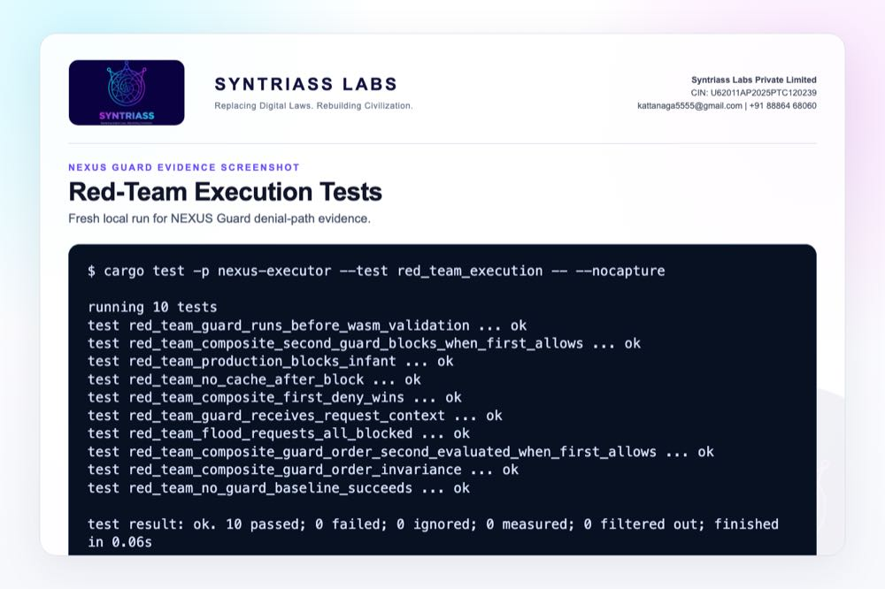

```{=typst}
#pagebreak()
```

## Evidence Page 11 - Red-Team Test Output

Screenshot to insert after rerun: terminal output from the red-team execution command.

Acceptance evidence:

- Tests pass.
- Unauthorized execution is denied.
- Denied path does not create a success proof.
- Denied path does not create a success cache artifact.

Status: rerun completed on 17 May 2026; screenshot embedded below.

Final rerun completed on 17 May 2026. Result: 10 passed, 0 failed.


```{=typst}
#pagebreak()
```

## Evidence Page 12 - ETK Audit Evidence Path

Purpose: show the offline audit verification path used by the Execution Truth Kernel (ETK).

Status: source evidence embedded. This page supports the claim that allowed execution evidence can be verified locally from proof, event, policy, and public-key artifacts.

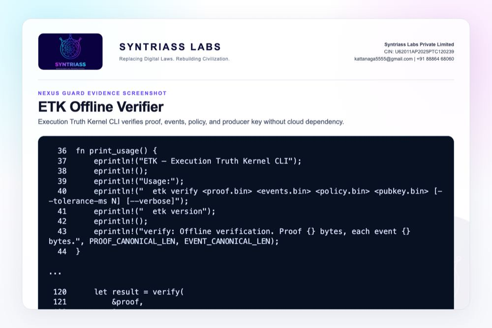

```{=typst}
#pagebreak()
```

## Evidence Page 13 - TELOS Consequence Accounting

Purpose: show the consequence-tier and entropy-budget mechanism proposed for high-impact action friction.

Status: source evidence embedded. The evidence is software-level only; operational tuning and hardware validation remain proposed iDEX work.

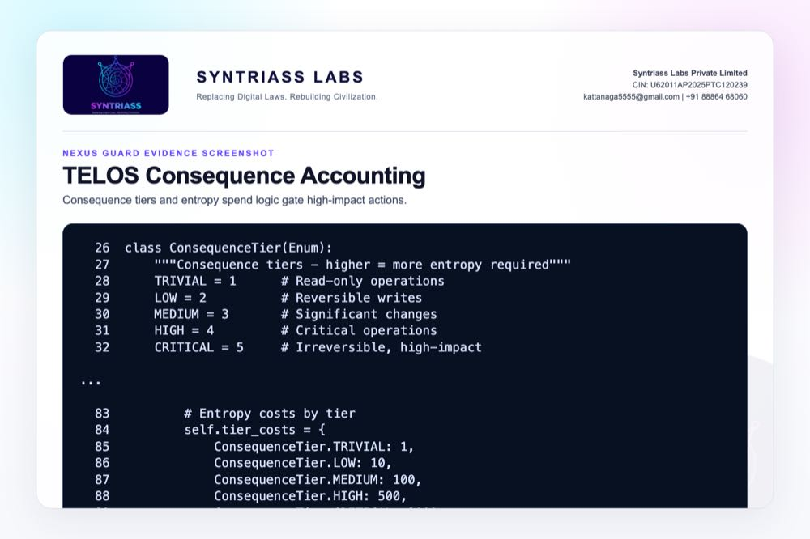

```{=typst}
#pagebreak()
```

## Evidence Page 14 - Guarded Request Schema

Purpose: show the execution context available to the guard decision: inputs, identity, resource limits, request ID, and risk metadata.

Status: source evidence embedded.


```{=typst}
#pagebreak()
```

## Evidence Page 15 - Denial Reason Codes

Purpose: show that denial, identity failure, proof failure, and cache failure are typed program outcomes rather than silent failures.

Status: source evidence embedded.


```{=typst}
#pagebreak()
```

## Evidence Page 16 - No Success Proof On Deny

Purpose: show that blocked execution returns an error path instead of a successful execution response/proof path.

Status: integration-test evidence embedded.

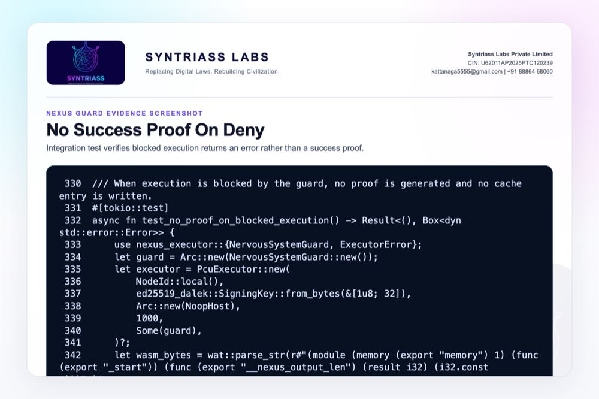

```{=typst}
#pagebreak()
```

## Evidence Page 17 - No Cache Artifact On Deny

Purpose: show that a denied request does not create a cache artifact that could later be served as a successful result.

Status: red-team test evidence embedded.


```{=typst}
#pagebreak()
```

## Evidence Page 18 - Allowed Execution Audit Record

Purpose: show the contrast between denied and allowed paths: only the successful branch generates a proof, writes cache, and returns `ExecutionResponse`.

Status: source evidence embedded.

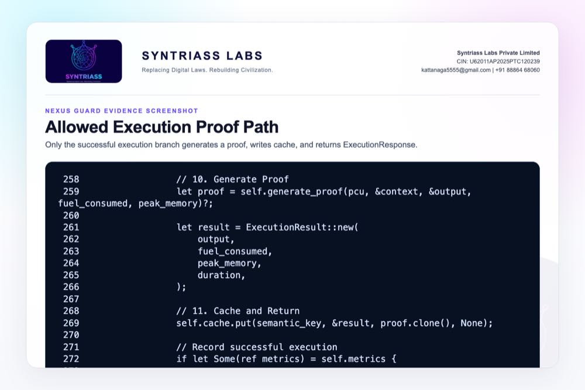

```{=typst}
#pagebreak()
```

## Evidence Page 19 - Unauthorized Action Demo

Purpose: show repeated unauthorized execution attempts remain blocked under the guard.

Status: red-team source evidence embedded; terminal output for the full test run is included on Evidence Page 10.


```{=typst}
#pagebreak()
```

## Evidence Page 20 - Authorized Action Demo

Purpose: show baseline execution with a signed identity when no guard constraint is installed, and clarify why production must use the guarded builder.

Status: red-team baseline evidence embedded. This page is a control case, not a claim that unguarded operation is acceptable for deployment.

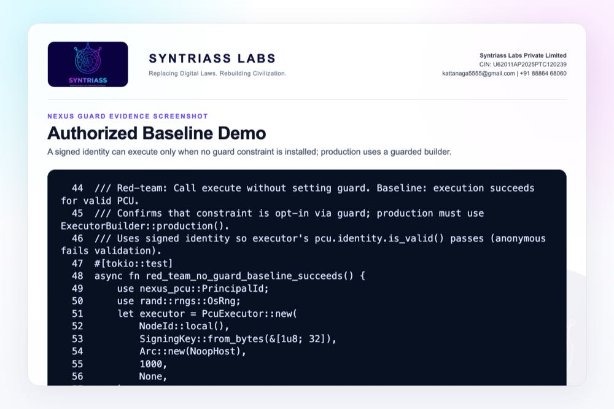

```{=typst}
#pagebreak()
```

## Evidence Page 21 - Replay Attempt Demo

Purpose: show current adversarial replay/cache behavior coverage and document the remaining work for nonce-level replay rejection.

Status: adversarial source evidence embedded; nonce replay hardening remains part of the iDEX prototype plan.


```{=typst}
#pagebreak()
```

## Evidence Page 22 - Policy Bypass Demo

Purpose: show that malformed or adversarial execution payloads cannot bypass the guard by failing later validation.

Status: red-team source evidence embedded.


```{=typst}
#pagebreak()
```

## Evidence Page 23 - Consequence Budget Demo

Purpose: show the concrete `spend()` path used for consequence-aware budget gating.

Status: source evidence embedded; mission-specific consequence thresholds are proposed for iDEX prototype calibration.


```{=typst}
#pagebreak()
```

## Evidence Page 24 - Console Summary View

Purpose: provide an evaluator-facing summary card of the current software evidence state.

Status: generated from current repository/test evidence. A full web dashboard is not claimed in this phase.

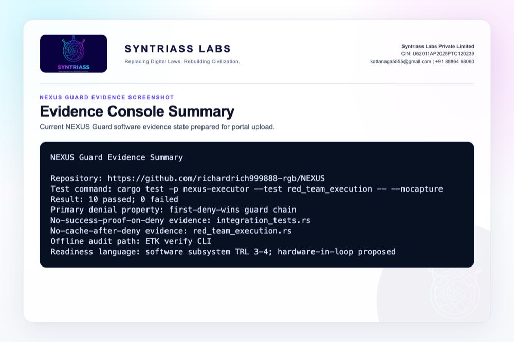

```{=typst}
#pagebreak()
```

## Evidence Page 25 - Audit Export File

Purpose: show the execution proof schema for allowed executions: PCU hash, input hashes, output hash, identity hash, executor node, timestamp, resource use, and attestation.

Status: source evidence embedded.

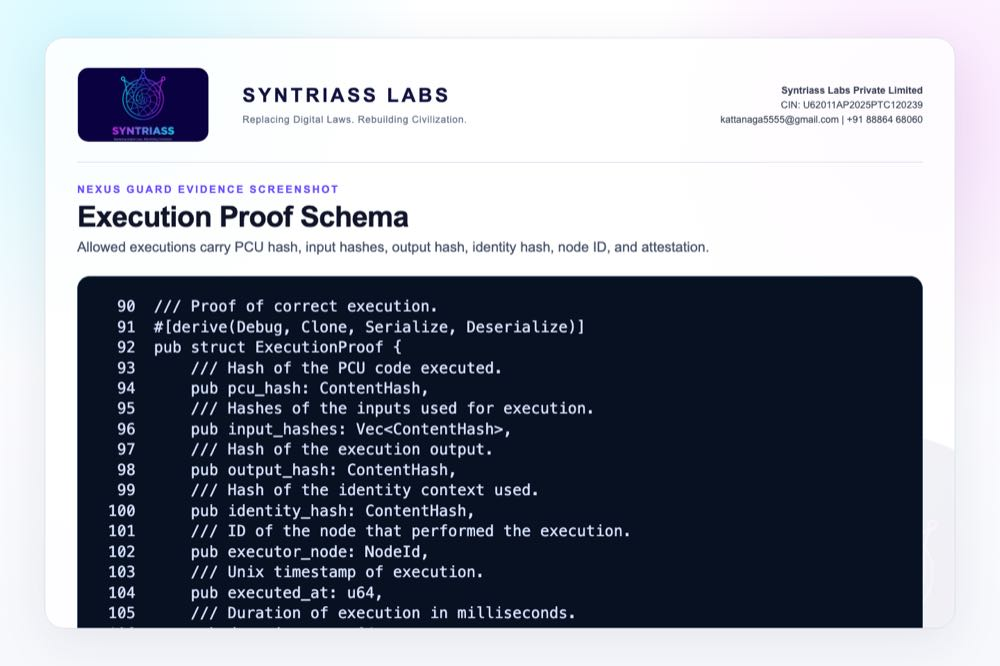

```{=typst}
#pagebreak()
```

## Evidence Page 26 - Offline Review Workflow

Purpose: show that review can be performed locally using ETK CLI artifacts and regulator-grade build checks.

Status: documentation evidence embedded.


```{=typst}
#pagebreak()
```

## Evidence Page 27 - Deployment Artifact

Purpose: show the executor deployment profile and hardware-attestation feature flags.

Status: source evidence embedded. SGX/SEV/TrustZone use remains a prototype integration step, not a field-validated claim.

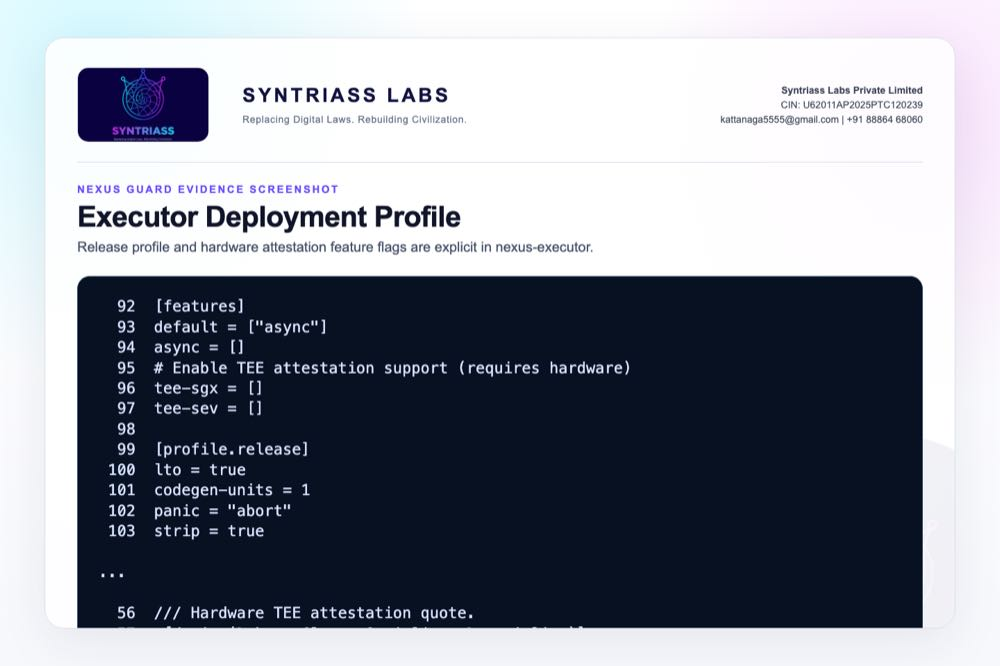

```{=typst}
#pagebreak()
```

## Evidence Page 28 - API Contract

Purpose: show the code-level integration contract exported to applications and robotics/simulation adapters.

Status: source evidence embedded.

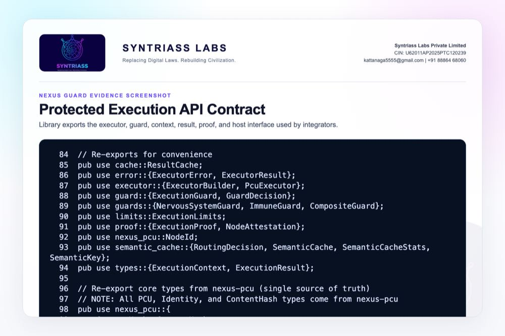

```{=typst}
#pagebreak()
```

## Evidence Page 29 - Reviewer Repository Map

Public repository:

- `https://github.com/richardrich999888-rgb/NEXUS`

Primary proposal package location inside the repository:

- `docs/idex-open-challenge-2026/01-nexus-guard/final_4_documents/`

Primary source modules for this application:

- `nexus-executor/src/guard.rs` - frozen pre-execution guard interface.
- `nexus-executor/src/guards/composite.rs` - first-deny-wins guard composition.
- `nexus-executor/src/executor.rs` - guard-before-cache-before-execution path.
- `nexus-executor/src/types.rs` - guarded request context and execution response types.
- `nexus-executor/src/error.rs` - typed denial, proof, identity, and cache errors.
- `nexus-executor/src/proof.rs` - execution proof and node attestation schema.

How to review quickly:

1. Open the GitHub repository.
2. Navigate to the file paths above.
3. Compare the code with Evidence Pages 6-28.
4. Run the test command on Evidence Page 10.

```{=typst}
#pagebreak()
```

## Evidence Page 30 - Claim To File Location Map

This page maps the main NEXUS Guard claims to exact repository evidence.

| Claim | Repository location | Evidence page |
|---|---|---|
| Guard interface exists | `nexus-executor/src/guard.rs` | Page 6 |
| First-deny-wins is implemented | `nexus-executor/src/guards/composite.rs` | Page 7 |
| Guard runs before cache/execution | `nexus-executor/src/executor.rs` | Page 8 |
| Red-team denial tests exist | `nexus-executor/tests/red_team_execution.rs` | Pages 9-11 |
| No cache after deny | `nexus-executor/tests/red_team_execution.rs` | Page 17 |
| No success proof on deny | `nexus-executor/tests/integration_tests.rs` | Page 16 |
| Allowed path creates proof/cache | `nexus-executor/src/executor.rs` | Page 18 |
| ETK offline review path exists | `etk/crates/etk-cli/src/main.rs`, `etk/README.md` | Pages 12, 26 |
| TELOS consequence budget exists | `agp-core/src/telos/membrane.py` | Pages 13, 23 |
| Proof schema exists | `nexus-executor/src/proof.rs` | Page 25 |

Reviewer note: these are software-subsystem evidence locations, not field deployment evidence.

```{=typst}
#pagebreak()
```

## Evidence Page 31 - Test And Command Locations

Primary executed test command:

```bash
cargo test -p nexus-executor --test red_team_execution -- --nocapture
```

Test file locations:

- `nexus-executor/tests/red_team_execution.rs`
- `nexus-executor/tests/integration_tests.rs`
- `nexus-executor/tests/adversarial.rs`

Recorded output artifact:

- `docs/idex-open-challenge-2026/01-nexus-guard/final_4_documents/evidence_assets/nexus_guard_red_team_test_output.txt`

Current recorded result:

- `10 passed; 0 failed`
- Fresh local run date: `17 May 2026`

Additional relevant test commands for later iDEX prototype stages:

- `cargo test -p nexus-executor --test integration_tests`
- `cargo test -p nexus-executor --test adversarial`
- `cargo test -p telos-protocol`

```{=typst}
#pagebreak()
```

## Evidence Page 32 - Generated Artifact Locations

Final PDF artifacts:

- `docs/idex-open-challenge-2026/01-nexus-guard/final_4_documents/01_SYNTRIASS_NEXUS_Guard_Annexure_1_Applicant_Details_and_Solution_Summary.pdf`
- `docs/idex-open-challenge-2026/01-nexus-guard/final_4_documents/02_SYNTRIASS_NEXUS_Guard_Annexure_2_Technical_Architecture.pdf`
- `docs/idex-open-challenge-2026/01-nexus-guard/final_4_documents/03_SYNTRIASS_NEXUS_Guard_Annexure_3_Advantages_and_Competencies.pdf`
- `docs/idex-open-challenge-2026/01-nexus-guard/final_4_documents/04_SYNTRIASS_NEXUS_Guard_Annexure_4_Supporting_Evidence_and_Screenshots.pdf`

Word artifacts:

- Same directory as above, with `.docx` extension.

Evidence screenshot folder:

- `docs/idex-open-challenge-2026/01-nexus-guard/final_4_documents/evidence_assets/`

Build scripts:

- `docs/idex-open-challenge-2026/01-nexus-guard/final_4_documents/generate_nexus_guard_evidence_screenshots.mjs`
- `docs/idex-open-challenge-2026/01-nexus-guard/final_4_documents/build_syntriass_letterhead_problem1.mjs`

File-size status:

- Annexure 4 PDF: under 5 MB after compressed evidence embedding.

```{=typst}
#pagebreak()
```

## Evidence Page 33 - Screenshot Artifact Index

Screenshot artifacts embedded in this Annexure:

- `evidence_assets/01_github_repository.jpg` - public repository link.
- `evidence_assets/02_red_team_test_output.jpg` - red-team test output.
- `evidence_assets/03_execution_guard_interface.jpg` - guard trait.
- `evidence_assets/04_composite_first_deny_wins.jpg` - composite deny path.
- `evidence_assets/05_executor_guard_gate.jpg` - executor guard gate.
- `evidence_assets/06_no_cache_after_block_test.jpg` - no cache after block.
- `evidence_assets/07_etk_offline_verifier.jpg` - ETK CLI verifier.
- `evidence_assets/08_telos_entropy_accounting.jpg` - consequence tiers.
- `evidence_assets/09_guarded_request_schema.jpg` - request context.
- `evidence_assets/10_denial_reason_codes.jpg` - typed errors.
- `evidence_assets/11_no_success_proof_on_deny.jpg` - no proof on denied path.
- `evidence_assets/12_no_cache_artifact_on_deny.jpg` - denied path cache check.
- `evidence_assets/13_allowed_execution_audit_record.jpg` - allowed proof/cache branch.
- `evidence_assets/14_unauthorized_action_demo.jpg` - unauthorized flood denial.
- `evidence_assets/15_authorized_action_demo.jpg` - baseline signed execution.
- `evidence_assets/16_replay_attempt_demo.jpg` - replay/cache behavior.
- `evidence_assets/17_policy_bypass_demo.jpg` - malformed WASM bypass denial.
- `evidence_assets/18_consequence_budget_demo.jpg` - budget spend path.
- `evidence_assets/19_console_summary_view.jpg` - evidence summary.
- `evidence_assets/20_execution_proof_schema.jpg` - proof schema.
- `evidence_assets/21_offline_review_workflow.jpg` - ETK review workflow.
- `evidence_assets/22_deployment_profile.jpg` - deployment/attestation profile.
- `evidence_assets/23_api_contract.jpg` - library API contract.

All screenshots are generated artifacts, not hand-edited screenshots.

```{=typst}
#pagebreak()
```

## Evidence Page 34 - Threat Model To Evidence Map

Threat-driven review map:

- Unauthorized execution: `red_team_flood_requests_all_blocked`, Evidence Page 19.
- Unguarded baseline risk: `red_team_no_guard_baseline_succeeds`, Evidence Page 20.
- Cache-after-deny risk: `red_team_no_cache_after_block`, Evidence Page 17.
- First-deny-wins bypass: `red_team_composite_first_deny_wins`, Evidence Page 7.
- Malformed payload bypass: `red_team_guard_runs_before_wasm_validation`, Evidence Page 22.
- Request-context manipulation: `red_team_guard_receives_request_context`, `nexus-executor/src/types.rs`.
- Proof forgery risk: `nexus-executor/src/proof.rs`, Evidence Page 25.
- Offline audit tampering risk: `etk/crates/etk-cli/src/main.rs`, Evidence Page 12.

Prototype-stage gaps still to validate:

- Hardware-in-loop command denial.
- Mission-specific replay nonce enforcement.
- Latency under robotics/cyber-physical workloads.
- Key custody and rotation procedure.

```{=typst}
#pagebreak()
```

## Evidence Page 35 - Prototype Work Package Locations

The following repository locations anchor the proposed iDEX prototype work:

- Guarded execution kernel: `nexus-executor/`
- PCU identity/proof primitives: `nexus-pcu/`
- Offline audit verifier: `etk/`
- Consequence membrane: `agp-core/src/telos/`
- Robotics/OS future adapter area: `agp-core/src/os/`
- ROS2 test area: `agp-core/tests/test_ros2.py`
- RTOS test area: `agp-core/tests/test_rtos.py`
- Resource controller test area: `agp-core/tests/test_resources.py`
- Production deployment references: `nexus-executor/Cargo.toml`, `docker-compose.prod.yml`, `k8s/`

Planned validation outputs during iDEX:

1. Hardware-in-loop denial report.
2. Latency characterization report.
3. Replay/nonce hardening test report.
4. Guarded ROS2 or API adapter demo.
5. ETK-compatible audit export bundle.

```{=typst}
#pagebreak()
```

## Evidence Page 36 - Panel Review Checklist

Suggested reviewer checklist:

- Confirm GitHub repository link on Evidence Page 5.
- Open `nexus-executor/src/guard.rs` and verify the `ExecutionGuard` trait.
- Open `nexus-executor/src/guards/composite.rs` and verify first-deny-wins logic.
- Open `nexus-executor/src/executor.rs` and verify guard check occurs before cache lookup and execution.
- Open `nexus-executor/tests/red_team_execution.rs` and inspect the bypass tests.
- Run `cargo test -p nexus-executor --test red_team_execution -- --nocapture`.
- Compare the terminal result with `evidence_assets/nexus_guard_red_team_test_output.txt`.
- Open `nexus-executor/src/proof.rs` and verify allowed execution proof fields.
- Open `etk/README.md` and verify offline audit workflow.

Final upload checks completed for this document:

- Annexure 4 page count: `37`.
- Annexure 4 PDF size: under `5 MB`.
- All evidence pages after page 11 contain either embedded source/test evidence or reviewer-navigation material.

```{=typst}
#pagebreak()
```

## Evidence Page 37 - Declaration, Caveats, And Repository Coordinates

Declaration:

NEXUS Guard is submitted as a software-subsystem prototype for governed autonomous execution evaluation.

Repository coordinates:

- Public repository: `https://github.com/richardrich999888-rgb/NEXUS`
- Proposal folder: `docs/idex-open-challenge-2026/01-nexus-guard/`
- Final documents: `docs/idex-open-challenge-2026/01-nexus-guard/final_4_documents/`
- Evidence assets: `docs/idex-open-challenge-2026/01-nexus-guard/final_4_documents/evidence_assets/`
- Test output: `docs/idex-open-challenge-2026/01-nexus-guard/final_4_documents/evidence_assets/nexus_guard_red_team_test_output.txt`

Caveats:

- No physical military hardware validation is claimed.
- No field deployment is claimed.
- No autonomous operational authority is requested.
- Human approval, command policy, and service-specific safety rules must be integrated before operational use.
- Software evidence supports prototype review and iDEX-funded validation planning.
- TRL 5 should be claimed only after relevant-environment validation, PQC verification evidence, and evaluator-witnessed pilot demonstration are complete.
