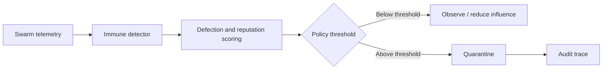

# Annexure - 2

Preferably on Company's letterhead (if available)

# 1. Proposed Technical Solution (Detailed)

## Technical Architecture & Approach

BioShield Swarm monitors autonomous agents using immune-inspired threat scoring. Telemetry, coordination messages, liveness signals, and behavioral summaries are converted into threat events. The system updates reputation, detects defection, stores threat memory, and triggers graded quarantine under policy thresholds.

## Official Problem Alignment and Scope Boundary

This proposal maps to ADITI 4 counter-UAS/autonomy demand signals and DISC 14 drone-management, C-UAS, and multi-agent UAS problem areas. It is intentionally separate from the existing ADITI PS24 space-domain submission. The technical scope here is swarm participant trust: identity checks, signed reports, threat memory, defection scoring, reputation decay, and quarantine/revalidation.

| Component | Role |
| --- | --- |
| Swarm signal adapter | Collects behavior, telemetry, coordination, and heartbeat signals |
| Immune detector | Converts abnormal patterns into threat signals |
| Defection scorer | Tracks identity failures, contradictory messages, false reports, and missed liveness |
| Reputation engine | Applies decay and reduces influence of unreliable nodes |
| Threat memory | Stores known compromise patterns for faster future detection |
| PQC node identity profile | Uses `nexus-pcu` hybrid Ed25519 plus ML-DSA path for selected node identity and signed-report records |
| Quarantine controller | Applies observe, reduce influence, isolate, or revalidate actions |

## Innovation

The product treats swarm trust as a continuously updated behavior score, not a permanent identity label. It combines cryptographic identity, defection scoring, reputation decay, and threat memory into one swarm-integrity layer.

## Implementation & Feasibility

Existing `multi-asi-immune` Rust modules provide identity, reputation, threat, enforcement, protocol, node, and integration logic. The iDEX work will package these into repeatable simulation scenarios with dashboards, PQC node-identity hardening, CI evidence, and evidence export.

## Challenges & Mitigation

| Challenge | Mitigation |
| --- | --- |
| False positives against degraded but benign nodes | Use graded response and revalidation policy |
| Subtle compromised behavior | Add spoofing, collusion, drift, and defection scenarios |
| Simulation overfitting | Keep scenarios parameterized and prepare relevant-environment / hardware-in-loop validation for TRL 5 exit |
| Mission disruption from quarantine | Support observe, reduce influence, isolate, and rejoin modes |

## Visuals & Supporting Data

## Any Other Relevant Details

Primary evidence is `cargo test -p multi-asi-immune --lib --tests -- --nocapture` and `cargo test -p nexus-pcu --features pqc pqc -- --nocapture` from the shared validation path. Current validation is software and simulation oriented; TRL 5 requires relevant-environment validation under the iDEX work.
