# IDEX OPEN CHALLENGE SUBMISSION

# Annexure-4

Supporting evidence, screenshots, repository locations, and artifact map

| CIN | PAN | TAN |
| --- | --- | --- |
| U62011AP2025PTC120239 | ABQCS7152R | VPNS31351F |

| Applicant Entity | Contact |
| --- | --- |
| Syntriass Labs Private Limited | kattanaga5555@gmail.com |
| 12-50, SLV Market, 12 Ward, Dharmavaram, Ananthapur - 515671, Andhra Pradesh, India | +91 88864 68060 |

# Supporting Evidence and Screenshots

## Company Identification Details

| Field | Details |
| --- | --- |
| Legal Entity Name | Syntriass Labs Private Limited |
| CIN | U62011AP2025PTC120239 |
| PAN | ABQCS7152R |
| TAN | VPNS31351F |
| Registered Office | 12-50, SLV Market, 12 Ward, Dharmavaram, Ananthapur - 515671, Andhra Pradesh, India |
| Contact Email | kattanaga5555@gmail.com |
| Contact Phone | +91 88864 68060 |
| GitHub Repository | `https://github.com/richardrich999888-rgb/NEXUS` |
| Submission Date | 17 May 2026 |

## 1. Applicant Resume Format

Applicant: K. Naga Sri Ganesh  
Company: Syntriass Labs Private Limited  
Role: Founder / Inventor  
Relevant focus: governed autonomy, multi-agent immune systems, execution assurance, reputation systems, and defence-oriented autonomy validation.

## 2. Prototype Evidence List

| Evidence Item | Repository / Artifact Location |
| --- | --- |
| Source module | `multi-asi-immune/src/` |
| Test suite | `multi-asi-immune/tests/` |
| Fresh test output | `docs/idex-open-challenge-2026/02-bioshield-swarm/final_4_documents/evidence_assets/bioshield_swarm_test_output.txt` |
| Evidence screenshots | `docs/idex-open-challenge-2026/02-bioshield-swarm/final_4_documents/evidence_assets/` |
| Final documents | `docs/idex-open-challenge-2026/02-bioshield-swarm/final_4_documents/` |

## 2A. Official Problem Alignment Evidence

| Evidence Item | Reviewer Use | Location / Source |
| --- | --- | --- |
| Open Challenge fit | Confirms the proposal is a standalone compromised-node and swarm-integrity prototype. | iDEX Open Challenge route; local package under `docs/idex-open-challenge-2026/02-bioshield-swarm/`. |
| ADITI 4 adjacency | Shows why counter-UAS and autonomous-platform problem areas need spoofing, compromise, and participant-trust checks. | Alignment summarized in Annexure 1 and Annexure 2; PS24 boundary stated explicitly. |
| DISC 14 adjacency | Shows relevance to drone management, C-UAS, and multi-agent UAS problem areas. | Alignment summarized in Annexure 1 and Annexure 2; technical evidence in `multi-asi-immune/`. |
| PS24 non-duplication | Helps reviewers separate this Open Challenge product from the already submitted ADITI PS24 space-domain application. | This package is scoped to swarm participant trust, not space-domain training, surveillance, or operations. |

## 3. Validation Scope

Current validation is software-subsystem validation. The evidence supports Rust module correctness and simulation-level behavior for identity, reputation, defection, threat memory, and threat propagation. It does not claim physical drone testing, tactical radio testing, EW range validation, or operational deployment.

```{=typst}
#pagebreak()
```

## 4. Test Command and Recorded Result

Primary command:

```bash
cargo test -p multi-asi-immune --lib --tests -- --nocapture
```

Fresh local result:

- 68 Rust tests passed.
- 0 failed.
- 1 doc-test ignored.
- Run date: 17 May 2026.

Test categories:

- Library unit tests.
- Defection tests.
- Identity tests.
- Integration tests.
- Reputation tests.
- Threat propagation tests.

## 5. Evidence Checklist

- Source screenshots embedded.
- Test output screenshot embedded.
- GitHub repository link embedded.
- File locations and artifact locations listed.
- Claims phrased as software-subsystem evidence, not field qualification.
- Hardware-in-loop validation listed as proposed work.

```{=typst}
#pagebreak()
```

## Evidence Page 5 - Public Repository Reference

Purpose: give panel reviewers a direct path to inspect the source repository.

Status: GitHub repository reference embedded.

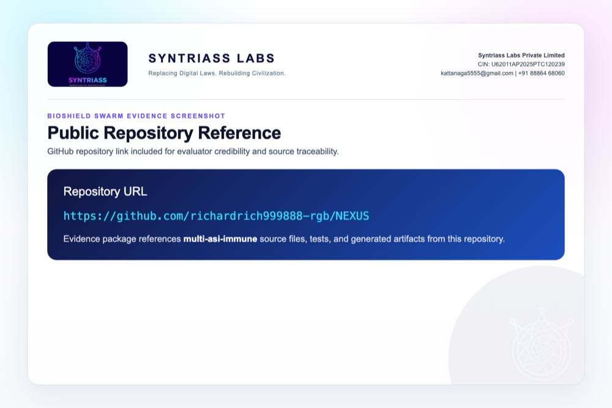

```{=typst}
#pagebreak()
```

## Evidence Page 6 - Fresh Test Output

Purpose: show that the BioShield Swarm Rust test suite was run locally before proposal packaging.

Status: test output screenshot embedded.

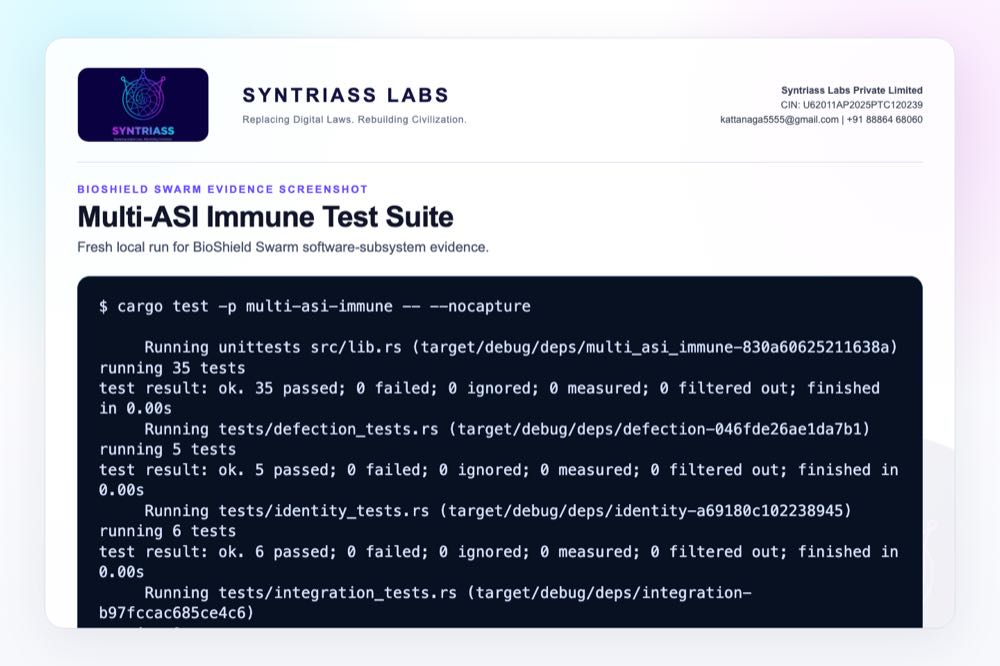

```{=typst}
#pagebreak()
```

## Evidence Page 7 - Threat Categories

Evidence source: `multi-asi-immune/src/threat/pattern.rs`

Purpose: show the implemented threat categories and severity model.

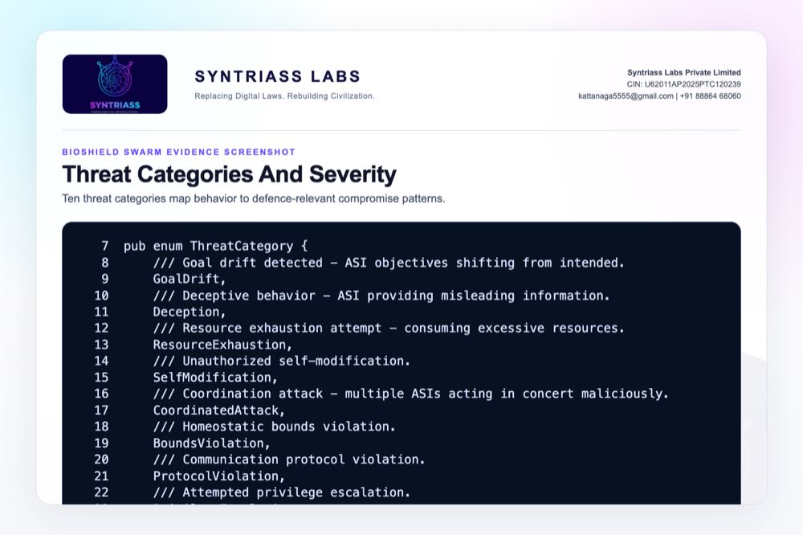

```{=typst}
#pagebreak()
```

## Evidence Page 8 - Defection Types

Evidence source: `multi-asi-immune/src/enforcement/defection.rs`

Purpose: show the observable defection categories used for rogue-node scoring.

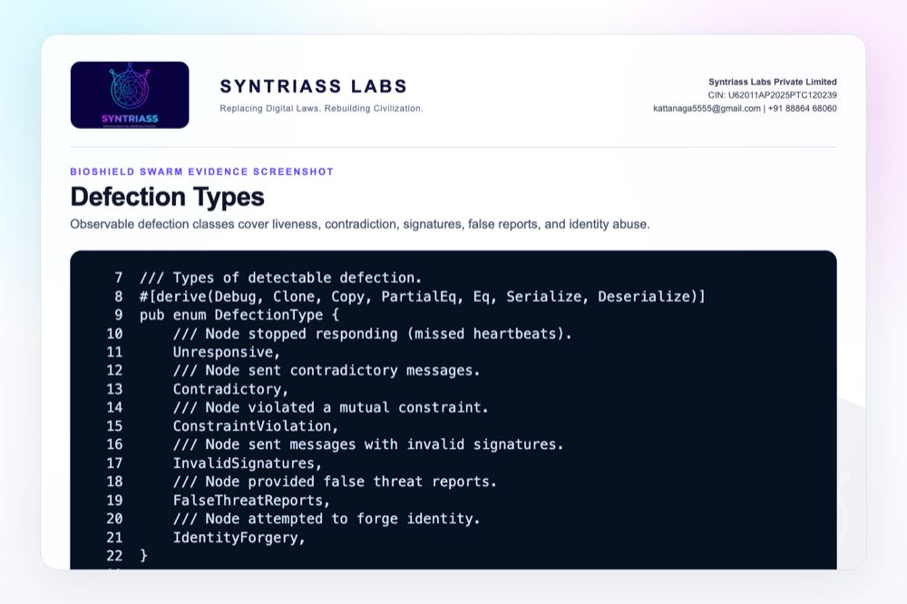

```{=typst}
#pagebreak()
```

## Evidence Page 9 - Isolation Logic

Evidence source: `multi-asi-immune/src/enforcement/defection.rs`

Purpose: show cumulative severity and isolation threshold logic.


```{=typst}
#pagebreak()
```

## Evidence Page 10 - Identity Sign and Verify

Evidence source: `multi-asi-immune/src/identity/keypair.rs`

Purpose: show identity generation, public identity, signing, and signature verification.


```{=typst}
#pagebreak()
```

## Evidence Page 11 - Reputation Decay

Evidence source: `multi-asi-immune/src/reputation/score.rs`

Purpose: show bounded, decaying reputation and suspicious-node detection.

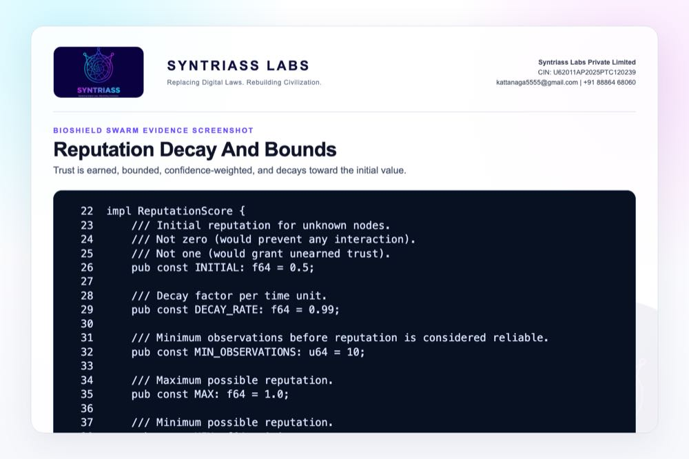

```{=typst}
#pagebreak()
```

## Evidence Page 12 - Threat Memory

Evidence source: `multi-asi-immune/src/threat/memory.rs`

Purpose: show duplicate rejection, reporter reputation filtering, confidence aggregation, and new-threat storage.


```{=typst}
#pagebreak()
```

## Evidence Page 13 - Signed Threat Report

Evidence source: `multi-asi-immune/src/threat/signature.rs`

Purpose: show signed reports binding pattern, reporter, confidence, timestamp, and signature.


```{=typst}
#pagebreak()
```

## Evidence Page 14 - Node Execution Gate

Evidence source: `multi-asi-immune/src/node/state.rs`

Purpose: show that isolated or low-reputation principals can be denied by node policy.


```{=typst}
#pagebreak()
```

## Evidence Page 15 - Threat Gossip Path

Evidence source: `multi-asi-immune/src/node/state.rs`

Purpose: show verified threat reports being stored and broadcast to peers.

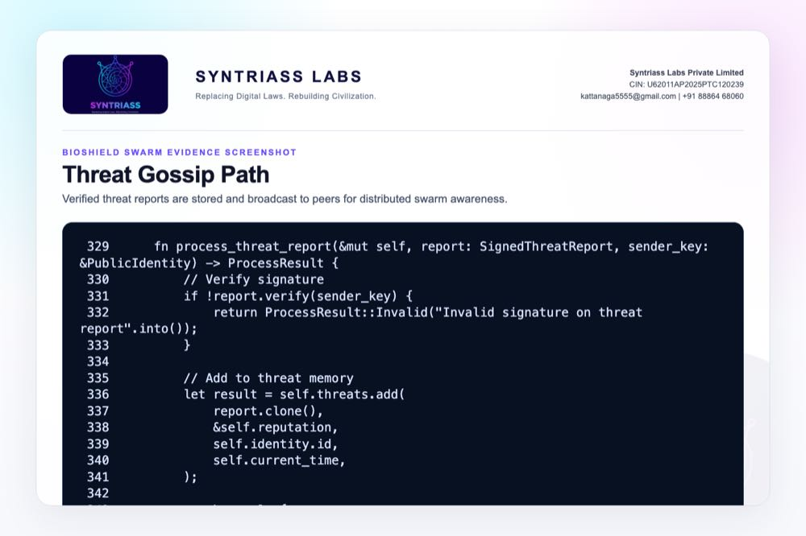

```{=typst}
#pagebreak()
```

## Evidence Page 16 - Swarm Protocol Messages

Evidence source: `multi-asi-immune/src/protocol/message.rs`

Purpose: show handshake, threat report, heartbeat, attestation, constraint, and accusation message types.

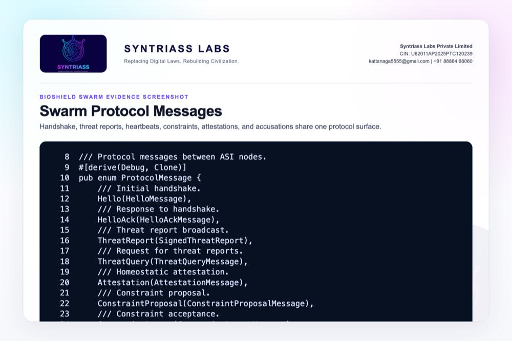

```{=typst}
#pagebreak()
```

## Evidence Page 17 - Constraint Actions

Evidence source: `multi-asi-immune/src/protocol/message.rs`

Purpose: show graded response actions including reduce cooperation, increase caution, broadcast warning, and isolate.

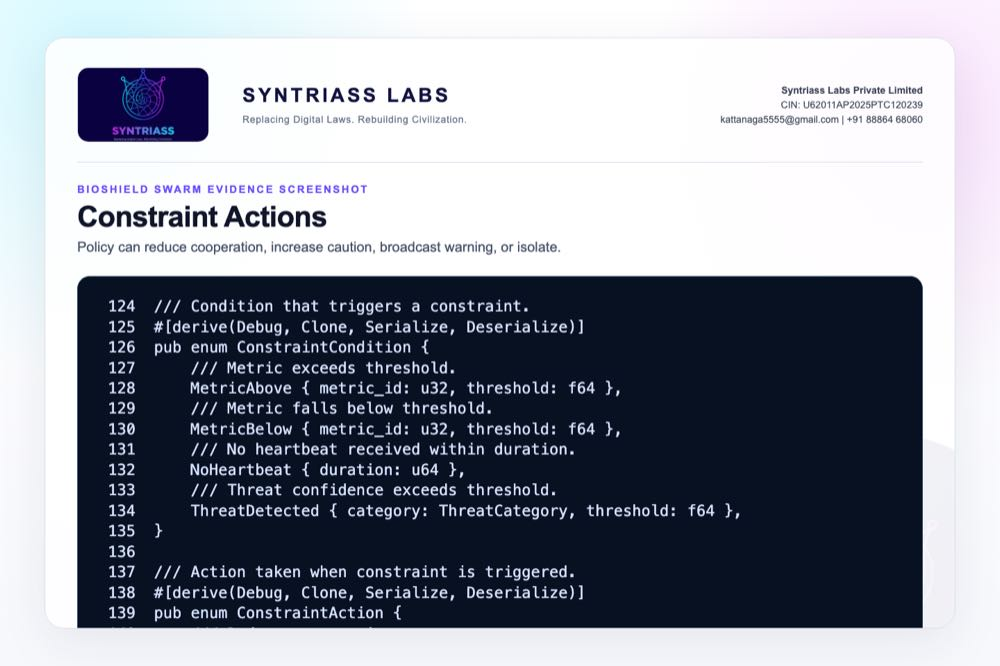

```{=typst}
#pagebreak()
```

## Evidence Page 18 - Network Health Assessment

Evidence source: `multi-asi-immune/src/node/state.rs`

Purpose: show active, suspicious, isolated, active-threat, and active-constraint summary fields.


```{=typst}
#pagebreak()
```

## Evidence Page 19 - Homeostatic Safety Constraints

Evidence source: `multi-asi-immune/src/integration/homeostasis_bridge.rs`

Purpose: show safety constraints derived from stress, caution, urgency, wellbeing, and cooperation state.

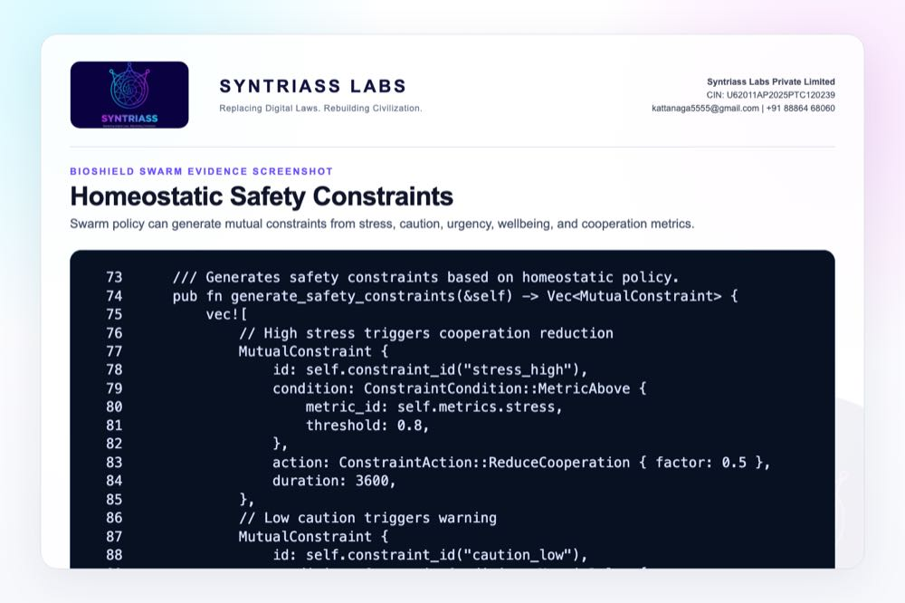

```{=typst}
#pagebreak()
```

## Evidence Page 20 - Threat Propagation Test

Evidence source: `multi-asi-immune/tests/integration_tests.rs`

Purpose: show that threat reporting propagates through peer processing and gossip.

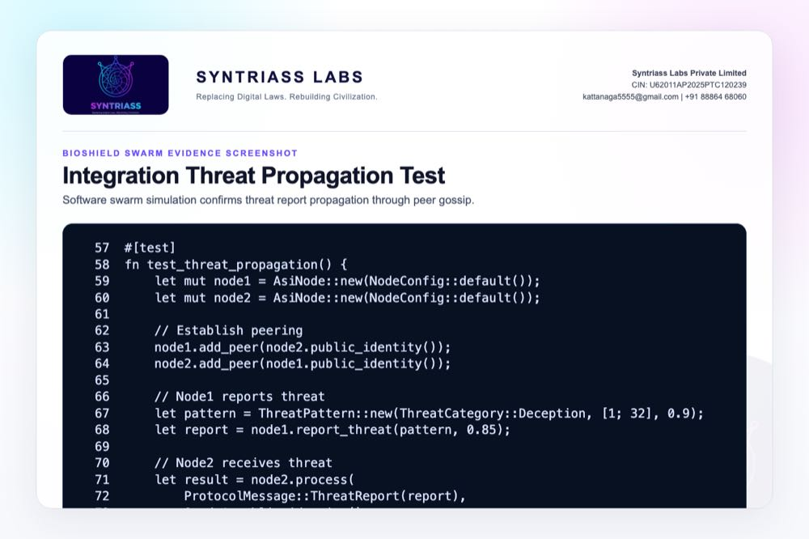

```{=typst}
#pagebreak()
```

## Evidence Page 21 - Full Protocol Flow Test

Evidence source: `multi-asi-immune/tests/integration_tests.rs`

Purpose: show a three-node flow for coordinated-attack reporting and propagation.

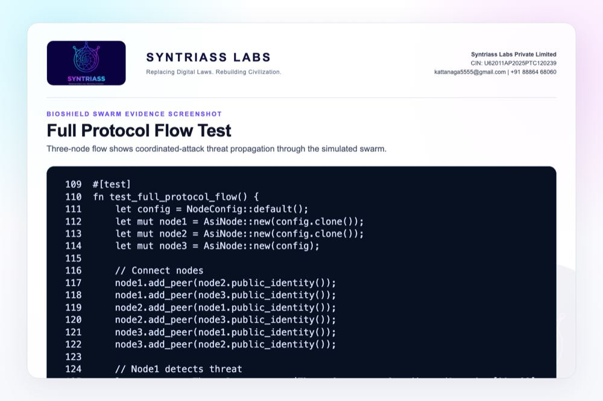

```{=typst}
#pagebreak()
```

## Evidence Page 22 - Defection Isolation Test

Evidence source: `multi-asi-immune/tests/defection_tests.rs`

Purpose: show test-level evidence for isolation threshold behavior.

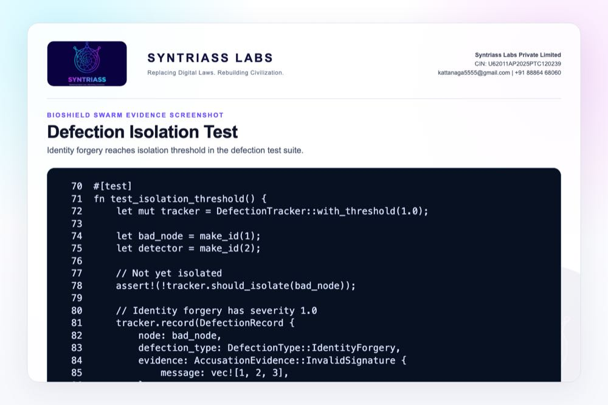

```{=typst}
#pagebreak()
```

## Evidence Page 23 - Identity Verification Tests

Evidence source: `multi-asi-immune/tests/identity_tests.rs`

Purpose: show correct signature verification and wrong-identity or modified-message failure.


```{=typst}
#pagebreak()
```

## Evidence Page 24 - Reputation Behavior Tests

Evidence source: `multi-asi-immune/tests/reputation_tests.rs`

Purpose: show positive behavior, negative behavior, and decay tests.

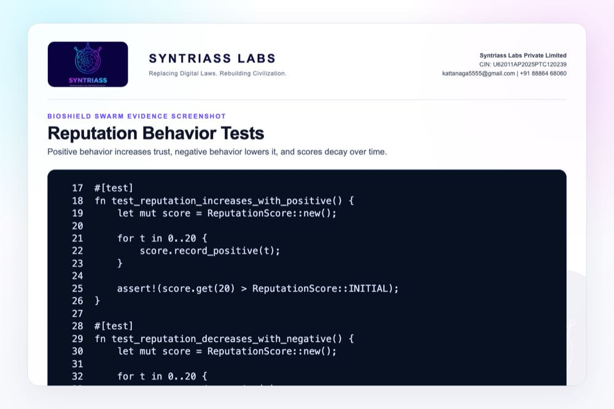

```{=typst}
#pagebreak()
```

## Evidence Page 25 - Threat Memory Tests

Evidence source: `multi-asi-immune/tests/threat_propagation_tests.rs`

Purpose: show threat memory add, duplicate rejection, and multi-reporter confirmation.

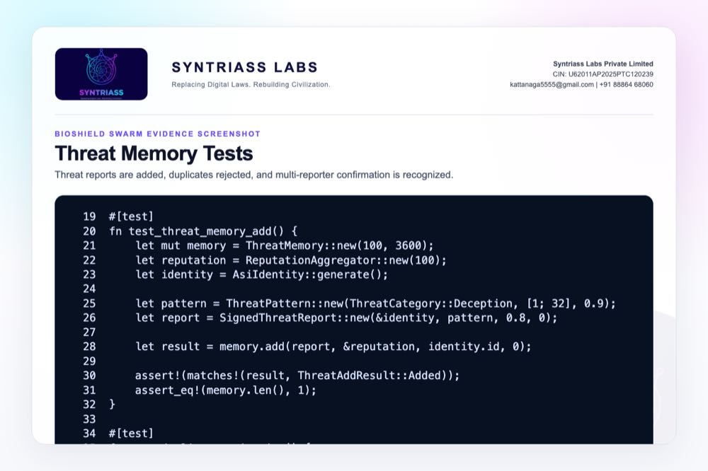

```{=typst}
#pagebreak()
```

## Evidence Page 26 - Package and Test Manifest

Evidence source: `multi-asi-immune/Cargo.toml`

Purpose: show crate dependencies and named test targets.


```{=typst}
#pagebreak()
```

## Evidence Page 27 - Public API Exports

Evidence source: `multi-asi-immune/src/lib.rs`

Purpose: show the public API surface exported for integration.


```{=typst}
#pagebreak()
```

## Evidence Page 28 - Reviewer Repository Map

Public repository:

- `https://github.com/richardrich999888-rgb/NEXUS`

Primary proposal package:

- `docs/idex-open-challenge-2026/02-bioshield-swarm/final_4_documents/`

Primary source modules:

- `multi-asi-immune/src/identity/keypair.rs`
- `multi-asi-immune/src/reputation/score.rs`
- `multi-asi-immune/src/reputation/aggregation.rs`
- `multi-asi-immune/src/threat/pattern.rs`
- `multi-asi-immune/src/threat/signature.rs`
- `multi-asi-immune/src/threat/memory.rs`
- `multi-asi-immune/src/enforcement/defection.rs`
- `multi-asi-immune/src/node/state.rs`
- `multi-asi-immune/src/protocol/message.rs`

How to review quickly:

1. Open the repository.
2. Navigate to `multi-asi-immune/`.
3. Compare source files with Evidence Pages 7-27.
4. Run the command on Evidence Page 6.

```{=typst}
#pagebreak()
```

## Evidence Page 29 - Claim To File Location Map

| Claim | Repository location | Evidence page |
| --- | --- | --- |
| Threat categories are implemented | `multi-asi-immune/src/threat/pattern.rs` | Page 7 |
| Defection classes are implemented | `multi-asi-immune/src/enforcement/defection.rs` | Page 8 |
| Isolation threshold exists | `multi-asi-immune/src/enforcement/defection.rs` | Page 9 |
| Identity signing and verification exist | `multi-asi-immune/src/identity/keypair.rs` | Page 10 |
| Reputation decays over time | `multi-asi-immune/src/reputation/score.rs` | Page 11 |
| Threat memory stores and deduplicates reports | `multi-asi-immune/src/threat/memory.rs` | Page 12 |
| Signed threat reports exist | `multi-asi-immune/src/threat/signature.rs` | Page 13 |
| Node policy can deny isolated/low-trust principals | `multi-asi-immune/src/node/state.rs` | Page 14 |
| Verified threats can be broadcast | `multi-asi-immune/src/node/state.rs` | Page 15 |
| Tests validate core behavior | `multi-asi-immune/tests/` | Pages 20-25 |

Reviewer note: these are software-subsystem evidence locations, not physical field qualification evidence.

```{=typst}
#pagebreak()
```

## Evidence Page 30 - Test And Command Locations

Primary executed test command:

```bash
cargo test -p multi-asi-immune --lib --tests -- --nocapture
```

Test file locations:

- `multi-asi-immune/tests/identity_tests.rs`
- `multi-asi-immune/tests/reputation_tests.rs`
- `multi-asi-immune/tests/defection_tests.rs`
- `multi-asi-immune/tests/threat_propagation_tests.rs`
- `multi-asi-immune/tests/integration_tests.rs`

Recorded output artifact:

- `docs/idex-open-challenge-2026/02-bioshield-swarm/final_4_documents/evidence_assets/bioshield_swarm_test_output.txt`

Current recorded result:

- `68 Rust tests passed; 0 failed; 1 doc-test ignored`
- Fresh local run date: `17 May 2026`

```{=typst}
#pagebreak()
```

## Evidence Page 31 - Generated Artifact Locations

Final PDF artifacts:

- `docs/idex-open-challenge-2026/02-bioshield-swarm/final_4_documents/01_SYNTRIASS_BioShield_Swarm_Annexure_1_Applicant_Details_and_Solution_Summary.pdf`
- `docs/idex-open-challenge-2026/02-bioshield-swarm/final_4_documents/02_SYNTRIASS_BioShield_Swarm_Annexure_2_Technical_Architecture.pdf`
- `docs/idex-open-challenge-2026/02-bioshield-swarm/final_4_documents/03_SYNTRIASS_BioShield_Swarm_Annexure_3_Advantages_and_Competencies.pdf`
- `docs/idex-open-challenge-2026/02-bioshield-swarm/final_4_documents/04_SYNTRIASS_BioShield_Swarm_Annexure_4_Supporting_Evidence_and_Screenshots.pdf`

Word artifacts:

- Same directory as above, with `.docx` extension.

Evidence screenshot folder:

- `docs/idex-open-challenge-2026/02-bioshield-swarm/final_4_documents/evidence_assets/`

Build scripts:

- `generate_bioshield_swarm_evidence_screenshots.mjs`
- `build_syntriass_letterhead_problem2.mjs`

```{=typst}
#pagebreak()
```

## Evidence Page 32 - Screenshot Artifact Index

Screenshot artifacts embedded in this Annexure:

- `evidence_assets/01_github_repository.jpg`
- `evidence_assets/02_test_output.jpg`
- `evidence_assets/03_threat_categories.jpg`
- `evidence_assets/04_defection_types.jpg`
- `evidence_assets/05_isolation_logic.jpg`
- `evidence_assets/06_identity_sign_verify.jpg`
- `evidence_assets/07_reputation_decay.jpg`
- `evidence_assets/08_threat_memory_add.jpg`
- `evidence_assets/09_signed_threat_report.jpg`
- `evidence_assets/10_node_execution_gate.jpg`
- `evidence_assets/11_threat_gossip.jpg`
- `evidence_assets/12_protocol_messages.jpg`
- `evidence_assets/13_constraint_actions.jpg`
- `evidence_assets/14_network_health.jpg`
- `evidence_assets/15_homeostasis_bridge.jpg`
- `evidence_assets/16_integration_threat_propagation.jpg`
- `evidence_assets/17_full_protocol_flow.jpg`
- `evidence_assets/18_defection_tests.jpg`
- `evidence_assets/19_identity_tests.jpg`
- `evidence_assets/20_reputation_tests.jpg`
- `evidence_assets/21_threat_memory_tests.jpg`
- `evidence_assets/22_package_manifest.jpg`
- `evidence_assets/23_api_exports.jpg`

All screenshots are generated artifacts from local source/test output.

```{=typst}
#pagebreak()
```

## Evidence Page 33 - Threat Model To Evidence Map

| Threat / Failure Mode | Evidence Location |
| --- | --- |
| Identity spoofing | Pages 10 and 23 |
| Invalid signature | Pages 13 and 23 |
| False threat reporting | Pages 12, 13, 25 |
| Contradictory messages | Pages 8, 9, 22 |
| Missed heartbeat / liveness loss | Pages 8, 16 |
| Low reputation / bad actor | Pages 11, 14, 24 |
| Threat propagation | Pages 15, 20, 21 |
| Quarantine / isolation | Pages 9, 14, 17, 22 |
| Degraded node ambiguity | Proposed iDEX calibration work |
| EW or radio-link stress | Proposed iDEX simulation work |

Prototype-stage gaps still to validate:

- Hardware-in-loop drone or robot node testing.
- EW packet-loss and spoofing simulation.
- Mission-specific threshold calibration.
- Operator revalidation workflow.

```{=typst}
#pagebreak()
```

## Evidence Page 34 - Prototype Work Package Locations

Repository anchors for proposed iDEX prototype work:

- Swarm immune module: `multi-asi-immune/`
- Identity and signing: `multi-asi-immune/src/identity/`
- Threat category engine: `multi-asi-immune/src/threat/pattern.rs`
- Threat report signatures: `multi-asi-immune/src/threat/signature.rs`
- Threat memory: `multi-asi-immune/src/threat/memory.rs`
- Reputation: `multi-asi-immune/src/reputation/`
- Defection tracking: `multi-asi-immune/src/enforcement/`
- Node processing and health: `multi-asi-immune/src/node/`
- Protocol messages: `multi-asi-immune/src/protocol/`
- Homeostatic integration: `multi-asi-immune/src/integration/`

Planned validation outputs during iDEX:

1. Compromised-node simulation report.
2. False-positive and false-negative analysis.
3. Threshold calibration report.
4. Quarantine/revalidation demo.
5. Hardware-in-loop validation plan.

```{=typst}
#pagebreak()
```

## Evidence Page 35 - Panel Review Checklist

Suggested reviewer checklist:

- Confirm GitHub repository link on Evidence Page 5.
- Open `multi-asi-immune/src/threat/pattern.rs` and inspect threat categories.
- Open `multi-asi-immune/src/enforcement/defection.rs` and inspect severity/isolation logic.
- Open `multi-asi-immune/src/identity/keypair.rs` and inspect signing/verification.
- Open `multi-asi-immune/src/reputation/score.rs` and inspect decay behavior.
- Open `multi-asi-immune/src/threat/memory.rs` and inspect duplicate rejection and confidence aggregation.
- Open `multi-asi-immune/tests/` and inspect identity, reputation, defection, threat propagation, and integration tests.
- Run `cargo test -p multi-asi-immune --lib --tests -- --nocapture`.
- Compare the terminal result with `evidence_assets/bioshield_swarm_test_output.txt`.

Upload checks for this document:

- Annexure 4 page count target: `37`.
- Annexure 4 PDF size target: under `5 MB`.
- Evidence pages contain source/test screenshots or reviewer navigation material.

```{=typst}
#pagebreak()
```

## Evidence Page 36 - Readiness Statement And Caveats

Current readiness:

- Software subsystem TRL 3-4.
- TRL 5 is an iDEX exit target, not a current claim.
- Rust module and test evidence available.
- Software simulation evidence available.
- PQC hardening will use the `nexus-pcu` hybrid Ed25519 plus ML-DSA path for selected node identity and signed-report records.
- Physical military hardware validation not claimed.
- EW/radio-link simulation not yet claimed.
- Operational deployment not claimed.

Caveats:

- Thresholds require mission-specific tuning.
- Degraded-but-benign nodes require careful policy treatment.
- Quarantine must be integrated with command policy and human review.
- Hardware-in-loop testing is required before higher readiness claims.
- Relevant-environment simulation, PQC verification evidence, and evaluator-witnessed validation are required before a TRL 5 claim.
- The iDEX prototype should evaluate latency, false-positive rate, false-negative rate, and recovery/revalidation behavior.

```{=typst}
#pagebreak()
```

## Evidence Page 37 - Declaration And Repository Coordinates

Declaration:

BioShield Swarm is submitted as a software-subsystem prototype for governed multi-agent swarm integrity evaluation.

Repository coordinates:

- Public repository: `https://github.com/richardrich999888-rgb/NEXUS`
- Proposal folder: `docs/idex-open-challenge-2026/02-bioshield-swarm/`
- Final documents: `docs/idex-open-challenge-2026/02-bioshield-swarm/final_4_documents/`
- Evidence assets: `docs/idex-open-challenge-2026/02-bioshield-swarm/final_4_documents/evidence_assets/`
- Test output: `docs/idex-open-challenge-2026/02-bioshield-swarm/final_4_documents/evidence_assets/bioshield_swarm_test_output.txt`

Submission caveat:

- The package is prepared for prototype review and iDEX-funded validation planning.
- No field deployment, weapons integration, or autonomous operational authority is claimed.
- Human approval, mission policy, and service-specific safety rules remain required for operational use.
