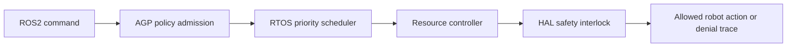

# Annexure - 2

Preferably on Company's letterhead (if available)

# 1. Proposed Technical Solution (Detailed)

## Technical Architecture & Approach

AGP-OS Robotics Safety Layer governs robot command execution through policy, scheduling, resource control, and simulated HAL safety interlocks. It is designed for ROS2-style command flows and RTOS-constrained edge environments.

| Component | Role |
| --- | --- |
| ROS2 bridge | Converts topics, services, and actions into governed requests |
| AGP policy layer | Applies authorization, task class, and safety policy |
| RTOS scheduler model | Prioritizes safety-critical work such as emergency stop paths |
| Resource controller | Denies or throttles CPU, memory, token, or mission budget overuse |
| HAL safety interlock | Blocks unsafe actuator or device access in simulated control paths |
| Audit path | Captures command decision, resource state, and denial reason |

## Innovation

The innovation is the combination of autonomy governance, robotics command admission, resource denial, and RTOS priority behavior in one robotics safety layer. This creates a practical bridge between AI decision logic and robot control paths.

## Implementation & Feasibility

The repository includes AGP logic, RTOS tests, ROS2 simulation-oriented tests, resource tests, and production-mode checks. The iDEX work will package these into a robotics-specific prototype, add demo scripts, and define the hardware-in-loop path.

## Challenges & Mitigation

| Challenge | Mitigation |
| --- | --- |
| ROS2 environment mismatch | Provide simulation mode and adapter boundary documentation |
| Hard real-time not proven on target board | Keep first phase to scheduler model and plan board validation |
| Resource denial disrupting mission flow | Support policy-defined degradation modes |
| HAL integration complexity | Start with simulated HAL interlocks before board-specific drivers |

## Visuals & Supporting Data

## Any Other Relevant Details

Primary evidence includes `test_rtos.py`, `test_ros2.py`, `test_resources.py`, `test_production.py`, and `nexus-rtos-core` checks. Current evidence is simulation-first, not physical robot certification.
