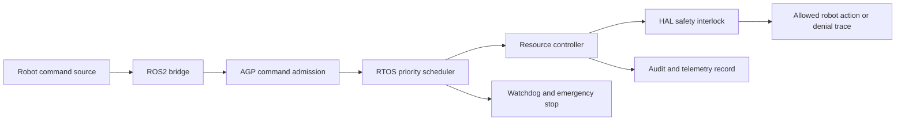

# IDEX OPEN CHALLENGE SUBMISSION

# Annexure-2

Technical architecture and implementation approach

| CIN | PAN | TAN |
| --- | --- | --- |
| U62011AP2025PTC120239 | ABQCS7152R | VPNS31351F |

| Applicant Entity | Contact |
| --- | --- |
| Syntriass Labs Private Limited | kattanaga5555@gmail.com |
| 12-50, SLV Market, 12 Ward, Dharmavaram, Ananthapur - 515671, Andhra Pradesh, India | +91 88864 68060 |

# Technical Architecture and Feasibility

## 1. Problem Statement

ROS2 and modern robotic middleware can transport commands efficiently, but defence review needs a stronger question answered before deployment: which command was allowed, which command was denied, which budget was exhausted, which safety interlock fired, and whether urgent motor safety paths were prioritized ahead of normal autonomy logic.

AGP-OS Robotics Safety Layer addresses this by placing a governed control layer between robot command sources and simulated hardware access. The prototype does not claim certified real-time deployment. It demonstrates the software safety boundary that future hardware-in-loop work can validate.

## 2. Technical Objective

| Objective | Implementation Mechanism |
| --- | --- |
| Govern robot commands | ROS2 bridge converts robot messages into controlled requests. |
| Protect critical timing paths | RTOS-style scheduler gives emergency and motor safety tasks highest priority. |
| Prevent resource abuse | Resource controller enforces memory, token, CPU, and I/O quotas. |
| Refuse unsafe actuator access | HAL safety interlock blocks low-alignment commands and caps velocity. |
| Detect runtime failure | Watchdog tracks heartbeat timeout and emergency-stop state. |
| Preserve review evidence | Test output, source screenshots, file maps, and artifact paths are packaged in Annexure 4. |

```{=typst}
#pagebreak()
```

## 3. High-Level Architecture



## 4. Component Map

| Component | Repository Location | Role In Prototype |
| --- | --- | --- |
| ROS2 bridge | `agp-core/src/os/ros2/bridge.py` | Simulates topics, robots, command publishing, sensor injection, and agent linking. |
| Production adapter | `agp-core/src/os/ros2/production.py` | Provides watchdog, velocity validation, emergency stop, and simulation fallback. |
| RTOS scheduler | `agp-core/src/os/rtos/scheduler.py` | Queues tasks by priority and deadline. |
| Resource controller | `agp-core/src/os/resources/controller.py` | Grants or denies agent resource requests. |
| HAL | `agp-core/src/os/hal/hal.py` | Registers sensors and actuators and enforces simulated safety checks. |
| Rust RTOS core | `nexus-rtos-core/src/lib.rs` | `no_std`, fixed-capacity RTOS scheduling primitive for future board ports. |
| Deployment files | `agp-core/deploy/` | Docker, systemd service, and entrypoint for robot packaging. |

```{=typst}
#pagebreak()
```

## 5. Command Admission Flow

1. A robot command is received from a topic, service, action, operator console, planner, or AI agent.
2. The ROS2 bridge translates the command into a governed request.
3. The AGP admission boundary checks whether the agent and command class are allowed under the active policy.
4. The RTOS scheduler places the resulting work item into the proper priority class.
5. The resource controller evaluates whether the agent has enough memory, token, CPU, or I/O budget.
6. The HAL safety interlock evaluates simulated hardware safety conditions before actuator access.
7. The output is an allowed action, capped action, blocked action, or denial trace.

## 6. RTOS Priority Model

| Priority | Code Value | Defence Meaning | Example Task |
| --- | ---: | --- | --- |
| CRITICAL | 0 | Must run ahead of normal autonomy work. | Emergency stop, motor safety, fail-safe action. |
| HIGH | 1 | Time-sensitive robot I/O. | Sensor polling, actuator command. |
| NORMAL | 2 | Governed agent operation. | Mission command admission, route update. |
| LOW | 3 | Non-urgent maintenance. | Background analytics, governance maintenance. |
| IDLE | 4 | Non-essential work. | Cleanup, low-priority telemetry. |

The Python scheduler demonstrates priority execution and deadline-miss tracking. The Rust RTOS core provides a `no_std`, `unsafe`-denied fixed-capacity implementation suitable for later embedded-board porting.

```{=typst}
#pagebreak()
```

## 7. Resource Control Design

The resource controller treats each robot agent as a budgeted principal. This matters in defence robotics because an AI component can degrade a mission by consuming memory, compute, tokens, or I/O even when it is not issuing direct movement commands.

| Resource | Enforcement Example | Evidence |
| --- | --- | --- |
| Memory | Deny memory request above assigned quota. | `test_resources.py` validates grant and denial paths. |
| Tokens | Deny excessive LLM token request. | `ResourceType.TOKENS` and quota checks. |
| CPU cycles | Budget CPU-cycle requests for future embedded integration. | `ResourceType.CPU_CYCLES`. |
| I/O operations | Bound high-frequency input/output behavior. | `ResourceType.IO_OPS`. |
| System memory | Avoid one agent exhausting global memory budget. | Global `system_memory_mb` and denial path. |

## 8. HAL Safety Interlock Design

The HAL registers sensors and actuators behind a common interface. Before a simulated actuator command is executed, the HAL can block it if the agent alignment score is below threshold. If the command includes a velocity above configured maximum, the command is capped before execution. The evidence is source-level and simulation-level; board-specific drivers are part of the proposed iDEX work.

```{=typst}
#pagebreak()
```

## 9. ROS2 Integration Design

The current bridge is simulation-ready and intentionally documents that production deployment should run inside a ROS2 environment with `rclpy`. The production adapter supports graceful fallback when `rclpy` is unavailable. This is useful for proposal review because the same tests can run on a normal development machine while the iDEX project can later validate real ROS2 hardware.

| ROS2 Feature | Current Evidence | iDEX Prototype Extension |
| --- | --- | --- |
| Topic creation | Publishers and subscriptions are created for robot command and sensor topics. | Map to target robot's real topics. |
| Command publish | Velocity command updates simulated robot state. | Add command policy wrappers for target platform. |
| Sensor injection | LIDAR-like simulated data is stored and exposed. | Connect actual sensor streams. |
| Agent linking | Robot state records linked AGP agent identity. | Bind to mission agent registry. |
| Production adapter | Watchdog, velocity cap, emergency stop, and deployment files are tested. | Run inside ROS2 Humble container and board environment. |

## 10. Audit and Evidence Path

The prototype will export a command decision record containing command class, agent identity, priority class, resource check result, HAL result, watchdog state, and denial reason. This keeps the first phase focused on reviewable governance evidence instead of broad robotics claims.

```{=typst}
#pagebreak()
```

## 11. Tests Conducted Before Packaging

| Test / Check | Command | Fresh Result |
| --- | --- | --- |
| RTOS scheduler | `agp-core/.venv/bin/python agp-core/tests/test_rtos.py` | 8 passed, 0 failed. |
| ROS2 bridge | `agp-core/.venv/bin/python agp-core/tests/test_ros2.py` | 16 passed, 0 failed. |
| Resource controller | `agp-core/.venv/bin/python agp-core/tests/test_resources.py` | 12 passed, 0 failed. |
| Production adapter | `agp-core/.venv/bin/python agp-core/tests/test_production.py` | 22 passed, 0 failed. |
| Rust RTOS core | `cargo test -p nexus-rtos-core -- --nocapture` | 4 passed, 0 failed. |
| Portability check | `cargo check -p nexus-rtos-core --target wasm32-unknown-unknown` | Passed. |

## 12. Risks and Mitigations

| Risk | Impact | Mitigation |
| --- | --- | --- |
| Simulation does not equal field timing | Cannot claim certified real-time behavior. | Keep TRL language at software subsystem level and plan hardware timing tests. |
| ROS2 environment mismatch | Target robots may use different topics and message schemas. | Define adapter boundary and include mapping work package. |
| HAL driver complexity | Each robot board may need custom safety hooks. | Start with simulated HAL, then board-specific driver integration. |
| Resource denial could affect mission continuity | Over-strict quotas may block useful work. | Add degradation modes and policy tuning in iDEX prototype. |
| Watchdog false positives | Communication jitter may trigger unnecessary stop. | Calibrate timeout and validate against target network conditions. |

```{=typst}
#pagebreak()
```

## 13. Prototype Demonstration Plan

| Demo Step | What The Evaluator Sees |
| --- | --- |
| Spawn simulated robot | ROS2 bridge creates robot state and standard topics. |
| Publish governed velocity command | Allowed command updates simulated position. |
| Submit reverse-priority workload | Critical motor safety task executes before normal and background work. |
| Exceed resource quota | Controller returns explicit denial and reason. |
| Trigger velocity cap | Production adapter caps excessive command. |
| Trigger watchdog timeout | Emergency-stop state is set after missed heartbeat. |
| Trigger HAL interlock | Low-alignment actuator request returns blocked status. |
| Export evidence | Command state, denial reason, source paths, test output, and artifact locations are available for review. |

## 14. Readiness Statement

The architecture is feasible for a 12-month iDEX prototype because the repository already contains working Python simulation modules, passing test scripts, deployment artifacts, and a Rust `no_std` RTOS core. The proposed work is integration, hardening, robotics scenario packaging, and hardware-in-loop validation planning rather than greenfield invention.

No field deployment, weapons integration, or autonomous operational authority is claimed in this submission.
