# IDEX OPEN CHALLENGE SUBMISSION

# Annexure-4

Supporting evidence, screenshots, repository locations, and artifact map

| CIN | PAN | TAN |
| --- | --- | --- |
| U62011AP2025PTC120239 | ABQCS7152R | VPNS31351F |

| Applicant Entity | Contact |
| --- | --- |
| Syntriass Labs Private Limited | kattanaga5555@gmail.com |
| 12-50, SLV Market, 12 Ward, Dharmavaram, Ananthapur - 515671, Andhra Pradesh, India | +91 88864 68060 |

# Supporting Evidence and Screenshots

## Company Identification Details

| Field | Details |
| --- | --- |
| Legal Entity Name | Syntriass Labs Private Limited |
| CIN | U62011AP2025PTC120239 |
| PAN | ABQCS7152R |
| TAN | VPNS31351F |
| Registered Office | 12-50, SLV Market, 12 Ward, Dharmavaram, Ananthapur - 515671, Andhra Pradesh, India |
| Contact Email | kattanaga5555@gmail.com |
| Contact Phone | +91 88864 68060 |
| GitHub Repository | `https://github.com/richardrich999888-rgb/NEXUS` |
| Submission Date | 17 May 2026 |

## 1. Applicant Resume Format

Applicant: K. Naga Sri Ganesh  
Company: Syntriass Labs Private Limited  
Role: Founder / Inventor  
Relevant focus: governed autonomy, robotic operating layers, AGP governance, RTOS scheduling, ROS2 simulation, safety interlocks, and defence-oriented autonomy validation.

## 2. Prototype Evidence List

| Evidence Item | Repository / Artifact Location |
| --- | --- |
| Source modules | `agp-core/src/os/`, `nexus-rtos-core/src/lib.rs` |
| Test suite | `agp-core/tests/test_rtos.py`, `test_ros2.py`, `test_resources.py`, `test_production.py` |
| Rust RTOS test | `cargo test -p nexus-rtos-core -- --nocapture` |
| Portability check | `cargo check -p nexus-rtos-core --target wasm32-unknown-unknown` |
| Fresh Python test output | `docs/idex-open-challenge-2026/03-agp-os-robotics-safety-layer/final_4_documents/evidence_assets/agp_os_robotics_test_output.txt` |
| Fresh Rust RTOS output | `docs/idex-open-challenge-2026/03-agp-os-robotics-safety-layer/final_4_documents/evidence_assets/nexus_rtos_core_test_output.txt` |
| Evidence screenshots | `docs/idex-open-challenge-2026/03-agp-os-robotics-safety-layer/final_4_documents/evidence_assets/` |
| Final documents | `docs/idex-open-challenge-2026/03-agp-os-robotics-safety-layer/final_4_documents/` |

## 3. Validation Scope

Current validation is software-subsystem validation. The evidence supports simulation-level ROS2 bridge behavior, RTOS scheduler behavior, resource-denial behavior, production adapter safety checks, and Rust `no_std` RTOS core checks. It does not claim physical robot testing, military-grade hardware timing, environmental qualification, ROS2 field deployment, or operational authority.

```{=typst}
#pagebreak()
```

## 4. Test Commands and Recorded Results

Primary commands:

```bash
agp-core/.venv/bin/python agp-core/tests/test_rtos.py
agp-core/.venv/bin/python agp-core/tests/test_ros2.py
agp-core/.venv/bin/python agp-core/tests/test_resources.py
agp-core/.venv/bin/python agp-core/tests/test_production.py
cargo test -p nexus-rtos-core -- --nocapture
cargo check -p nexus-rtos-core --target wasm32-unknown-unknown
```

Fresh local results:

- RTOS scheduler: 8 passed, 0 failed.
- ROS2 bridge: 16 passed, 0 failed.
- Resource controller: 12 passed, 0 failed.
- Production ROS2 adapter: 22 passed, 0 failed.
- Rust RTOS core: 4 passed, 0 failed.
- Rust `wasm32-unknown-unknown` check: passed.
- Run date: 17 May 2026.

## 5. Evidence Checklist

- Source screenshots embedded.
- Test output screenshot embedded.
- GitHub repository link embedded.
- File locations and artifact locations listed.
- Claims phrased as software-subsystem evidence, not field qualification.
- Hardware-in-loop validation listed as proposed work.

```{=typst}
#pagebreak()
```

## Evidence Page 5 - Public Repository Reference

Purpose: give panel reviewers a direct path to inspect the source repository.

Status: GitHub repository reference embedded.

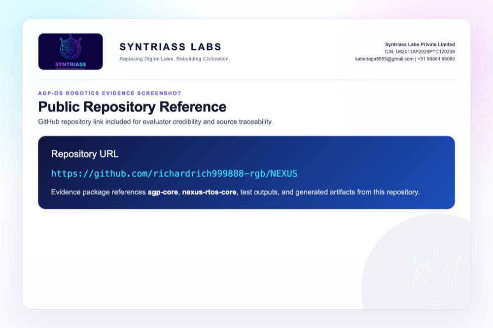

```{=typst}
#pagebreak()
```

## Evidence Page 6 - Fresh Test Output

Purpose: show that AGP-OS Robotics tests were run locally before proposal packaging.

Status: test output screenshot embedded.


```{=typst}
#pagebreak()
```

## Evidence Page 7 - RTOS Priority Classes

Evidence source: `agp-core/src/os/rtos/scheduler.py`

Purpose: show implemented critical, high, normal, low, and idle task priority classes.


```{=typst}
#pagebreak()
```

## Evidence Page 8 - RTOS Dispatch and Deadline Logic

Evidence source: `agp-core/src/os/rtos/scheduler.py`

Purpose: show scheduler dispatch, task execution, and deadline-miss accounting.


```{=typst}
#pagebreak()
```

## Evidence Page 9 - ROS2 Message and Robot State Model

Evidence source: `agp-core/src/os/ros2/bridge.py`

Purpose: show common ROS2 message classes and simulated robot state structure.

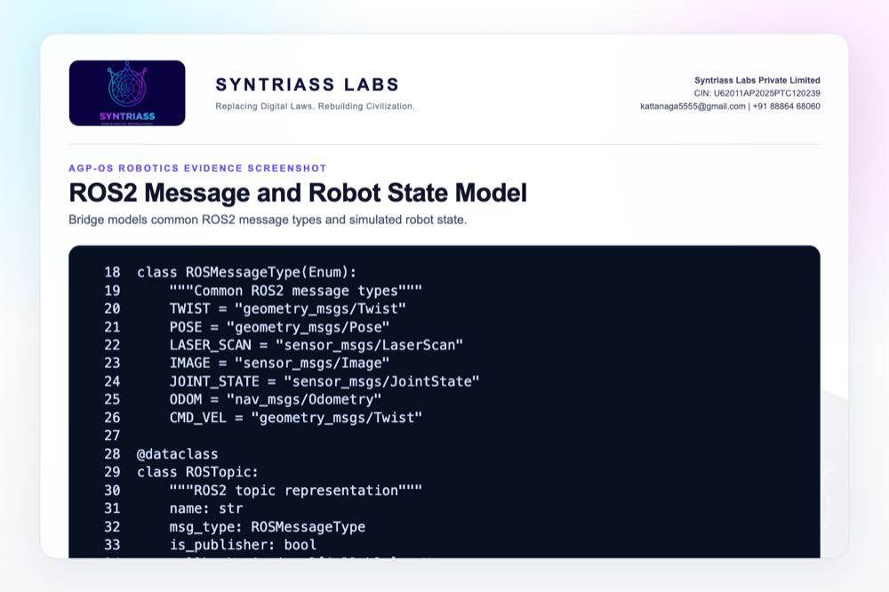

```{=typst}
#pagebreak()
```

## Evidence Page 10 - ROS2 Topic Publish Flow

Evidence source: `agp-core/src/os/ros2/bridge.py`

Purpose: show publisher validation and simulated command processing.

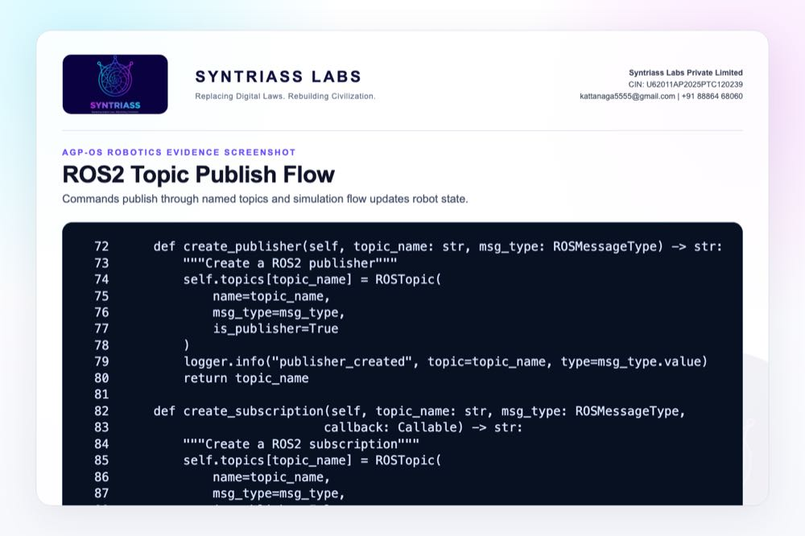

```{=typst}
#pagebreak()
```

## Evidence Page 11 - ROS2 Robot Spawn and Agent Linking

Evidence source: `agp-core/src/os/ros2/bridge.py`

Purpose: show robot spawn path, standard topic creation, and AGP agent linkage.


```{=typst}
#pagebreak()
```

## Evidence Page 12 - ROS2 Sensor Injection and Statistics

Evidence source: `agp-core/src/os/ros2/bridge.py`

Purpose: show simulated sensor injection and bridge statistics.


```{=typst}
#pagebreak()
```

## Evidence Page 13 - Resource Quota Model

Evidence source: `agp-core/src/os/resources/controller.py`

Purpose: show memory, tokens, CPU, I/O, and priority fields.

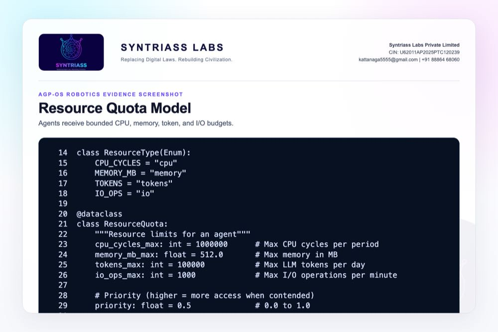

```{=typst}
#pagebreak()
```

## Evidence Page 14 - Resource Grant and Denial Path

Evidence source: `agp-core/src/os/resources/controller.py`

Purpose: show explicit grant and denial logic for over-quota requests.

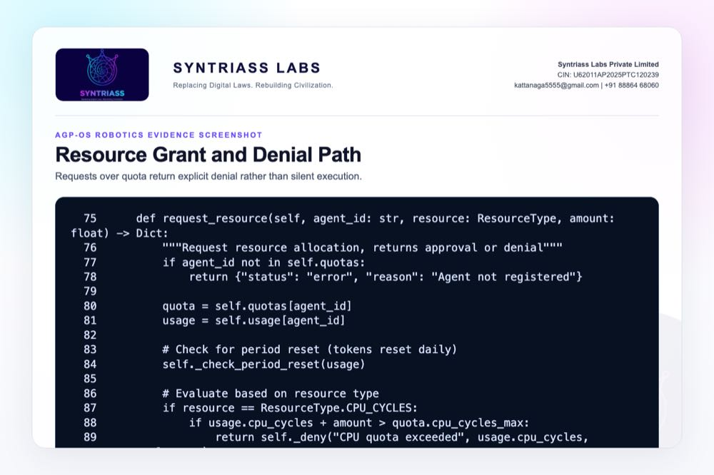

```{=typst}
#pagebreak()
```

## Evidence Page 15 - Resource Usage and System Status

Evidence source: `agp-core/src/os/resources/controller.py`

Purpose: show reviewer-visible usage and system-level resource status.

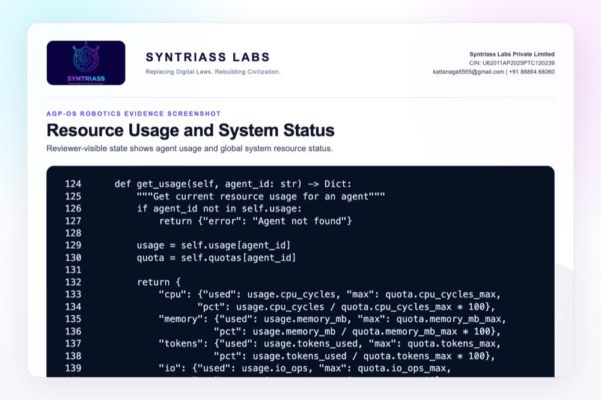

```{=typst}
#pagebreak()
```

## Evidence Page 16 - HAL Device and Safety Thresholds

Evidence source: `agp-core/src/os/hal/hal.py`

Purpose: show sensor, actuator, status, and safety threshold structures.


```{=typst}
#pagebreak()
```

## Evidence Page 17 - HAL Safety Interlock

Evidence source: `agp-core/src/os/hal/hal.py`

Purpose: show low-alignment actuator block and velocity cap behavior.


```{=typst}
#pagebreak()
```

## Evidence Page 18 - Production Safety Watchdog

Evidence source: `agp-core/src/os/ros2/production.py`

Purpose: show heartbeat timeout and emergency-stop state.


```{=typst}
#pagebreak()
```

## Evidence Page 19 - Velocity Guard and Emergency Stop

Evidence source: `agp-core/src/os/ros2/production.py`

Purpose: show velocity capping and emergency-stop command path.


```{=typst}
#pagebreak()
```

## Evidence Page 20 - ROS2 Production Adapter

Evidence source: `agp-core/src/os/ros2/production.py`

Purpose: show hardware connection path and simulation fallback when ROS2 runtime is unavailable locally.

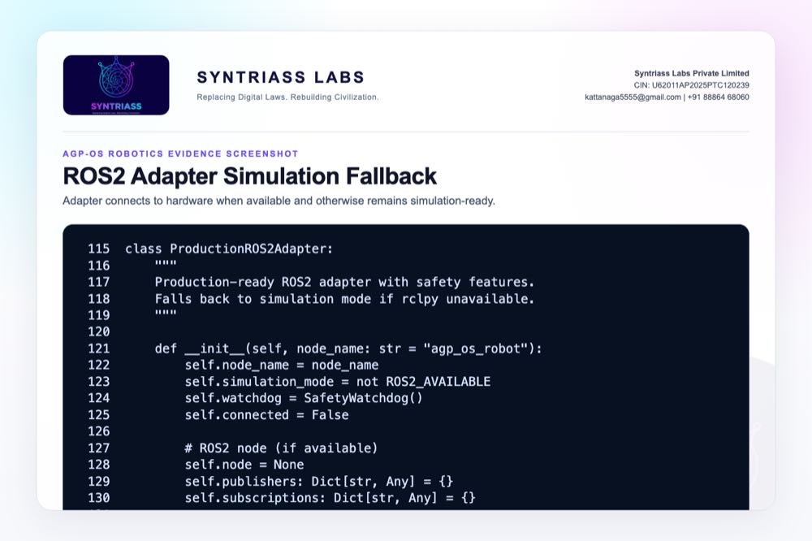

```{=typst}
#pagebreak()
```

## Evidence Page 21 - Robot Deployment Artifacts

Evidence source: `agp-core/deploy/Dockerfile.ros2` and `agp-core/deploy/agp-os-robot.service`

Purpose: show container and service-level deployment packaging for future prototype validation.

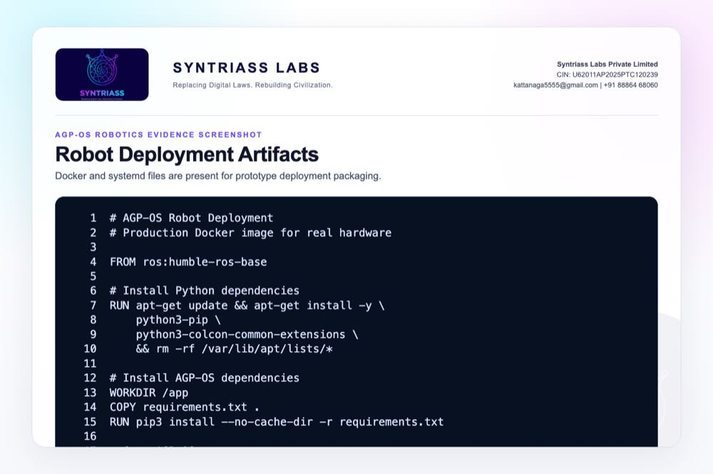

```{=typst}
#pagebreak()
```

## Evidence Page 22 - RTOS Test Scenario

Evidence source: `agp-core/tests/test_rtos.py`

Purpose: show test setup for reverse-order submission and critical-first execution.

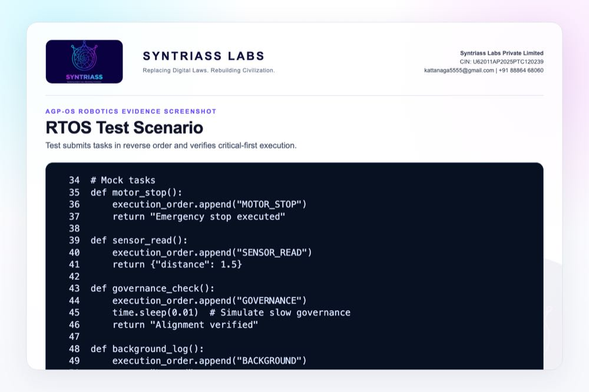

```{=typst}
#pagebreak()
```

## Evidence Page 23 - ROS2 Bridge Test Scenario

Evidence source: `agp-core/tests/test_ros2.py`

Purpose: show spawn, publish, sensor, and AGP agent link validation.

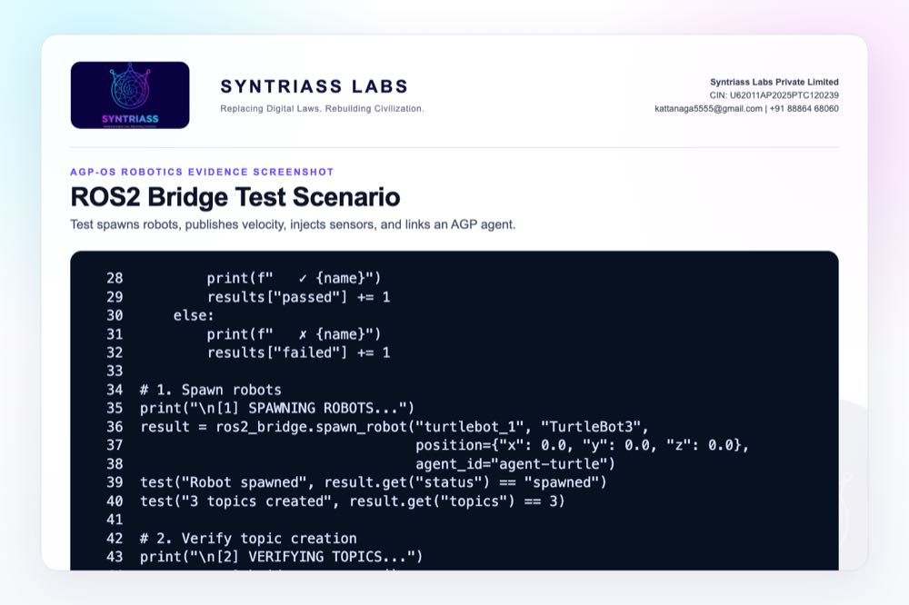

```{=typst}
#pagebreak()
```

## Evidence Page 24 - Resource Controller Test Scenario

Evidence source: `agp-core/tests/test_resources.py`

Purpose: show within-quota grants and over-quota denials.


```{=typst}
#pagebreak()
```

## Evidence Page 25 - Production Adapter Test Scenario

Evidence source: `agp-core/tests/test_production.py`

Purpose: show watchdog, velocity cap, timeout, emergency stop, and deployment checks.


```{=typst}
#pagebreak()
```

## Evidence Page 26 - Rust RTOS Core

Evidence source: `nexus-rtos-core/src/lib.rs`

Purpose: show `no_std`, `unsafe`-denied, fixed-capacity scheduling primitives.

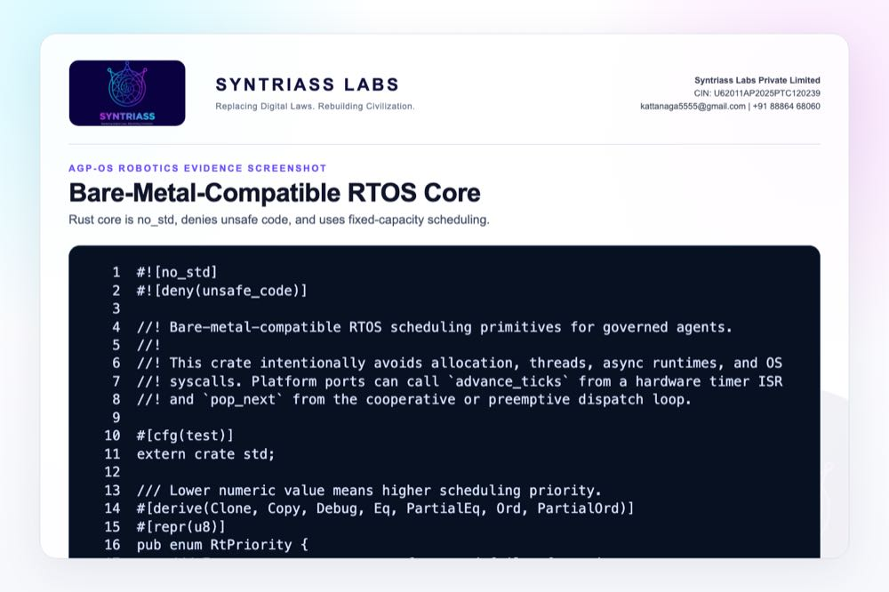

```{=typst}
#pagebreak()
```

## Evidence Page 27 - Rust RTOS Core Tests

Evidence source: `nexus-rtos-core/src/lib.rs`

Purpose: show Rust tests for priority, deadline order, capacity, duplicate IDs, and missed deadlines.

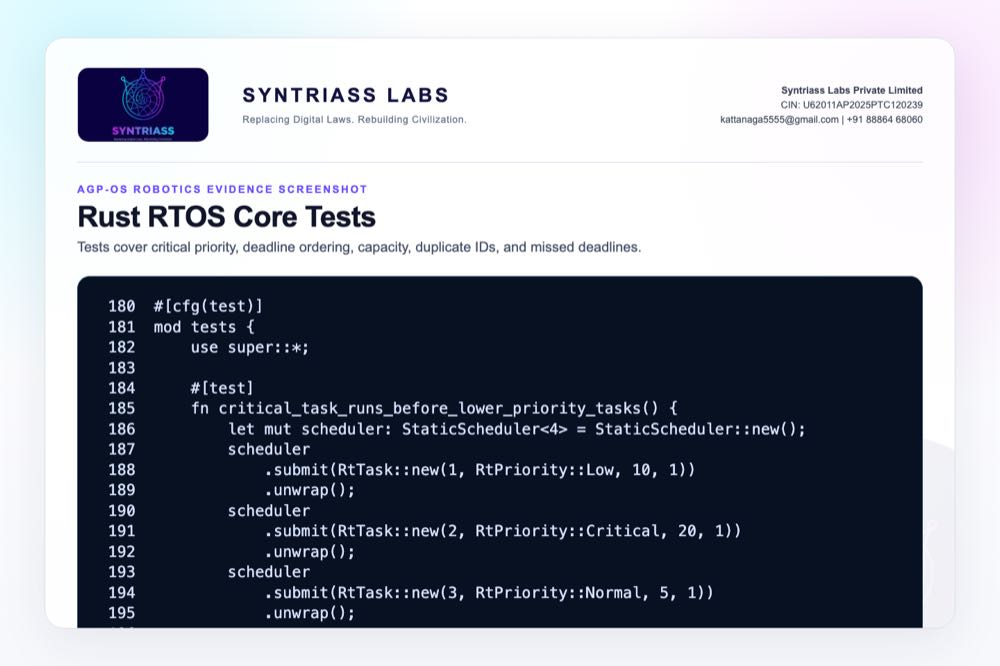

```{=typst}
#pagebreak()
```

## Evidence Page 28 - Reviewer Repository Map

Purpose: give panel reviewers a direct navigation map.

| Review Area | Path |
| --- | --- |
| Final proposal package | `docs/idex-open-challenge-2026/03-agp-os-robotics-safety-layer/final_4_documents/` |
| Screenshot assets | `docs/idex-open-challenge-2026/03-agp-os-robotics-safety-layer/final_4_documents/evidence_assets/` |
| AGP-OS source | `agp-core/src/os/` |
| RTOS scheduler | `agp-core/src/os/rtos/scheduler.py` |
| ROS2 bridge | `agp-core/src/os/ros2/bridge.py` |
| Production adapter | `agp-core/src/os/ros2/production.py` |
| Resource controller | `agp-core/src/os/resources/controller.py` |
| HAL | `agp-core/src/os/hal/hal.py` |
| Rust RTOS core | `nexus-rtos-core/src/lib.rs` |

```{=typst}
#pagebreak()
```

## Evidence Page 29 - Claim-to-File Location Map

| Proposal Claim | Source Evidence |
| --- | --- |
| Critical task priority exists | `agp-core/src/os/rtos/scheduler.py`, `TaskPriority.CRITICAL` |
| Scheduler tracks deadline misses | `agp-core/src/os/rtos/scheduler.py`, `missed_deadlines` |
| ROS2 simulation bridge exists | `agp-core/src/os/ros2/bridge.py`, `ROS2Bridge` |
| Robot-agent linking exists | `agp-core/src/os/ros2/bridge.py`, `link_agent()` |
| Resource quota denial exists | `agp-core/src/os/resources/controller.py`, `request_resource()` |
| HAL interlock exists | `agp-core/src/os/hal/hal.py`, `move_actuator()` |
| Watchdog timeout exists | `agp-core/src/os/ros2/production.py`, `SafetyWatchdog.check()` |
| Velocity cap exists | `agp-core/src/os/ros2/production.py`, `validate_velocity()` |
| Embedded RTOS path exists | `nexus-rtos-core/src/lib.rs`, `#![no_std]` |

```{=typst}
#pagebreak()
```

## Evidence Page 30 - Test and Command Locations

| Test Area | Command / File |
| --- | --- |
| RTOS scheduler | `agp-core/.venv/bin/python agp-core/tests/test_rtos.py` |
| ROS2 bridge | `agp-core/.venv/bin/python agp-core/tests/test_ros2.py` |
| Resource controller | `agp-core/.venv/bin/python agp-core/tests/test_resources.py` |
| Production adapter | `agp-core/.venv/bin/python agp-core/tests/test_production.py` |
| Rust RTOS unit tests | `cargo test -p nexus-rtos-core -- --nocapture` |
| Rust RTOS target check | `cargo check -p nexus-rtos-core --target wasm32-unknown-unknown` |
| Python output artifact | `evidence_assets/agp_os_robotics_test_output.txt` |
| Rust output artifact | `evidence_assets/nexus_rtos_core_test_output.txt` |

```{=typst}
#pagebreak()
```

## Evidence Page 31 - Generated Artifact Locations

| Artifact Type | Location |
| --- | --- |
| Annexure 1 PDF | `01_SYNTRIASS_AGP_OS_Robotics_Annexure_1_Applicant_Details_and_Solution_Summary.pdf` |
| Annexure 2 PDF | `02_SYNTRIASS_AGP_OS_Robotics_Annexure_2_Technical_Architecture.pdf` |
| Annexure 3 PDF | `03_SYNTRIASS_AGP_OS_Robotics_Annexure_3_Advantages_and_Competencies.pdf` |
| Annexure 4 PDF | `04_SYNTRIASS_AGP_OS_Robotics_Annexure_4_Supporting_Evidence_and_Screenshots.pdf` |
| DOCX files | Same directory, matching `.docx` names. |
| Rendered HTML | `final_4_documents/html/` |
| Evidence screenshots | `final_4_documents/evidence_assets/*.jpg` |
| Screenshot generator | `generate_agp_os_robotics_evidence_screenshots.mjs` |
| PDF builder | `build_syntriass_letterhead_problem3.mjs` |

```{=typst}
#pagebreak()
```

## Evidence Page 32 - Screenshot Artifact Index

| Screenshot | File |
| --- | --- |
| GitHub repository | `evidence_assets/01_github_repository.jpg` |
| Fresh test output | `evidence_assets/02_test_output.jpg` |
| RTOS priority classes | `evidence_assets/03_rtos_priorities.jpg` |
| RTOS dispatch | `evidence_assets/04_rtos_dispatch.jpg` |
| ROS2 message model | `evidence_assets/05_ros2_messages.jpg` |
| ROS2 topic flow | `evidence_assets/06_ros2_topic_flow.jpg` |
| ROS2 spawn and link | `evidence_assets/07_ros2_spawn_robot.jpg` |
| ROS2 sensor statistics | `evidence_assets/08_ros2_sensor_hal.jpg` |
| Resource quota | `evidence_assets/09_resource_quota.jpg` |
| Resource denial | `evidence_assets/10_resource_denial.jpg` |
| Resource status | `evidence_assets/11_resource_status.jpg` |
| HAL device model | `evidence_assets/12_hal_device_model.jpg` |
| HAL interlock | `evidence_assets/13_hal_interlock.jpg` |
| Watchdog | `evidence_assets/14_production_watchdog.jpg` |
| Velocity guard | `evidence_assets/15_velocity_guard.jpg` |
| Production adapter | `evidence_assets/16_production_adapter.jpg` |
| Deployment artifacts | `evidence_assets/17_deploy_artifacts.jpg` |
| Test scenario screenshots | `evidence_assets/18_test_rtos.jpg` through `23_rtos_core_tests.jpg` |

```{=typst}
#pagebreak()
```

## Evidence Page 33 - Defence Problem to Evidence Map

| Defence Problem | AGP-OS Control | Evidence |
| --- | --- | --- |
| Unsafe robot command admission | ROS2 bridge plus governed request boundary | Evidence pages 9-12. |
| Priority inversion around safety tasks | RTOS-style critical priority | Evidence pages 7-8 and 22. |
| Resource exhaustion by AI agent | Quota controller and explicit denial | Evidence pages 13-15 and 24. |
| Unsafe simulated actuator command | HAL interlock and velocity cap | Evidence pages 16-19. |
| Heartbeat loss / runtime failure | Production safety watchdog | Evidence page 18 and 25. |
| Bare-metal readiness path | Rust `no_std` RTOS core | Evidence pages 26-27. |

```{=typst}
#pagebreak()
```

## Evidence Page 34 - Prototype Work Package Locations

| Work Package | Existing Starting Point |
| --- | --- |
| Robotics command schema | `agp-core/src/os/ros2/bridge.py` |
| RTOS priority and deadline behavior | `agp-core/src/os/rtos/scheduler.py`, `nexus-rtos-core/src/lib.rs` |
| Resource denial policy | `agp-core/src/os/resources/controller.py` |
| HAL interlock policy | `agp-core/src/os/hal/hal.py` |
| Watchdog and emergency stop | `agp-core/src/os/ros2/production.py` |
| Deployment packaging | `agp-core/deploy/Dockerfile.ros2`, `entrypoint.sh`, `agp-os-robot.service` |
| Acceptance tests | `agp-core/tests/test_rtos.py`, `test_ros2.py`, `test_resources.py`, `test_production.py` |

```{=typst}
#pagebreak()
```

## Evidence Page 35 - Panel Review Checklist

| Reviewer Question | Where To Check |
| --- | --- |
| Is there real source code? | Evidence pages 7-27 and repository paths on pages 28-29. |
| Were tests actually run? | Evidence page 6 and test output files in `evidence_assets/`. |
| Is this physical robot validated? | No. Current scope is software plus simulation; caveats on pages 1, 4, and 36. |
| Is ROS2 hardware claimed? | No. Production adapter has simulation fallback; hardware validation is proposed. |
| Is real-time certification claimed? | No. RTOS scheduling is software-subsystem evidence and `no_std` core check. |
| Is the GitHub repository identified? | Evidence page 5 and repository coordinate page 37. |
| Are artifact locations included? | Evidence pages 28-32. |

```{=typst}
#pagebreak()
```

## Evidence Page 36 - Readiness Statement and Caveats

| Area | Position |
| --- | --- |
| Software subsystem readiness | Current evidence supports software subsystem TRL 3-4. |
| Physical robot validation | Planned under iDEX; not claimed as complete. |
| Hard real-time timing | Scheduler behavior is tested; certified timing on target hardware is pending. |
| ROS2 production environment | Adapter exists; local test used simulation fallback because `rclpy` was unavailable. |
| HAL safety | Interlock logic exists; board-specific driver integration is pending. |
| Operational authority | Human approval, mission policy, safety doctrine, and service-specific approvals remain required. |
| Proposed next validation | Hardware-in-loop robot demo, latency measurement, watchdog tuning, policy tuning, and safety-case report. |

```{=typst}
#pagebreak()
```

## Evidence Page 37 - Declaration and Repository Coordinates

Declaration:

AGP-OS Robotics Safety Layer is submitted as a software-subsystem prototype for governed ROS2 and RTOS robotic safety evaluation.

Repository coordinates:

- Public repository: `https://github.com/richardrich999888-rgb/NEXUS`
- Proposal folder: `docs/idex-open-challenge-2026/03-agp-os-robotics-safety-layer/`
- Final documents: `docs/idex-open-challenge-2026/03-agp-os-robotics-safety-layer/final_4_documents/`
- Evidence assets: `docs/idex-open-challenge-2026/03-agp-os-robotics-safety-layer/final_4_documents/evidence_assets/`
- Python test output: `docs/idex-open-challenge-2026/03-agp-os-robotics-safety-layer/final_4_documents/evidence_assets/agp_os_robotics_test_output.txt`
- Rust RTOS output: `docs/idex-open-challenge-2026/03-agp-os-robotics-safety-layer/final_4_documents/evidence_assets/nexus_rtos_core_test_output.txt`

Submission caveat:

- The package is prepared for prototype review and iDEX-funded validation planning.
- No field deployment, weapons integration, or autonomous operational authority is claimed.
- Physical robot testing, hardware-in-loop timing, and service-specific safety rules remain required for operational use.
