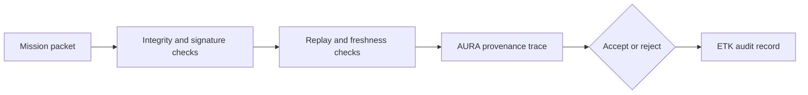

# Annexure - 2

Preferably on Company's letterhead (if available)

# 1. Proposed Technical Solution (Detailed)

## Technical Architecture & Approach

AURA Trust provides offline verification for mission information packets. Each packet carries payload hash, source identity, timestamp, nonce, provenance metadata, policy class, and signature material. The verifier checks integrity, source, freshness, replay status, and provenance before accepting the packet.

| Component | Role |
| --- | --- |
| Mission packet format | Encodes payload hash, source, timestamp, nonce, and provenance metadata |
| Signature verifier | Validates current classical signatures and supports a PQC migration path |
| Replay/freshness checker | Rejects stale packets, repeated nonces, and invalid sequence windows |
| AURA provenance engine | Records source lineage, transformations, and trust context |
| ETK audit exporter | Produces tamper-evident verification decision records |
| Offline verifier CLI | Enables field-style verification without central service availability |

## Innovation

The innovation is offline mission information verification with provenance and audit output. The system is designed for disconnected environments where central trust services may be unavailable or delayed.

## Implementation & Feasibility

Existing NEXUS components include provenance concepts, ETK audit models, and PCU/PQC test evidence. The iDEX work will harden AURA into a defence-focused packet verifier with replay rejection, audit export, key lifecycle design, and testable packet formats.

## Challenges & Mitigation

| Challenge | Mitigation |
| --- | --- |
| Offline key management | Define key lifecycle, revocation bundles, and rotation policy |
| Replay handling while disconnected | Use signed sequence windows, nonce stores, and freshness profiles |
| Cryptographic profile alignment | Align with evaluator-approved classical and NIST PQC paths |
| Secure platform overclaim | Position as a provenance verifier prototype until accreditation work is complete |

## Visuals & Supporting Data

## Any Other Relevant Details

Current AURA Trust work requires defence hardening. Existing `nexus-pcu` PQC tests support the migration path, but packet-level PQC enforcement remains proposed work.
