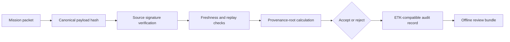

# IDEX OPEN CHALLENGE SUBMISSION

# Annexure-2

Technical architecture and implementation approach

| CIN | PAN | TAN |
| --- | --- | --- |
| U62011AP2025PTC120239 | ABQCS7152R | VPNS31351F |

| Applicant Entity | Contact |
| --- | --- |
| Syntriass Labs Private Limited | kattanaga5555@gmail.com |
| 12-50, SLV Market, 12 Ward, Dharmavaram, Ananthapur - 515671, Andhra Pradesh, India | +91 88864 68060 |

# Technical Architecture and Feasibility

## 1. Problem Statement

Defence information packets can move across tactical radios, offline devices, field laptops, edge gateways, disconnected bases, and delayed synchronization paths. Encryption alone does not prove that a packet is current, source-bound, unmodified, non-replayed, or traceable to a known provenance path.

AURA Trust addresses this as an offline verification problem. The verifier should answer: who produced the packet, what payload hash was signed, whether the timestamp and sequence are acceptable, whether the nonce has already been seen, what provenance chain is claimed, what policy applies, and what audit record proves the decision.

## 2. Technical Objective

| Objective | Implementation Mechanism |
| --- | --- |
| Verify packet integrity offline | Canonical payload hash and source signature verification. |
| Reject replay attacks | Local nonce memory and sequence-number monotonicity. |
| Reject stale packets | Freshness window for disconnected operation. |
| Preserve provenance evidence | Provenance-root hash over packet lineage metadata. |
| Emit decision audit records | ETK-compatible record containing packet hash, payload hash, policy ref, result, and reason. |
| Provide PQC migration path | NEXUS PCU hybrid Ed25519 plus ML-DSA feature path. |

```{=typst}
#pagebreak()
```

## 3. High-Level Architecture



## 4. Component Map

| Component | Repository Location | Role In Prototype |
| --- | --- | --- |
| Packet verification harness | `docs/idex-open-challenge-2026/04-aura-trust/final_4_documents/evidence_assets/aura_trust_offline_verification.py` | Demonstrates packet schema, signing, tamper rejection, replay rejection, and audit records. |
| Existing AURA offline verifier | `src/network/offline.py` | Shows current offline verification direction and early-stage boundary. |
| AURA RIA core | `src/core/ria.py` | Provides AURA transaction signature container and offline verification concepts. |
| ETK schema | `nexus-etk/src/schema.rs` | Canonical event and proof schema for audit decision records. |
| ETK event chain | `nexus-etk/src/chain.rs` | Hash-chained event lifecycle and proof finalization. |
| ETK verifier | `nexus-etk/src/verifier.rs` | Offline verifier phases for schema, signature, chain, policy, time, and outcome checks. |
| PCU proof path | `nexus-pcu/src/proof.rs` | Execution proof and attestation pattern. |
| PQC migration path | `nexus-pcu/src/pqc.rs` | Hybrid Ed25519 plus ML-DSA signature support under feature flag. |

```{=typst}
#pagebreak()
```

## 5. Mission Packet Format

| Field | Purpose |
| --- | --- |
| `source_id` | Names the offline-trusted packet producer. |
| `payload_hash` | Binds signature to exact packet content without exposing full payload in the audit line. |
| `timestamp_utc` | Supports freshness window enforcement. |
| `nonce` | Supports replay rejection while disconnected. |
| `sequence_number` | Rejects rollback and repeated older packets from the same source. |
| `provenance` | Records source lineage such as sensor node, edge filter, packetizer, or transformation stage. |
| `policy_class` | Binds verification to a policy profile. |
| `signature` | Source signature over canonical packet fields. |

## 6. Verification Flow

1. Load an offline trust bundle containing source public keys.
2. Parse the mission packet and compute canonical payload hash.
3. Check source identity against the local trust store.
4. Reject stale packet timestamps outside the profile window.
5. Reject nonce reuse and sequence rollback.
6. Verify the source signature over canonical signing bytes.
7. Produce an accept or reject decision with a reason code.
8. Emit an ETK-compatible audit record for later review.

```{=typst}
#pagebreak()
```

## 7. Replay and Freshness Design

The current evidence harness demonstrates two local controls: nonce memory and highest-sequence memory. In the iDEX prototype these should be extended into signed trust bundles, field revocation bundles, source-specific freshness policies, and disconnected synchronization rules.

| Attack / Failure Mode | Detection Mechanism | Demonstrated In Evidence |
| --- | --- | --- |
| Same packet submitted twice | `(source_id, nonce)` already seen | `REPLAYED_NONCE` |
| Old sequence resubmitted | sequence number lower than highest accepted | `REPLAYED_SEQUENCE` |
| Packet too old for policy | timestamp outside freshness window | `STALE_PACKET` |
| Packet source not trusted offline | source absent from public key bundle | `UNKNOWN_SOURCE` |
| Payload changed after signing | signature check fails because payload hash changes | `SIGNATURE_INVALID_OR_TAMPERED` |

## 8. Audit Record Design

The audit record uses compact hash fields so reviewers can confirm a decision without revealing full payload content in every downstream log. The iDEX prototype can later bind this record into the ETK event chain.

| Audit Field | Purpose |
| --- | --- |
| `schema` | Versioned record type. |
| `source_id` | Producer identity. |
| `packet_hash` | Hash of canonical signing bytes. |
| `payload_hash` | Hash of packet payload. |
| `provenance_root` | Hash over provenance metadata. |
| `policy_ref` | Hash over verification policy class. |
| `result` | `ACCEPT` or `REJECT`. |
| `reason` | Deterministic reason code for the decision. |
| `audit_record_hash` | Hash over the audit record itself. |

```{=typst}
#pagebreak()
```

## 9. ETK Integration Path

ETK already provides canonical event serialization, hash-chained event lifecycle, and an offline verifier. AURA Trust can emit verification decisions as ETK-style events where `actor_id` is the packet source, `workload_id` is the mission packet hash, `execution_context` is the provenance root, `policy_ref` is the policy hash, and `outcome_code` records accept or reject state.

| ETK Capability | Relevance To AURA Trust |
| --- | --- |
| Canonical bytes | Same event produces same hash across machines. |
| Event ID computation | Decision record is content-addressed. |
| Previous-event hash | Decisions can be chained for later review. |
| Proof signing bytes | Verifier signature can bind proof over chain root and policy reference. |
| Offline verifier phases | Schema, signature, chain, policy, time, and outcome can be checked without a central service. |

## 10. PCU/PQC Migration Path

The current AURA Trust evidence uses Ed25519 packet signatures for the demonstration harness. The NEXUS `nexus-pcu` module already contains a feature-gated hybrid signature path using Ed25519 and ML-DSA. The proposed iDEX work will adapt packet signing to that key bundle and define the field key lifecycle.

| Capability | Current Evidence | Proposed Extension |
| --- | --- | --- |
| Classical signature | Demo harness signs and verifies packets with Ed25519. | Integrate with operational key store. |
| Hybrid signature type | `HybridSignature` exists in `nexus-pcu/src/pqc.rs`. | Bind to mission packet schema. |
| ML-DSA feature tests | `cargo test -p nexus-pcu --features pqc pqc` passed. | Enforce packet-level hybrid verification under selected profile. |
| Public key bundle | `PublicKeyBundle` supports classical and PQC keys. | Package offline trust bundles and revocation bundles. |

```{=typst}
#pagebreak()
```

## 11. Tests Conducted Before Packaging

| Test / Check | Command | Fresh Result |
| --- | --- | --- |
| AURA Trust offline packet harness | `python3 .../aura_trust_offline_verification.py` | 8 passed, 0 failed. |
| PCU PQC feature path | `cargo test -p nexus-pcu --features pqc pqc -- --nocapture` | 7 passed, 0 failed. |
| ETK audit primitives | `cargo test -p nexus-etk -- --nocapture` | 9 passed, 0 failed. |

## 12. Risks and Mitigations

| Risk | Impact | Mitigation |
| --- | --- | --- |
| Current AURA offline verifier is early-stage | Cannot claim a completed secure information platform. | Add packet-level harness now; propose hardening as iDEX work. |
| Offline key revocation is difficult | Compromised source keys may remain trusted in disconnected environments. | Signed revocation bundles, expiry windows, and source-specific trust profiles. |
| Replay memory can be lost | Device reset may forget nonce history. | Persistent nonce/sequence store with signed synchronization bundles. |
| PQC path not yet packet-enforced | Quantum-safe claim would overreach. | State as migration path until packet-level ML-DSA verification is integrated. |
| Classified deployment requirements unknown | Secure platform accreditation cannot be assumed. | Treat as prototype and plan accreditation mapping with evaluator guidance. |

```{=typst}
#pagebreak()
```

## 13. Prototype Demonstration Plan

| Demo Step | What The Evaluator Sees |
| --- | --- |
| Generate packet | Mission packet with source, payload, timestamp, nonce, sequence, provenance, policy, and signature. |
| Verify valid packet | Packet accepted and audit hash generated. |
| Modify payload | Packet rejected as signature invalid or tampered. |
| Replay packet | First submission accepted; repeated nonce rejected. |
| Submit stale packet | Packet rejected outside freshness window. |
| Submit old sequence | Packet rejected as sequence rollback. |
| Submit unknown source | Packet rejected by offline trust store. |
| Export audit | Decision record contains packet hash, payload hash, provenance root, policy ref, result, and reason. |

## 14. Readiness Statement

AURA Trust is feasible for a 12-month iDEX prototype because the repository already contains AURA offline verification concepts, ETK audit primitives, PCU proof structures, PQC feature tests, and a newly added packet-level evidence harness. The proposed work is hardening, integration, key lifecycle design, deployment packaging, and evaluator acceptance testing.

No classified-network accreditation, field deployment, or secure information platform certification is claimed in this submission.
