# IDEX OPEN CHALLENGE SUBMISSION

# Annexure-4

Supporting evidence, screenshots, repository locations, and artifact map

| CIN | PAN | TAN |
| --- | --- | --- |
| U62011AP2025PTC120239 | ABQCS7152R | VPNS31351F |

| Applicant Entity | Contact |
| --- | --- |
| Syntriass Labs Private Limited | kattanaga5555@gmail.com |
| 12-50, SLV Market, 12 Ward, Dharmavaram, Ananthapur - 515671, Andhra Pradesh, India | +91 88864 68060 |

# Supporting Evidence and Screenshots

## Company Identification Details

| Field | Details |
| --- | --- |
| Legal Entity Name | Syntriass Labs Private Limited |
| CIN | U62011AP2025PTC120239 |
| PAN | ABQCS7152R |
| TAN | VPNS31351F |
| Registered Office | 12-50, SLV Market, 12 Ward, Dharmavaram, Ananthapur - 515671, Andhra Pradesh, India |
| Contact Email | kattanaga5555@gmail.com |
| Contact Phone | +91 88864 68060 |
| GitHub Repository | `https://github.com/richardrich999888-rgb/NEXUS` |
| Submission Date | 17 May 2026 |

## 1. Applicant Resume Format

Applicant: K. Naga Sri Ganesh  
Company: Syntriass Labs Private Limited  
Role: Founder / Inventor  
Relevant focus: governed autonomy, offline provenance, proof-carrying units, post-quantum migration, execution audit, and defence-oriented information verification.

## 2. Prototype Evidence List

| Evidence Item | Repository / Artifact Location |
| --- | --- |
| Packet-level evidence harness | `docs/idex-open-challenge-2026/04-aura-trust/final_4_documents/evidence_assets/aura_trust_offline_verification.py` |
| Existing AURA offline verifier | `src/network/offline.py` |
| AURA RIA core | `src/core/ria.py` |
| ETK source | `nexus-etk/src/` |
| PCU/PQC source | `nexus-pcu/src/` |
| Fresh test output | `docs/idex-open-challenge-2026/04-aura-trust/final_4_documents/evidence_assets/aura_trust_test_output.txt` |
| Evidence screenshots | `docs/idex-open-challenge-2026/04-aura-trust/final_4_documents/evidence_assets/` |
| Final documents | `docs/idex-open-challenge-2026/04-aura-trust/final_4_documents/` |

## 3. Validation Scope

Current validation is software-subsystem validation. The evidence supports packet-level offline verification behavior, ETK audit primitive tests, and PCU/PQC feature-path tests. It does not claim secure information platform accreditation, classified network deployment, hardware security module integration, field key lifecycle approval, or operational certification.

```{=typst}
#pagebreak()
```

## 4. Test Commands and Recorded Results

Primary commands:

```bash
python3 docs/idex-open-challenge-2026/04-aura-trust/final_4_documents/evidence_assets/aura_trust_offline_verification.py
cargo test -p nexus-pcu --features pqc pqc -- --nocapture
cargo test -p nexus-etk -- --nocapture
```

Fresh local results:

- AURA Trust offline packet harness: 8 passed, 0 failed.
- NEXUS PCU PQC feature tests: 7 passed, 0 failed.
- NEXUS ETK tests: 9 passed, 0 failed.
- Run date: 17 May 2026.

Tested behaviors:

- Valid signed packet acceptance.
- Tampered payload rejection.
- Replayed nonce rejection.
- Stale packet rejection.
- Replayed sequence rejection.
- Unknown-source rejection.
- Audit record hash generation.

```{=typst}
#pagebreak()
```

## Evidence Page 5 - Public Repository Reference

Purpose: give panel reviewers a direct path to inspect the source repository.

Status: GitHub repository reference embedded.

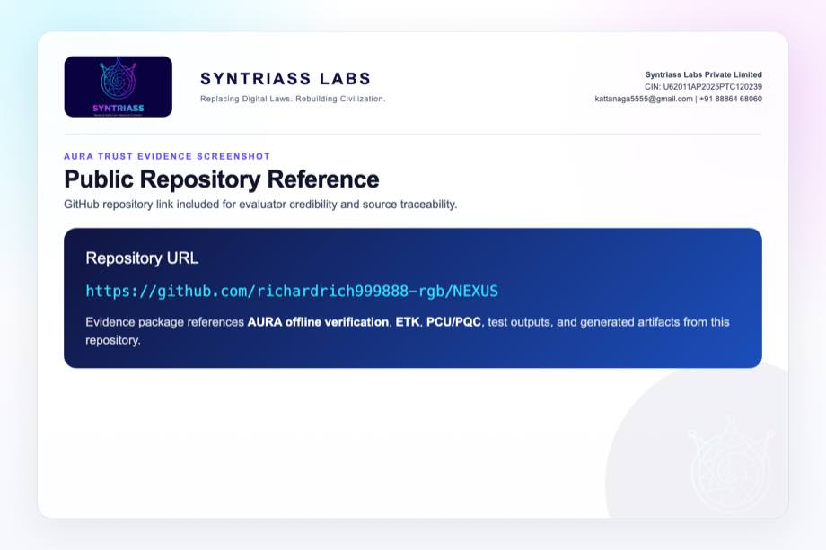

```{=typst}
#pagebreak()
```

## Evidence Page 6 - Fresh Test Output

Purpose: show that AURA Trust packet checks, PCU/PQC tests, and ETK tests were run locally before proposal packaging.

Status: test output screenshot embedded.

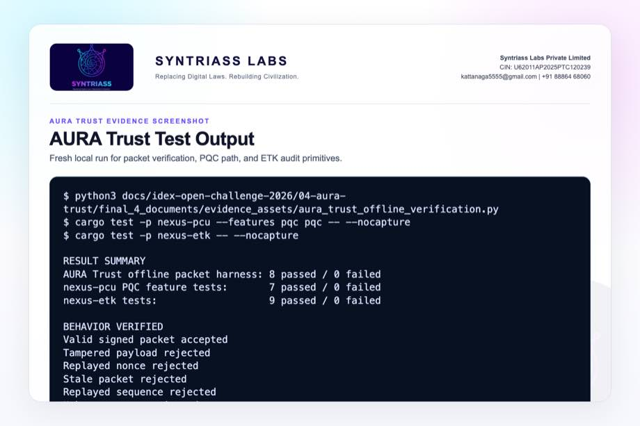

```{=typst}
#pagebreak()
```

## Evidence Page 7 - Mission Packet Schema

Evidence source: `aura_trust_offline_verification.py`

Purpose: show source, payload, timestamp, nonce, sequence, provenance, policy, and signature fields.

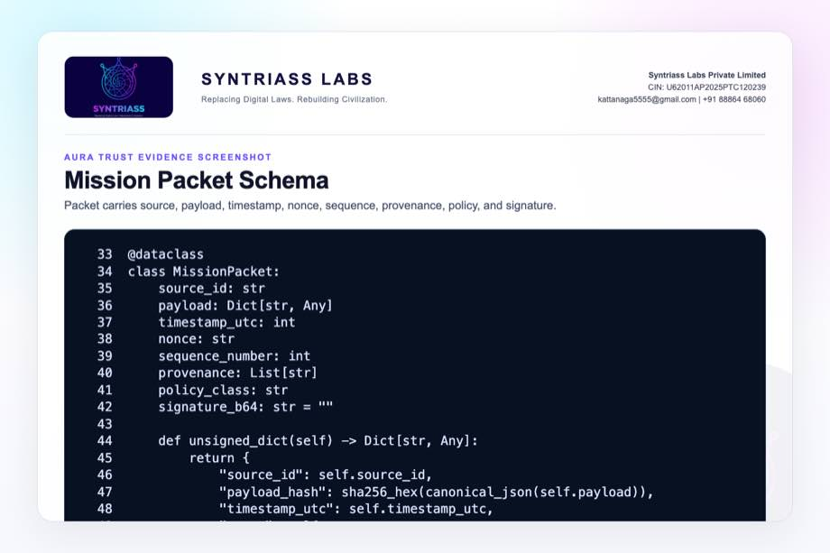

```{=typst}
#pagebreak()
```

## Evidence Page 8 - Offline Trust Store

Evidence source: `aura_trust_offline_verification.py`

Purpose: show local public keys, nonce memory, and sequence memory.

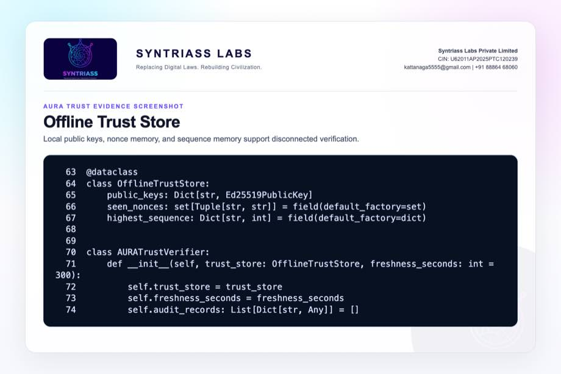

```{=typst}
#pagebreak()
```

## Evidence Page 9 - Replay and Freshness Gates

Evidence source: `aura_trust_offline_verification.py`

Purpose: show unknown-source, stale-packet, nonce replay, and sequence replay rejection.

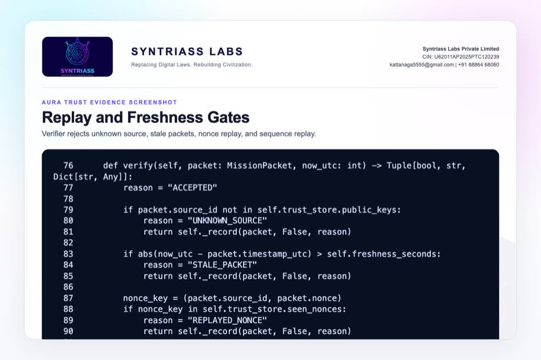

```{=typst}
#pagebreak()
```

## Evidence Page 10 - Signature Verification

Evidence source: `aura_trust_offline_verification.py`

Purpose: show verification of source signature before packet acceptance.

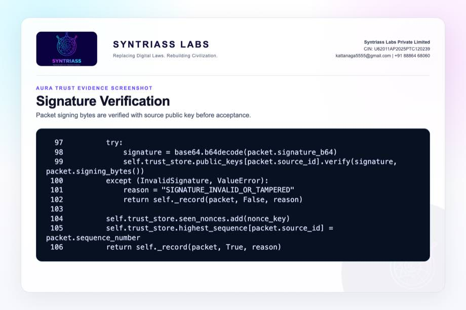

```{=typst}
#pagebreak()
```

## Evidence Page 11 - ETK-Compatible Audit Record

Evidence source: `aura_trust_offline_verification.py`

Purpose: show packet hash, payload hash, provenance root, policy ref, result, reason, and audit hash.


```{=typst}
#pagebreak()
```

## Evidence Page 12 - Mission Packet Builder

Evidence source: `aura_trust_offline_verification.py`

Purpose: show demo mission payload, provenance chain, policy class, and signing path.

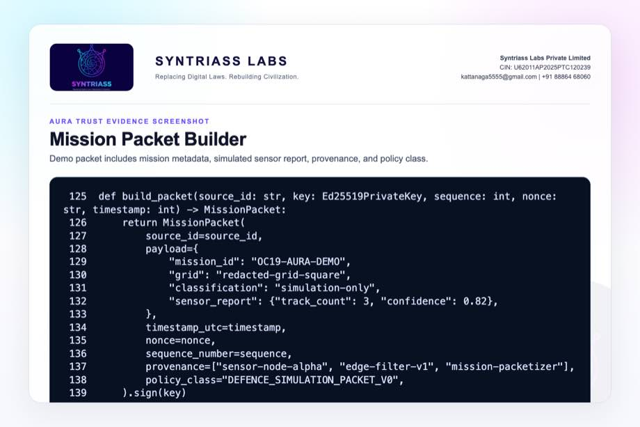

```{=typst}
#pagebreak()
```

## Evidence Page 13 - Acceptance and Tamper Tests

Evidence source: `aura_trust_offline_verification.py`

Purpose: show valid packet acceptance and modified-payload rejection.

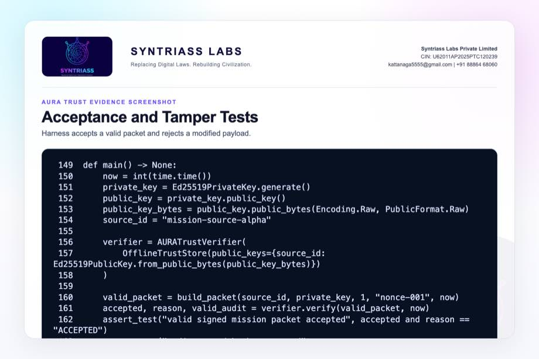

```{=typst}
#pagebreak()
```

## Evidence Page 14 - Replay, Stale, and Unknown-Source Tests

Evidence source: `aura_trust_offline_verification.py`

Purpose: show replay nonce, stale timestamp, old sequence, and unknown source rejection tests.

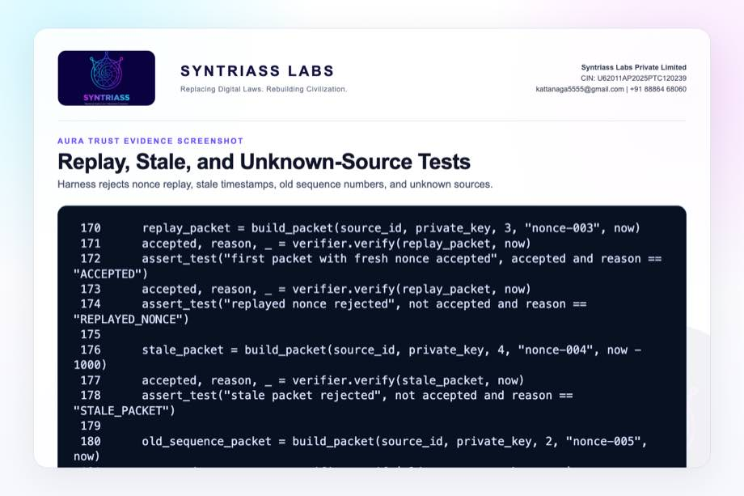

```{=typst}
#pagebreak()
```

## Evidence Page 15 - Existing AURA Offline Verifier

Evidence source: `src/network/offline.py`

Purpose: show current AURA offline verification direction and early-stage caveat.

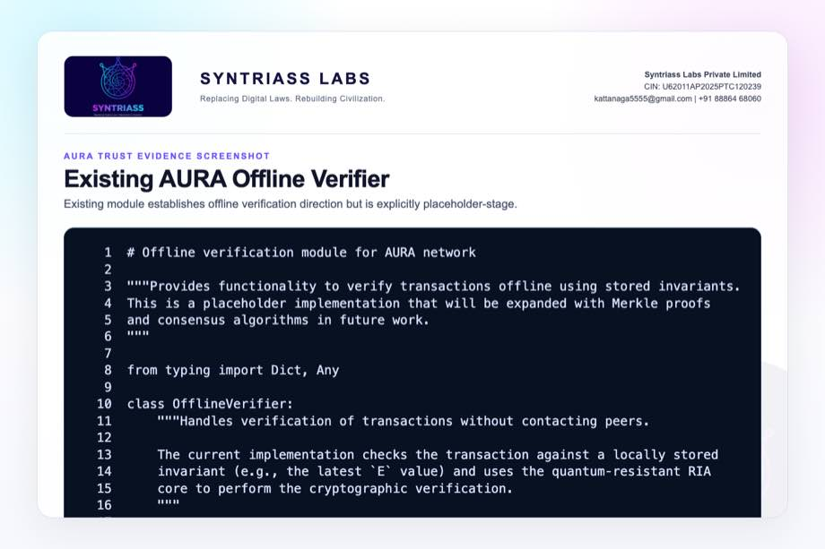

```{=typst}
#pagebreak()
```

## Evidence Page 16 - AURA RIA Signature Container

Evidence source: `src/core/ria.py`

Purpose: show current AURA signature container fields including timestamp, nonce, network, and metadata.


```{=typst}
#pagebreak()
```

## Evidence Page 17 - AURA RIA Transaction Verification

Evidence source: `src/core/ria.py`

Purpose: show transaction message reconstruction, signature recomputation, timestamp check, and invariant update.


```{=typst}
#pagebreak()
```

## Evidence Page 18 - ETK Event Schema

Evidence source: `nexus-etk/src/schema.rs`

Purpose: show canonical execution-event fields and deterministic event ID computation.


```{=typst}
#pagebreak()
```

## Evidence Page 19 - ETK Proof Schema

Evidence source: `nexus-etk/src/schema.rs`

Purpose: show canonical proof fields and signing bytes.


```{=typst}
#pagebreak()
```

## Evidence Page 20 - ETK Hash-Chained Events

Evidence source: `nexus-etk/src/chain.rs`

Purpose: show append-only event chain invariants and event append checks.

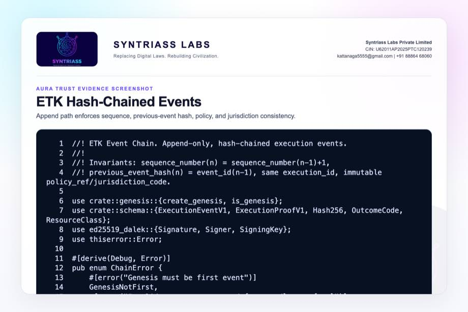

```{=typst}
#pagebreak()
```

## Evidence Page 21 - ETK Finalize and Sign

Evidence source: `nexus-etk/src/chain.rs`

Purpose: show proof finalization and signature over canonical signing bytes.

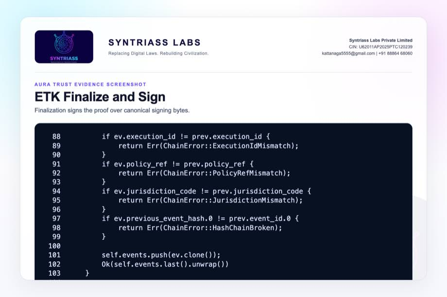

```{=typst}
#pagebreak()
```

## Evidence Page 22 - ETK Offline Verifier

Evidence source: `nexus-etk/src/verifier.rs`

Purpose: show offline verification phases for schema, signature, chain, time, policy, and outcome checks.

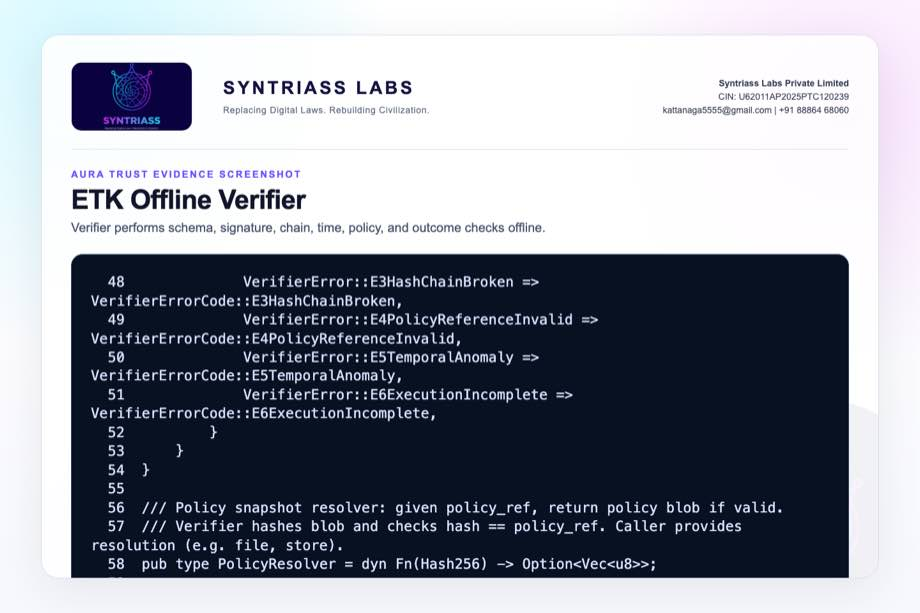

```{=typst}
#pagebreak()
```

## Evidence Page 23 - PCU Execution Proof

Evidence source: `nexus-pcu/src/proof.rs`

Purpose: show proof fields binding PCU hash, input hashes, code hash, output hash, metrics, and attestation.


```{=typst}
#pagebreak()
```

## Evidence Page 24 - PCU Unit Structure

Evidence source: `nexus-pcu/src/pcu.rs`

Purpose: show self-contained computation unit fields used by downstream proof and identity paths.

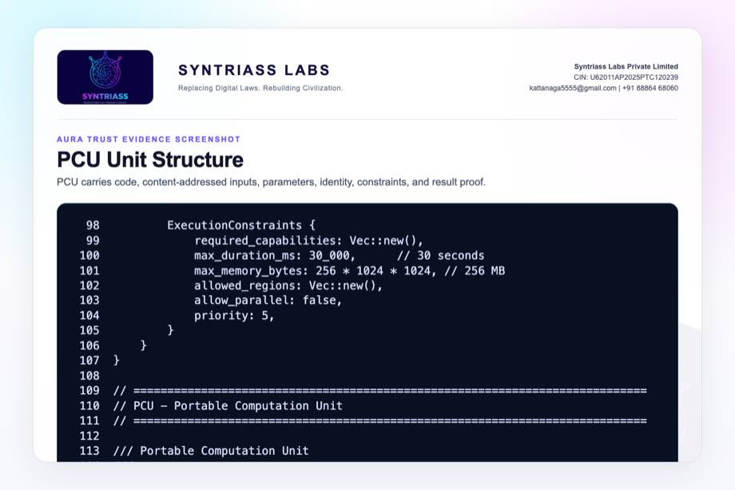

```{=typst}
#pagebreak()
```

## Evidence Page 25 - PQC Hybrid Signature Path

Evidence source: `nexus-pcu/src/pqc.rs`

Purpose: show hybrid signature structure and verification path.

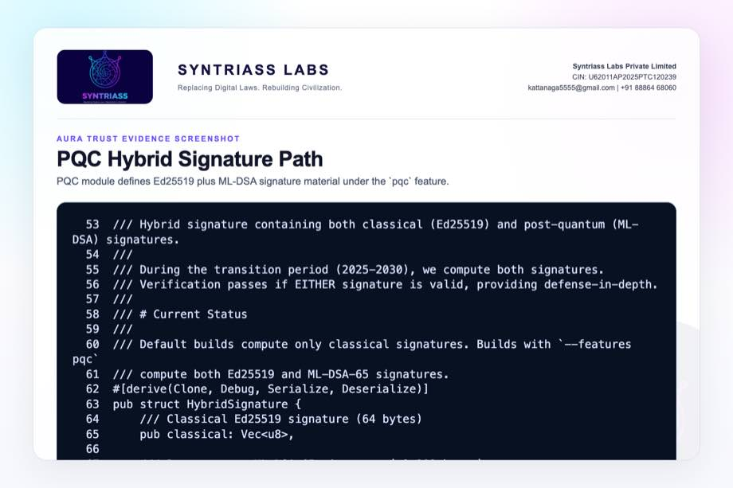

```{=typst}
#pagebreak()
```

## Evidence Page 26 - PQC Keypair and Public Bundle

Evidence source: `nexus-pcu/src/pqc.rs`

Purpose: show hybrid keypair signing and public key bundle verification.

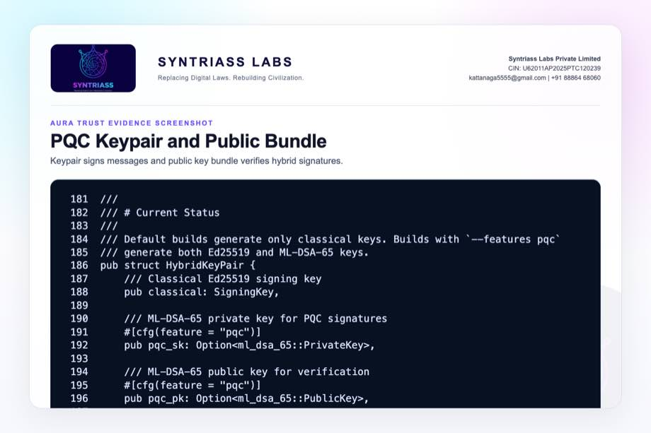

```{=typst}
#pagebreak()
```

## Evidence Page 27 - PQC Feature Tests

Evidence source: `nexus-pcu/src/pqc.rs`

Purpose: show feature-gated tests for key generation, signing, serialization, bundle verification, size, and PQC fallback.

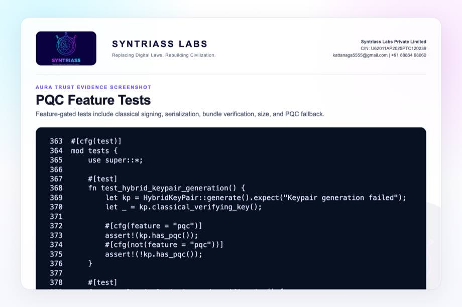

```{=typst}
#pagebreak()
```

## Evidence Page 28 - Reviewer Repository Map

Purpose: give panel reviewers a direct navigation map.

| Review Area | Path |
| --- | --- |
| Final proposal package | `docs/idex-open-challenge-2026/04-aura-trust/final_4_documents/` |
| Screenshot assets | `docs/idex-open-challenge-2026/04-aura-trust/final_4_documents/evidence_assets/` |
| Packet harness | `docs/idex-open-challenge-2026/04-aura-trust/final_4_documents/evidence_assets/aura_trust_offline_verification.py` |
| AURA offline verifier | `src/network/offline.py` |
| AURA RIA core | `src/core/ria.py` |
| ETK source | `nexus-etk/src/` |
| PCU/PQC source | `nexus-pcu/src/` |

```{=typst}
#pagebreak()
```

## Evidence Page 29 - Claim-to-File Location Map

| Proposal Claim | Source Evidence |
| --- | --- |
| Packet schema exists in evidence harness | `aura_trust_offline_verification.py`, `MissionPacket` |
| Payload hash binds content | `MissionPacket.unsigned_dict()` |
| Source signature verification exists | `AURATrustVerifier.verify()` |
| Stale packet rejection exists | `STALE_PACKET` check |
| Nonce replay rejection exists | `REPLAYED_NONCE` check |
| Sequence rollback rejection exists | `REPLAYED_SEQUENCE` check |
| Audit record emission exists | `_record()` in evidence harness |
| ETK canonical audit primitives exist | `nexus-etk/src/schema.rs`, `chain.rs`, `verifier.rs` |
| PQC migration path exists | `nexus-pcu/src/pqc.rs` |

```{=typst}
#pagebreak()
```

## Evidence Page 30 - Test and Command Locations

| Test Area | Command / File |
| --- | --- |
| Packet-level offline verification | `python3 docs/idex-open-challenge-2026/04-aura-trust/final_4_documents/evidence_assets/aura_trust_offline_verification.py` |
| PCU PQC feature tests | `cargo test -p nexus-pcu --features pqc pqc -- --nocapture` |
| ETK audit primitive tests | `cargo test -p nexus-etk -- --nocapture` |
| Combined output artifact | `evidence_assets/aura_trust_test_output.txt` |
| Evidence screenshot generator | `generate_aura_trust_evidence_screenshots.mjs` |
| PDF builder | `build_syntriass_letterhead_problem4.mjs` |

```{=typst}
#pagebreak()
```

## Evidence Page 31 - Generated Artifact Locations

| Artifact Type | Location |
| --- | --- |
| Annexure 1 PDF | `01_SYNTRIASS_AURA_Trust_Annexure_1_Applicant_Details_and_Solution_Summary.pdf` |
| Annexure 2 PDF | `02_SYNTRIASS_AURA_Trust_Annexure_2_Technical_Architecture.pdf` |
| Annexure 3 PDF | `03_SYNTRIASS_AURA_Trust_Annexure_3_Advantages_and_Competencies.pdf` |
| Annexure 4 PDF | `04_SYNTRIASS_AURA_Trust_Annexure_4_Supporting_Evidence_and_Screenshots.pdf` |
| DOCX files | Same directory, matching `.docx` names. |
| Rendered HTML | `final_4_documents/html/` |
| Evidence screenshots | `final_4_documents/evidence_assets/*.jpg` |
| Test output | `final_4_documents/evidence_assets/aura_trust_test_output.txt` |

```{=typst}
#pagebreak()
```

## Evidence Page 32 - Screenshot Artifact Index

| Screenshot | File |
| --- | --- |
| GitHub repository | `evidence_assets/01_github_repository.jpg` |
| Fresh test output | `evidence_assets/02_test_output.jpg` |
| Mission packet schema | `evidence_assets/03_packet_schema.jpg` |
| Offline trust store | `evidence_assets/04_trust_store.jpg` |
| Replay/freshness gates | `evidence_assets/05_replay_freshness_gates.jpg` |
| Signature verification | `evidence_assets/06_signature_verification.jpg` |
| Audit record | `evidence_assets/07_audit_record.jpg` |
| Packet builder | `evidence_assets/08_packet_builder.jpg` |
| Harness tests | `evidence_assets/09_accept_tamper_tests.jpg`, `10_replay_stale_tests.jpg` |
| AURA current modules | `evidence_assets/11_existing_offline_verifier.jpg` through `13_ria_transaction_verify.jpg` |
| ETK screenshots | `evidence_assets/14_etk_event_schema.jpg` through `18_etk_verifier_phases.jpg` |
| PCU/PQC screenshots | `evidence_assets/19_pcu_execution_proof.jpg` through `23_pqc_tests.jpg` |

```{=typst}
#pagebreak()
```

## Evidence Page 33 - Defence Problem to Evidence Map

| Defence Problem | AURA Trust Control | Evidence |
| --- | --- | --- |
| Tampered mission data | Payload hash plus signature verification | Evidence pages 7, 10, 13. |
| Replay attack | Nonce memory and sequence memory | Evidence pages 8, 9, 14. |
| Stale data | Timestamp freshness profile | Evidence pages 9, 14. |
| Unknown source | Offline public-key trust bundle | Evidence pages 8, 14. |
| Weak auditability | ETK-compatible decision record | Evidence pages 11, 18-22. |
| Quantum transition | PCU hybrid Ed25519 plus ML-DSA feature path | Evidence pages 25-27. |

```{=typst}
#pagebreak()
```

## Evidence Page 34 - Prototype Work Package Locations

| Work Package | Existing Starting Point |
| --- | --- |
| Mission packet schema | `aura_trust_offline_verification.py`, `MissionPacket` |
| Offline trust store | `OfflineTrustStore` in evidence harness |
| Replay/freshness logic | `AURATrustVerifier.verify()` |
| Audit export | `_record()` in evidence harness |
| AURA current verifier direction | `src/network/offline.py` |
| ETK binding | `nexus-etk/src/schema.rs`, `chain.rs`, `verifier.rs` |
| PCU/PQC migration | `nexus-pcu/src/pqc.rs` |

```{=typst}
#pagebreak()
```

## Evidence Page 35 - Panel Review Checklist

| Reviewer Question | Where To Check |
| --- | --- |
| Is there real packet-level behavior? | Evidence pages 7-14 and output file `aura_trust_test_output.txt`. |
| Were tests actually run? | Evidence page 6 and test output file in `evidence_assets/`. |
| Is this accredited as a secure information platform? | No. Caveats on pages 1, 4, and 36. |
| Is PQC packet enforcement complete? | No. PQC is currently a validated migration path, not packet-level enforcement. |
| Does ETK already provide audit primitives? | Evidence pages 18-22. |
| Is the GitHub repository identified? | Evidence page 5 and repository coordinate page 37. |
| Are artifact locations included? | Evidence pages 28-32. |

```{=typst}
#pagebreak()
```

## Evidence Page 36 - Readiness Statement and Caveats

| Area | Position |
| --- | --- |
| Software subsystem readiness | Current evidence supports software subsystem TRL 3-4. |
| Packet-level behavior | Harness demonstrates accept/reject/audit behavior for simulation packets. |
| Current AURA module | Existing offline verifier is early-stage and requires hardening. |
| ETK audit path | ETK primitives pass tests and can be integrated into AURA Trust. |
| PQC path | PCU PQC feature tests pass; packet-level enforcement remains proposed work. |
| Secure information platform claim | Not claimed until key lifecycle, revocation, accreditation, and deployment hardening are complete. |
| Operational use | Human approval, network policy, key authority, and service-specific controls remain required. |

```{=typst}
#pagebreak()
```

## Evidence Page 37 - Declaration and Repository Coordinates

Declaration:

AURA Trust is submitted as a software-subsystem prototype for offline mission information provenance and verification evaluation.

Repository coordinates:

- Public repository: `https://github.com/richardrich999888-rgb/NEXUS`
- Proposal folder: `docs/idex-open-challenge-2026/04-aura-trust/`
- Final documents: `docs/idex-open-challenge-2026/04-aura-trust/final_4_documents/`
- Evidence assets: `docs/idex-open-challenge-2026/04-aura-trust/final_4_documents/evidence_assets/`
- Test output: `docs/idex-open-challenge-2026/04-aura-trust/final_4_documents/evidence_assets/aura_trust_test_output.txt`
- Packet harness: `docs/idex-open-challenge-2026/04-aura-trust/final_4_documents/evidence_assets/aura_trust_offline_verification.py`

Submission caveat:

- The package is prepared for prototype review and iDEX-funded validation planning.
- No classified-network deployment, secure information platform accreditation, or operational authority is claimed.
- Key lifecycle, revocation bundles, hardware security modules, and service-specific information policies remain required for operational use.
