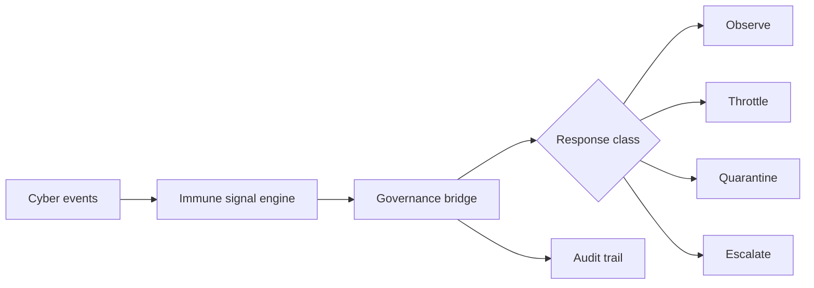

# Annexure - 2

Preferably on Company's letterhead (if available)

# 1. Proposed Technical Solution (Detailed)

## Technical Architecture & Approach

Cyber Immune SOAR converts cyber telemetry into immune threat signals and governance-controlled response actions. It provides autonomous containment while preserving policy limits and auditability.

## Official Problem Alignment and Scope Boundary

This proposal maps to DISC 14 cyber demand signals including network monitoring, secure information exchange, and cyber deception, with adjacency to ADITI 4 EW/OSINT-style high-volume event analysis. It is intentionally separate from the existing ADITI PS24 space-domain submission. The technical scope here is cyber event response: event-to-signal conversion, threat memory, governed containment classes, trust reduction, and audit/replay.

| Component | Role |
| --- | --- |
| Event ingestor | Accepts simulated logs, endpoint alerts, service events, and agent behavior signals |
| Immune signal engine | Converts events into threat, novelty, confidence, and severity scores |
| Reputation layer | Updates trust for agents, services, or identities associated with an event |
| Governance bridge | Selects observe, throttle, quarantine, or escalate response under policy |
| PQC event/audit profile | Uses `nexus-pcu` hybrid Ed25519 plus ML-DSA path for selected event and response records |
| Response executor | Runs bounded containment actions in simulation |
| Audit trail | Records event, signal, governance decision, action, and result |

## Innovation

The innovation is combining immune-style anomaly handling with governed cyber response. The system is designed to avoid unconstrained automation by requiring response actions to pass through policy classes.

## Implementation & Feasibility

Existing AGP immune bridge, immune system, unified immune, and multi-agent governance tests provide the software basis. The iDEX work will package these into a SOAR-style prototype with event adapters, scenario library, PQC event/audit signing, bounded response actions, CI evidence, and audit dashboard.

## Challenges & Mitigation

| Challenge | Mitigation |
| --- | --- |
| Unsafe autonomous response | Use policy-bounded response classes and human-escalation thresholds |
| False positives disrupting services | Start with observe/throttle modes and require confidence thresholds for quarantine |
| Limited telemetry realism | Build scenario library and allow evaluator-provided samples |
| Audit gaps | Persist every event-to-action decision with reason codes, PQC signature metadata, and replay support |

## Visuals & Supporting Data

## Any Other Relevant Details

Initial demos should use simulated cyber events. Live SOC integration, realistic telemetry feeds, PQC-signed audit validation, and threshold calibration are proposed work. TRL 5 should be claimed only after relevant-environment SOC simulation and evaluator replay are complete.
