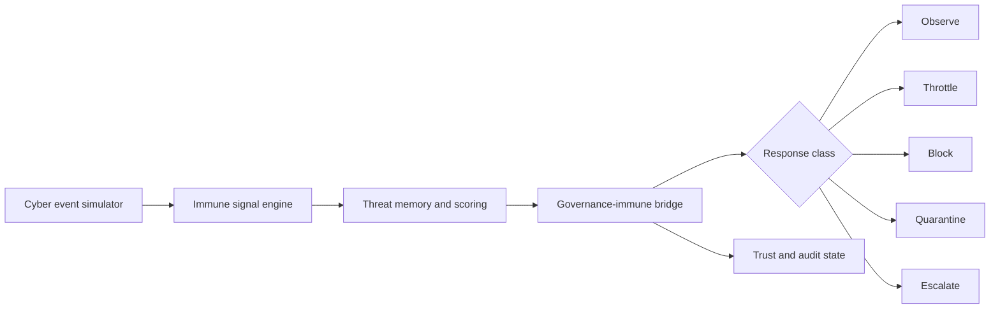

# IDEX OPEN CHALLENGE SUBMISSION

# Annexure-2

Technical architecture and implementation approach

| CIN | PAN | TAN |
| --- | --- | --- |
| U62011AP2025PTC120239 | ABQCS7152R | VPNS31351F |

| Applicant Entity | Contact |
| --- | --- |
| Syntriass Labs Private Limited | kattanaga5555@gmail.com |
| 12-50, SLV Market, 12 Ward, Dharmavaram, Ananthapur - 515671, Andhra Pradesh, India | +91 88864 68060 |

# Technical Architecture and Feasibility

## 1. Problem Statement

Defence networks, mission software, robotic services, and agentic systems produce more security events than analysts can manually triage. Existing SOAR tools can automate playbooks, but a defence setting requires stronger constraints: response actions must be bounded, auditable, reversible where possible, and escalated when consequence is high.

Cyber Immune SOAR addresses this as a governed response problem. The prototype asks: what event occurred, what agent or service is involved, what severity and confidence are assigned, whether the event resembles known threats, whether multiple agents are defecting together, what response is permitted by policy, and what audit evidence explains the action.

## 2. Technical Objective

| Objective | Implementation Mechanism |
| --- | --- |
| Convert cyber events into immune signals | ThreatSignal and DefectionSignal schema. |
| Bound automated response | GovernanceImmuneBridge maps severity to monitor, throttle, block, quarantine, or escalation. |
| Detect coordinated compromise | Defection signal carries involved agents, defection type, evidence score, and pattern. |
| Reduce trust after suspicious action | Trust score reduction and propagation logic. |
| Preserve reviewability | Status, threat breakdown, and recorded test output. |
| Improve future detection | Unified immune system stores known threat vectors and checks similarity. |

## 2A. Official Problem Pull and Scope Boundary

Cyber Immune SOAR is positioned as an Open Challenge proposal because cyber defence response cuts across official network-monitoring, secure-information, cyber-deception, EW, and intelligence-support problem areas. The proposal is deliberately scoped as a governed software prototype, not a claim of live SOC authority.

| Alignment Area | Defence Pull | Cyber Immune SOAR Scope | Explicit Non-Duplication Boundary |
| --- | --- | --- | --- |
| DISC 14 cyber problem areas | Network monitoring, secure information exchange, and cyber deception problem areas indicate demand for faster event triage and bounded response. | Demonstrate event-to-immune-signal conversion, threat memory, trust reduction, quarantine classes, and audit evidence. | Does not propose a space-domain training, surveillance, or operations tool under PS24. |
| ADITI 4 EW / OSINT-adjacent problem areas | Cognitive EW and AI-assisted intelligence workflows create large event streams requiring anomaly detection and governed response. | Use simulated cyber events and policy-bounded response classes before any operational integration is claimed. | Does not reuse PS24 datasets, operational scenarios, or space-domain deliverables. |
| Open Challenge route | The gap is a cross-cutting cyber assurance problem rather than a single endpoint product. | Deliver a 12-month software prototype with simulator, governance bridge, PQC event/audit signing profile, dashboard/replay, and validation report. | Current evidence remains software-subsystem TRL 3-4; TRL 5 is an exit target after relevant-environment validation. |

```{=typst}
#pagebreak()
```

## 3. High-Level Architecture



## 4. Component Map

| Component | Repository Location | Role In Prototype |
| --- | --- | --- |
| Governance-immune bridge | `agp-core/src/immunity/governance_bridge.py` | Maps threat and defection signals into response actions. |
| Artificial immune system | `agp-core/src/immunity/immune_system.py` | Provides innate/adaptive/memory-style threat scanning. |
| Unified immune system | `agp-core/src/immunity/unified.py` | Integrates immune scan, governance action, AHES, and TELOS response boundary. |
| Anomaly detector | `agp-core/src/governance/anomaly.py` | Detects behavioral drift, sudden shift, category shift, frequency spike, and high-risk patterns. |
| Bridge evidence test | `agp-core/tests/test_immune_bridge.py` | Tests low/high/critical threat, defection, trust, suppression, and status flows. |
| Immune pytest suites | `agp-core/tests/immunity/test_immune_system.py`, `agp-core/tests/immunity/test_unified_immune.py` | Unit and integration tests for immune components. |
| Governance simulation | `agp-core/tests/test_multi_agent_governance.py` | Simulates 12 agents across task success, collaboration, risk, ethics, anomaly, and ranking behavior. |
| Test output artifact | `docs/idex-open-challenge-2026/05-cyber-immune-soar/final_4_documents/evidence_assets/cyber_immune_soar_test_output.txt` | Fresh local results used in Annexure 4. |

```{=typst}
#pagebreak()
```

## 5. Cyber Event Model

The iDEX prototype will use controlled simulation events before live network or endpoint integration. This avoids overstating readiness while still demonstrating the decision logic.

| Event Class | Example Signal | Intended Response Class |
| --- | --- | --- |
| Suspicious process behavior | Unexpected execution or privilege-like behavior in simulation | Monitor or throttle based on confidence. |
| Service anomaly | Unusual service activity rate or category shift | Monitor, throttle, or escalate. |
| Policy violation | Action outside permitted service role | Block or escalate. |
| Compromised agent indicator | High-confidence takeover or alignment violation signal | Block or quarantine. |
| Coordinated defection | Multiple agents showing collusion pattern | Multi_quarantine and trust reduction. |
| Maintenance exception | Known update window where signal suppression is allowed | Temporarily suppress with restoration record. |

## 6. Immune Signal Schema

ThreatSignal captures one agent/service threat. DefectionSignal captures multi-agent behavior.

| Field | Purpose |
| --- | --- |
| `agent_id` | Service, endpoint, or agent identifier under monitoring. |
| `threat_level` | NONE, LOW, MEDIUM, HIGH, or CRITICAL. |
| `threat_type` | Event class such as anomaly, alignment violation, takeover attempt, or policy violation. |
| `confidence` | Numeric evidence confidence between 0.0 and 1.0. |
| `details` | Scenario-specific evidence and metadata. |
| `antibody_match` | Immune matching score. |
| `tcell_activation` | Adaptive response activation score. |
| `memory_hit` | Whether the signal resembles a stored threat pattern. |

```{=typst}
#pagebreak()
```

## 7. Governance Response Flow

1. Receive event from simulator or future SIEM/SOAR adapter.
2. Convert event into ThreatSignal or DefectionSignal.
3. Check whether immune response is suppressed for maintenance.
4. Store active threat and compute response class.
5. Return monitor, throttle, block, quarantine, multi_quarantine, or escalation action.
6. Update trust when defection evidence is present.
7. Record status and evidence for reviewer replay.

| Threat Level | Current Response Mapping |
| --- | --- |
| NONE | No action. |
| LOW | Monitor and increase logging. |
| MEDIUM | Throttle with 50 percent rate limit for bounded duration. |
| HIGH | Block actuators/equivalent high-consequence interfaces and escalate to human. |
| CRITICAL | Quarantine, disconnect from mesh, freeze resources, and escalate. |

## 8. Multi-Agent Defection Handling

The bridge treats coordinated compromise differently from a single anomaly. DefectionSignal carries the agents involved, defection type, evidence score, and coordination pattern. The current code reduces trust for all involved agents and returns a multi_quarantine action.

| Defection Scenario | Prototype Evidence |
| --- | --- |
| Collusion | `test_immune_bridge.py` creates two colluder agents and verifies multi_quarantine. |
| Trust reduction | Same test confirms trust decreases for both colluders. |
| Trust propagation | Same test confirms trust propagation changes score toward trusted peer. |
| Status reporting | Bridge status includes active threats, defection signals, tracked agents, suppression state, and threat breakdown. |

```{=typst}
#pagebreak()
```

## 9. Unified Immune System Integration

The unified immune module adds a single entry point around immune scan, governance bridge, AHES stress coupling, and TELOS consequence boundary. For the iDEX prototype this becomes the response decision core used by the SOAR-style event loop.

| Stage | Mechanism |
| --- | --- |
| Behavior normalization | Input vectors are padded/truncated for internal model use. |
| AIS scan | ArtificialImmuneSystem returns diagnostics for threat type, severity, memory hit, and response time. |
| Known-threat match | Stored threat vectors are compared using cosine similarity. |
| Threat score | Weighted combination of innate and adaptive scores. |
| Severity classification | BENIGN, LOW, MEDIUM, HIGH, or CRITICAL. |
| Governance action | Severity is routed to ThreatSignal and bridge response mapping. |
| Status output | Scans performed, threats detected, quarantines issued, detection rate, and enabled integrations. |

## 10. Audit and Review Design

The prototype will record a structured event-to-action trail for every simulation event. This is required because defence reviewers need to inspect not only whether the system acted, but why it acted and what evidence supported that action.

| Audit Field | Purpose |
| --- | --- |
| `event_id` | Stable identifier for input event. |
| `agent_id` | Affected service or software agent. |
| `event_type` | Simulator class or adapter class. |
| `threat_level` | NONE to CRITICAL. |
| `confidence` | Evidence confidence score. |
| `governance_action` | Monitor, throttle, block, quarantine, multi_quarantine, or escalate. |
| `trust_delta` | Reputation impact where applicable. |
| `reason_code` | Human-readable reason for decision. |
| `timestamp` | Review and replay ordering. |

## 10A. PQC Event and Audit Hardening

Cyber Immune SOAR will include a PQC transition profile using the repository's `nexus-pcu` hybrid Ed25519 plus ML-DSA path. The current prototype records event-to-action evidence in software. The proposed hardening work signs selected event/audit packets with hybrid signatures, verifies the PQC feature path in CI, and includes signature metadata in evaluator replay.

| PQC Work Item | Implementation Target |
| --- | --- |
| Hybrid event signature | Sign selected cyber event, immune signal, and response-decision records through `nexus-pcu::HybridSignature`. |
| Identity bundle | Bind service/agent ID to classical and optional PQC verification material. |
| Replay verification | Verify audit packets offline during dashboard/replay review. |
| TRL 5 evidence | Include PQC verification output, event replay, and relevant-environment SOC simulation evidence. |

```{=typst}
#pagebreak()
```

## 11. Tests Conducted Before Packaging

| Test / Check | Command | Fresh Result |
| --- | --- | --- |
| Governance-immune bridge | `agp-core/.venv/bin/python agp-core/tests/test_immune_bridge.py` | 19 passed, 0 failed. |
| Immune pytest suites | `agp-core/.venv/bin/python -m pytest agp-core/tests/immunity/test_immune_system.py agp-core/tests/immunity/test_unified_immune.py -q` | 54 passed, 0 failed. |
| Multi-agent governance simulation | `agp-core/.venv/bin/python agp-core/tests/test_multi_agent_governance.py` | Completed successfully. |

## 12. Risks and Mitigations

| Risk | Impact | Mitigation |
| --- | --- | --- |
| False positives | Incorrect quarantine could disrupt a mission service. | Start with monitor/throttle, require higher confidence for quarantine, add reviewer override. |
| Unsafe automated action | Automated response may exceed intended authority. | Enforce response classes and human escalation for HIGH/CRITICAL scenarios. |
| Telemetry realism gap | Simulation may not cover operational network behavior. | Add evaluator-provided event samples and staged SIEM adapter. |
| Evasion by adversary | Known threat patterns may be bypassed. | Combine memory matching, anomaly drift detection, and continuous scenario expansion. |
| Audit persistence not hardened | Logs may not satisfy operational evidence requirements. | Add signed audit records, durable store, and export bundle under iDEX. |
| Live SOC integration not done | Cannot claim production SOAR replacement. | Position as prototype and integrate through controlled adapters after evaluator approval. |

```{=typst}
#pagebreak()
```

## 13. Prototype Demonstration Plan

| Demo Step | What The Evaluator Sees |
| --- | --- |
| Start event simulator | Controlled cyber events enter the system. |
| Low threat event | System returns monitor and tracks active threat. |
| Medium threat event | System returns throttle with rate limit and duration. |
| High threat event | System returns block and human escalation. |
| Critical event | System returns quarantine, mesh disconnect, resource freeze, and escalation. |
| Collusion event | Two agents receive multi_quarantine and trust reduction. |
| Clear event | Threat state is cleared after simulated resolution. |
| Maintenance window | Suppression prevents response during controlled update, then restores. |
| Dashboard/replay | Reviewer inspects event, signal, action, status, and reason code. |

## 14. Readiness Statement

Cyber Immune SOAR is feasible for a 12-month iDEX prototype because the repository already contains the governance-immune bridge, artificial immune system, unified immune integration, anomaly detector, and executed tests covering bridge behavior, immune components, and multi-agent governance simulation.

No live SOC deployment, endpoint quarantine authority, classified-network certification, or operational cyber-response accreditation is claimed in this submission.
