# IDEX OPEN CHALLENGE SUBMISSION

# Annexure-4

Supporting evidence, screenshots, repository locations, and artifact map

| CIN | PAN | TAN |
| --- | --- | --- |
| U62011AP2025PTC120239 | ABQCS7152R | VPNS31351F |

| Applicant Entity | Contact |
| --- | --- |
| Syntriass Labs Private Limited | kattanaga5555@gmail.com |
| 12-50, SLV Market, 12 Ward, Dharmavaram, Ananthapur - 515671, Andhra Pradesh, India | +91 88864 68060 |

# Supporting Evidence and Screenshots

## Company Identification Details

| Field | Details |
| --- | --- |
| Legal Entity Name | Syntriass Labs Private Limited |
| CIN | U62011AP2025PTC120239 |
| PAN | ABQCS7152R |
| TAN | VPNS31351F |
| Registered Office | 12-50, SLV Market, 12 Ward, Dharmavaram, Ananthapur - 515671, Andhra Pradesh, India |
| Contact Email | kattanaga5555@gmail.com |
| Contact Phone | +91 88864 68060 |
| GitHub Repository | `https://github.com/richardrich999888-rgb/NEXUS` |
| Submission Date | 17 May 2026 |

## 1. Applicant Resume Format

Applicant: K. Naga Sri Ganesh  
Company: Syntriass Labs Private Limited  
Role: Founder / Inventor  
Relevant focus: governed autonomy, immune cyber defence, multi-agent trust, anomaly scoring, auditability, and defence-oriented response assurance.

## 2. Prototype Evidence List

| Evidence Item | Repository / Artifact Location |
| --- | --- |
| Governance-immune bridge | `agp-core/src/immunity/governance_bridge.py` |
| Artificial immune system | `agp-core/src/immunity/immune_system.py` |
| Unified immune system | `agp-core/src/immunity/unified.py` |
| Governance anomaly detector | `agp-core/src/governance/anomaly.py` |
| Bridge test | `agp-core/tests/test_immune_bridge.py` |
| Immune pytest suites | `agp-core/tests/immunity/test_immune_system.py`, `agp-core/tests/immunity/test_unified_immune.py` |
| Multi-agent governance simulation | `agp-core/tests/test_multi_agent_governance.py` |
| Fresh test output | `docs/idex-open-challenge-2026/05-cyber-immune-soar/final_4_documents/evidence_assets/cyber_immune_soar_test_output.txt` |
| Evidence screenshots | `docs/idex-open-challenge-2026/05-cyber-immune-soar/final_4_documents/evidence_assets/` |
| Final documents | `docs/idex-open-challenge-2026/05-cyber-immune-soar/final_4_documents/` |

## 2A. Official Problem Alignment Evidence

| Evidence Item | Reviewer Use | Location / Source |
| --- | --- | --- |
| Open Challenge fit | Confirms the proposal is a standalone governed cyber-response prototype. | iDEX Open Challenge route; local package under `docs/idex-open-challenge-2026/05-cyber-immune-soar/`. |
| DISC 14 cyber adjacency | Shows relevance to network monitoring, secure information exchange, and cyber deception problem areas. | Alignment summarized in Annexure 1 and Annexure 2; technical evidence in `agp-core/src/immunity/`. |
| ADITI 4 EW / OSINT adjacency | Shows relevance to high-volume event analysis and policy-limited response in contested or intelligence-support settings. | Alignment summarized in Annexure 1 and Annexure 2; simulation evidence in `agp-core/tests/`. |
| PS24 non-duplication | Helps reviewers separate this Open Challenge product from the already submitted ADITI PS24 space-domain application. | This package is scoped to cyber event response and containment simulation, not space-domain training, surveillance, or operations. |

## 3. Validation Scope

Current validation is software-subsystem validation. The evidence supports immune bridge response behavior, immune component tests, and multi-agent governance simulation. It does not claim live SOC deployment, endpoint quarantine authority, classified network integration, operational cyber response approval, or field certification.

```{=typst}
#pagebreak()
```

## 4. Test Commands and Recorded Results

Primary commands:

```bash
agp-core/.venv/bin/python agp-core/tests/test_immune_bridge.py
agp-core/.venv/bin/python -m pytest agp-core/tests/immunity/test_immune_system.py agp-core/tests/immunity/test_unified_immune.py -q
agp-core/.venv/bin/python agp-core/tests/test_multi_agent_governance.py
```

Fresh local results:

- Governance-immune bridge: 19 passed, 0 failed.
- Immune pytest suites: 54 passed, 0 failed.
- Multi-agent governance simulation: completed successfully.
- Run date: 17 May 2026.

Tested behaviors:

- LOW threat maps to monitor and tracking.
- HIGH threat maps to block and human escalation.
- CRITICAL threat maps to quarantine and mesh disconnect.
- Multi-agent defection maps to multi_quarantine and trust reduction.
- Trust propagation, threat clearing, immune suppression, and status reporting.
- Unified immune scan, known threat training, governance action mapping, and multi-agent ranking.

```{=typst}
#pagebreak()
```

## Evidence Page 5 - Public Repository Reference

Purpose: give panel reviewers a direct path to inspect the source repository.

Status: GitHub repository reference embedded.

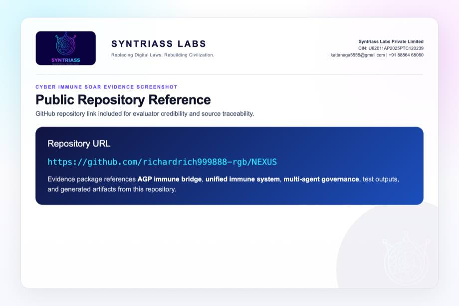

```{=typst}
#pagebreak()
```

## Evidence Page 6 - Fresh Test Output

Purpose: show that immune bridge, immune component suites, and multi-agent governance simulation were run locally before proposal packaging.

Status: test output screenshot embedded.


```{=typst}
#pagebreak()
```

## Evidence Page 7 - Threat Signal Schema

Evidence source: `agp-core/src/immunity/governance_bridge.py`

Purpose: show ThreatSignal and DefectionSignal fields used by the response flow.


```{=typst}
#pagebreak()
```

## Evidence Page 8 - Governance-Immune Bridge State

Evidence source: `agp-core/src/immunity/governance_bridge.py`

Purpose: show active threats, permissions, defection signals, trust scores, and callbacks.


```{=typst}
#pagebreak()
```

## Evidence Page 9 - Threat Action Mapping

Evidence source: `agp-core/src/immunity/governance_bridge.py`

Purpose: show mapping from NONE, LOW, MEDIUM, HIGH, and CRITICAL to response classes.


```{=typst}
#pagebreak()
```

## Evidence Page 10 - Defection Response

Evidence source: `agp-core/src/immunity/governance_bridge.py`

Purpose: show multi-agent defection handling, trust reduction, and multi_quarantine action.


```{=typst}
#pagebreak()
```

## Evidence Page 11 - Trust, Suppression, and Status Controls

Evidence source: `agp-core/src/immunity/governance_bridge.py`

Purpose: show trust propagation, direct quarantine helper, restriction helper, suppression, restoration, and status reporting.

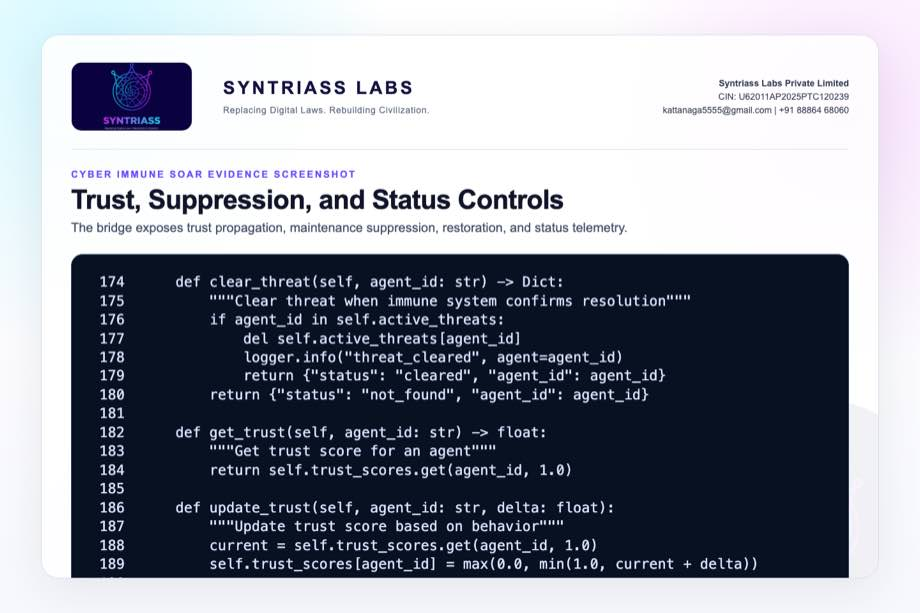

```{=typst}
#pagebreak()
```

## Evidence Page 12 - Artificial Immune System Configuration

Evidence source: `agp-core/src/immunity/immune_system.py`

Purpose: show AIS configuration for innate, adaptive, memory, T-cell, and optional swarm mode.


```{=typst}
#pagebreak()
```

## Evidence Page 13 - Immune Forward Scan

Evidence source: `agp-core/src/immunity/immune_system.py`

Purpose: show runtime scan diagnostics for threat type, severity, memory hit, and response time.


```{=typst}
#pagebreak()
```

## Evidence Page 14 - Unified Immune Architecture

Evidence source: `agp-core/src/immunity/unified.py`

Purpose: show integration of innate, adaptive, immune memory, governance bridge, AHES, and TELOS.

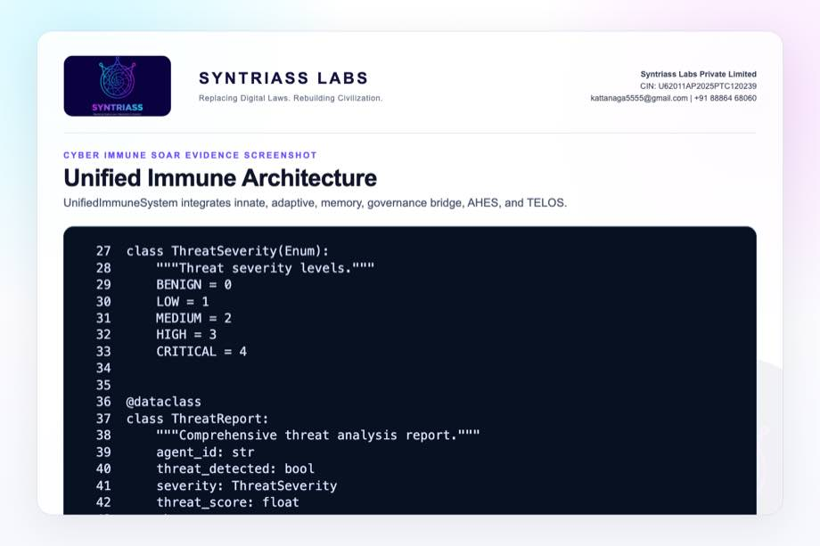

```{=typst}
#pagebreak()
```

## Evidence Page 15 - Unified Scan Flow

Evidence source: `agp-core/src/immunity/unified.py`

Purpose: show behavior-vector normalization, AIS scan, score calculation, severity classification, and governance routing.

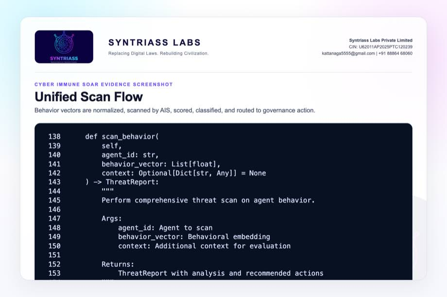

```{=typst}
#pagebreak()
```

## Evidence Page 16 - Unified Governance Mapping

Evidence source: `agp-core/src/immunity/unified.py`

Purpose: show severity translated into ThreatSignal and returned as warn, escalate, restrict, or quarantine.

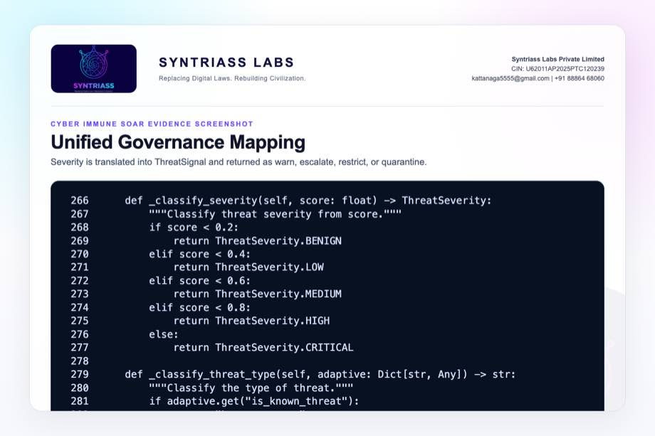

```{=typst}
#pagebreak()
```

## Evidence Page 17 - Threat Memory Training

Evidence source: `agp-core/src/immunity/unified.py`

Purpose: show known threat vector storage and similarity matching for later scans.


```{=typst}
#pagebreak()
```

## Evidence Page 18 - Governance Anomaly Taxonomy

Evidence source: `agp-core/src/governance/anomaly.py`

Purpose: show anomaly classes: drift, sudden shift, category shift, frequency spike, and high-risk pattern.

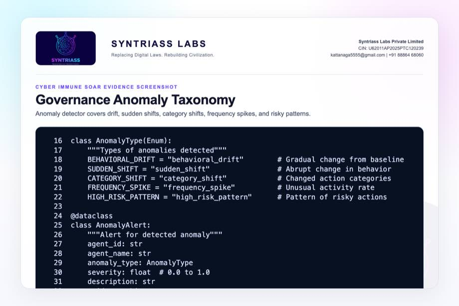

```{=typst}
#pagebreak()
```

## Evidence Page 19 - Anomaly Detection Flow

Evidence source: `agp-core/src/governance/anomaly.py`

Purpose: show baseline/recent behavior retrieval and typed alert emission.


```{=typst}
#pagebreak()
```

## Evidence Page 20 - Behavioral Drift Detector

Evidence source: `agp-core/src/governance/anomaly.py`

Purpose: show recent embedding comparison against baseline and severity conversion.


```{=typst}
#pagebreak()
```

## Evidence Page 21 - Bridge Test Cases

Evidence source: `agp-core/tests/test_immune_bridge.py`

Purpose: show tests for low, high, critical, defection, trust, clearing, suppression, and status flows.

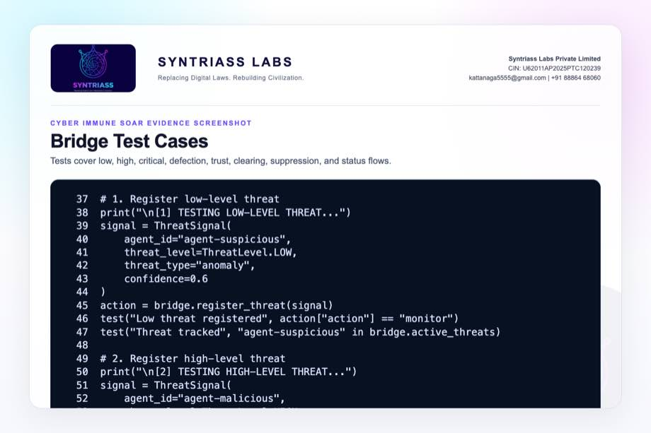

```{=typst}
#pagebreak()
```

## Evidence Page 22 - Bridge Test Summary

Evidence source: `agp-core/tests/test_immune_bridge.py`

Purpose: show pass/fail summary gate and verified output condition.

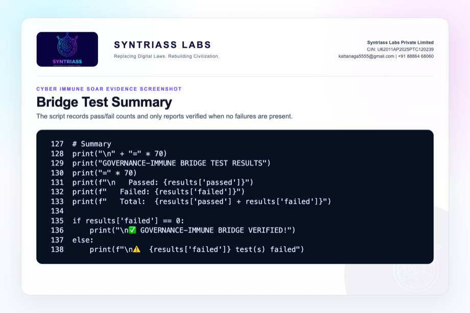

```{=typst}
#pagebreak()
```

## Evidence Page 23 - Unified Immune Tests

Evidence source: `agp-core/tests/immunity/test_unified_immune.py`

Purpose: show tests for initialization, registration, behavior scan, threat detection, and memory update.

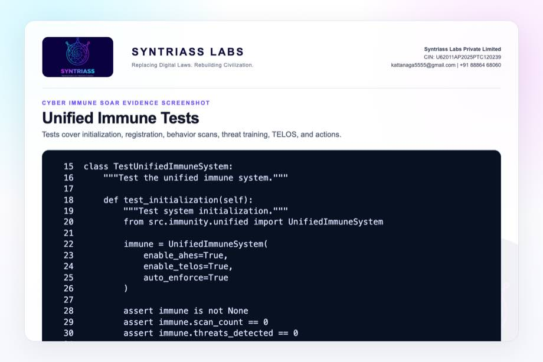

```{=typst}
#pagebreak()
```

## Evidence Page 24 - Full Integration Test

Evidence source: `agp-core/tests/immunity/test_unified_immune.py`

Purpose: show all-components integration test with multiple agents, threat training, scans, and status.


```{=typst}
#pagebreak()
```

## Evidence Page 25 - AIS Unit Tests

Evidence source: `agp-core/tests/immunity/test_immune_system.py`

Purpose: show antibody creation, binding, neutralization, cloning, fitness, and pool behavior tests.

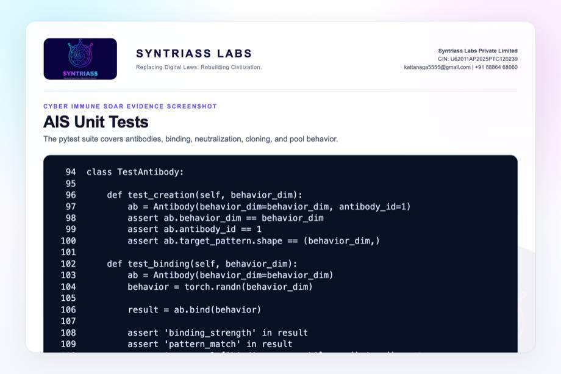

```{=typst}
#pagebreak()
```

## Evidence Page 26 - Multi-Agent Governance Simulation

Evidence source: `agp-core/tests/test_multi_agent_governance.py`

Purpose: show 12 behavior profiles across task success, collaboration, risk, and ethics signals.

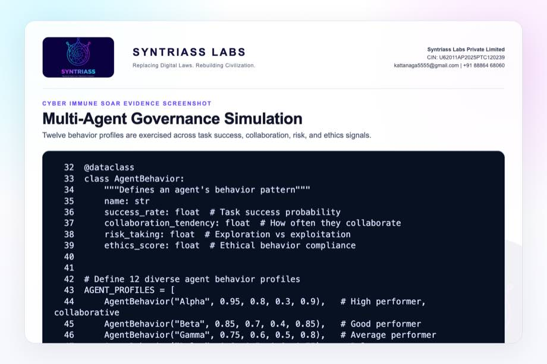

```{=typst}
#pagebreak()
```

## Evidence Page 27 - Governance Result Gate

Evidence source: `agp-core/tests/test_multi_agent_governance.py`

Purpose: show simulation succeeds only when high performers rank high and the high-risk actor ranks low.

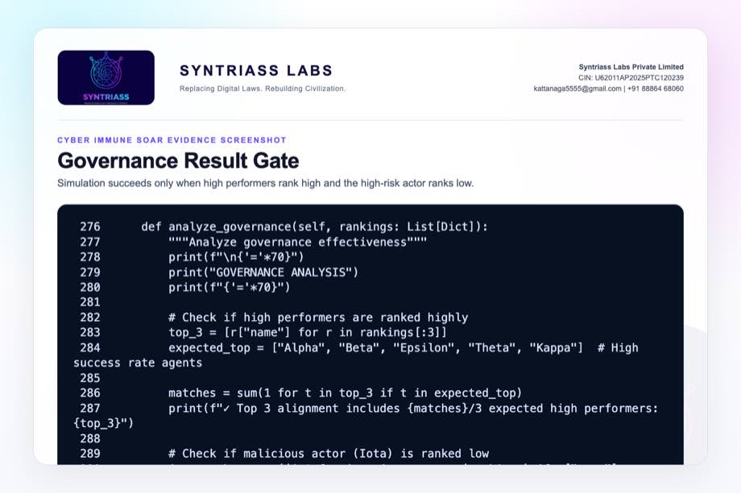

```{=typst}
#pagebreak()
```

## Evidence Page 28 - Reviewer Repository Map

Purpose: give panel reviewers a direct navigation map.

| Review Area | Path |
| --- | --- |
| Final proposal package | `docs/idex-open-challenge-2026/05-cyber-immune-soar/final_4_documents/` |
| Screenshot assets | `docs/idex-open-challenge-2026/05-cyber-immune-soar/final_4_documents/evidence_assets/` |
| Governance-immune bridge | `agp-core/src/immunity/governance_bridge.py` |
| Artificial immune system | `agp-core/src/immunity/immune_system.py` |
| Unified immune system | `agp-core/src/immunity/unified.py` |
| Governance anomaly detector | `agp-core/src/governance/anomaly.py` |
| AGP immune tests | `agp-core/tests/immunity/` |
| Multi-agent governance simulation | `agp-core/tests/test_multi_agent_governance.py` |

```{=typst}
#pagebreak()
```

## Evidence Page 29 - Claim-to-File Location Map

| Proposal Claim | Source Evidence |
| --- | --- |
| Threat signal schema exists | `governance_bridge.py`, `ThreatSignal` |
| Defection signal schema exists | `governance_bridge.py`, `DefectionSignal` |
| LOW threat maps to monitor | `GovernanceImmuneBridge._determine_action()` |
| MEDIUM threat maps to throttle | `GovernanceImmuneBridge._determine_action()` |
| HIGH threat maps to block and escalation | `GovernanceImmuneBridge._determine_action()` |
| CRITICAL threat maps to quarantine | `GovernanceImmuneBridge._determine_action()` |
| Multi-agent defection reduces trust | `GovernanceImmuneBridge.register_defection()` |
| Unified immune scan exists | `UnifiedImmuneSystem.scan_behavior()` |
| Known threat memory exists | `UnifiedImmuneSystem.train_on_threat()` and `_known_threat_similarity()` |
| Multi-agent ranking simulation exists | `test_multi_agent_governance.py` |

```{=typst}
#pagebreak()
```

## Evidence Page 30 - Test and Command Locations

| Test Area | Command / File |
| --- | --- |
| Governance-immune bridge | `agp-core/.venv/bin/python agp-core/tests/test_immune_bridge.py` |
| Immune pytest suites | `agp-core/.venv/bin/python -m pytest agp-core/tests/immunity/test_immune_system.py agp-core/tests/immunity/test_unified_immune.py -q` |
| Multi-agent governance simulation | `agp-core/.venv/bin/python agp-core/tests/test_multi_agent_governance.py` |
| Combined output artifact | `evidence_assets/cyber_immune_soar_test_output.txt` |
| Evidence screenshot generator | `generate_cyber_immune_soar_evidence_screenshots.mjs` |
| PDF builder | `build_syntriass_letterhead_problem5.mjs` |

```{=typst}
#pagebreak()
```

## Evidence Page 31 - Generated Artifact Locations

| Artifact Type | Location |
| --- | --- |
| Annexure 1 PDF | `01_SYNTRIASS_Cyber_Immune_SOAR_Annexure_1_Applicant_Details_and_Solution_Summary.pdf` |
| Annexure 2 PDF | `02_SYNTRIASS_Cyber_Immune_SOAR_Annexure_2_Technical_Architecture.pdf` |
| Annexure 3 PDF | `03_SYNTRIASS_Cyber_Immune_SOAR_Annexure_3_Advantages_and_Competencies.pdf` |
| Annexure 4 PDF | `04_SYNTRIASS_Cyber_Immune_SOAR_Annexure_4_Supporting_Evidence_and_Screenshots.pdf` |
| DOCX files | Same directory, matching `.docx` names. |
| Rendered HTML | `final_4_documents/html/` |
| Evidence screenshots | `final_4_documents/evidence_assets/*.jpg` |
| Test output | `final_4_documents/evidence_assets/cyber_immune_soar_test_output.txt` |

```{=typst}
#pagebreak()
```

## Evidence Page 32 - Screenshot Artifact Index

| Screenshot | File |
| --- | --- |
| GitHub repository | `evidence_assets/01_github_repository.jpg` |
| Fresh test output | `evidence_assets/02_test_output.jpg` |
| Threat and defection schema | `evidence_assets/03_threat_signal_schema.jpg` |
| Bridge state | `evidence_assets/04_bridge_state.jpg` |
| Threat action mapping | `evidence_assets/05_threat_action_mapping.jpg` |
| Defection response | `evidence_assets/06_defection_response.jpg` |
| Trust/status controls | `evidence_assets/07_trust_status_controls.jpg` |
| Immune system screenshots | `evidence_assets/08_immune_system_config.jpg` through `13_threat_memory.jpg` |
| Anomaly screenshots | `evidence_assets/14_anomaly_taxonomy.jpg` through `16_drift_detector.jpg` |
| Test screenshots | `evidence_assets/17_bridge_test_cases.jpg` through `23_governance_result_gate.jpg` |

```{=typst}
#pagebreak()
```

## Evidence Page 33 - Defence Problem to Evidence Map

| Defence Problem | Cyber Immune SOAR Control | Evidence |
| --- | --- | --- |
| Alert overload | Severity and confidence signal engine | Evidence pages 7-9, 12-15. |
| Unsafe automated response | Governance bridge response mapping | Evidence pages 8-11, 16. |
| Compromised service or agent | ThreatSignal and quarantine paths | Evidence pages 7, 9, 21-22. |
| Coordinated compromise | DefectionSignal and multi_quarantine | Evidence pages 7, 10, 21. |
| Weak threat memory | Known threat vector storage and similarity matching | Evidence page 17. |
| Poor after-action review | Status, output, artifact map, and test evidence | Evidence pages 6, 28-32, 35-37. |

```{=typst}
#pagebreak()
```

## Evidence Page 34 - Prototype Work Package Locations

| Work Package | Existing Starting Point |
| --- | --- |
| Threat signal schema | `governance_bridge.py`, `ThreatSignal` |
| Defection signal schema | `governance_bridge.py`, `DefectionSignal` |
| Response mapping | `GovernanceImmuneBridge._determine_action()` |
| Trust update | `GovernanceImmuneBridge.register_defection()` |
| Status reporting | `GovernanceImmuneBridge.get_status()` |
| Unified scan | `UnifiedImmuneSystem.scan_behavior()` |
| Known threat memory | `UnifiedImmuneSystem.train_on_threat()` |
| Anomaly detector | `AnomalyDetector.detect_anomalies()` |
| Simulation harness | `test_multi_agent_governance.py` |

```{=typst}
#pagebreak()
```

## Evidence Page 35 - Panel Review Checklist

| Reviewer Question | Where To Check |
| --- | --- |
| Were tests actually run? | Evidence page 6 and output file `cyber_immune_soar_test_output.txt`. |
| Is there real bridge behavior? | Evidence pages 7-11 and `test_immune_bridge.py`. |
| Does this replace a live SOC? | No. It is a simulation-first prototype. Caveats on pages 1, 4, and 36. |
| Does it perform real endpoint quarantine today? | No. Current quarantine is a governed simulation action. |
| Does it handle multi-agent collusion? | DefectionSignal path and bridge test evidence on pages 7, 10, and 21. |
| Is the GitHub repository identified? | Evidence page 5 and repository coordinate page 37. |
| Are artifact locations included? | Evidence pages 28-32. |

```{=typst}
#pagebreak()
```

## Evidence Page 36 - Readiness Statement and Caveats

| Area | Position |
| --- | --- |
| Software subsystem readiness | Current evidence supports software subsystem TRL 3-4. |
| TRL 5 target | TRL 5 is an iDEX exit target after relevant-environment SOC simulation, PQC-signed audit validation, and evaluator replay. |
| PQC hardening | Proposed path uses `nexus-pcu` hybrid Ed25519 plus ML-DSA for selected event/audit records. |
| Bridge behavior | Script test reports 19 passed and 0 failed. |
| Immune components | Pytest immune suites report 54 passed. |
| Multi-agent governance | Simulation completes successfully. |
| Live SOC deployment | Not claimed. Requires adapters, policy approval, safety testing, and operator workflow validation. |
| Endpoint quarantine | Not claimed as operational enforcement. Current quarantine is a bounded simulation action. |
| Classified network use | Not claimed. Accreditation, audit retention, access control, and network authority remain required. |
| False-positive handling | Requires evaluator datasets, red-team simulation, thresholds, and human override policy. |

```{=typst}
#pagebreak()
```

## Evidence Page 37 - Declaration and Repository Coordinates

Declaration:

Cyber Immune SOAR is submitted as a software-subsystem prototype for governed cyber defence response evaluation.

Repository coordinates:

- Public repository: `https://github.com/richardrich999888-rgb/NEXUS`
- Proposal folder: `docs/idex-open-challenge-2026/05-cyber-immune-soar/`
- Final documents: `docs/idex-open-challenge-2026/05-cyber-immune-soar/final_4_documents/`
- Evidence assets: `docs/idex-open-challenge-2026/05-cyber-immune-soar/final_4_documents/evidence_assets/`
- Test output: `docs/idex-open-challenge-2026/05-cyber-immune-soar/final_4_documents/evidence_assets/cyber_immune_soar_test_output.txt`
- Bridge source: `agp-core/src/immunity/governance_bridge.py`
- Unified immune source: `agp-core/src/immunity/unified.py`
- Simulation source: `agp-core/tests/test_multi_agent_governance.py`

Submission caveat:

- The package is prepared for prototype review and iDEX-funded validation planning.
- No live cyber operation authority, classified-network deployment, endpoint-quarantine certification, or operational SOC replacement is claimed.
- SIEM/SOAR adapters, endpoint controls, signed audit storage, evaluator datasets, and response-authority approvals remain required for operational use.
