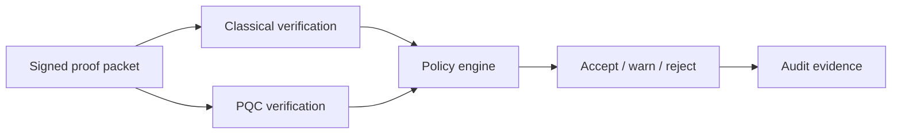

# Annexure - 2

Preferably on Company's letterhead (if available)

# 1. Proposed Technical Solution (Detailed)

## Technical Architecture & Approach

PQC Defence Identity defines a hybrid signing envelope for defence agents and devices. It verifies classical signatures for current compatibility and a post-quantum ML-DSA-compatible path for migration readiness.

| Component | Role |
| --- | --- |
| Identity record | Stores identity, key metadata, role, and validity period |
| Hybrid signing envelope | Carries payload hash, classical signature, PQC signature, and policy flags |
| Verification engine | Evaluates classical and post-quantum verification paths |
| Policy engine | Decides accept, warn, reject, or migration-required status |
| Audit exporter | Records verification result and key metadata |
| Key lifecycle plan | Defines rotation, revocation, and provisioning assumptions |

## Innovation

The innovation is a practical migration envelope that allows classical and post-quantum identity paths to coexist. It supports evaluator-visible policy choices instead of forcing an all-at-once migration.

## Implementation & Feasibility

The repository contains `nexus-pcu` hybrid signature and PQC feature tests. The iDEX work will convert unit-level cryptographic paths into a defence identity prototype with envelope specification, verifier CLI, integration examples, and key lifecycle documentation.

## Challenges & Mitigation

| Challenge | Mitigation |
| --- | --- |
| Cryptographic profile changes | Keep implementation modular and align with evaluator-approved NIST PQC profiles |
| Key lifecycle complexity | Define provisioning, revocation, rotation, and compromise handling early |
| Device integration burden | Provide CLI, SDK, and packet-level examples |
| Quantum-safety overclaim | State migration readiness and prototype validation only until accreditation |

## Visuals & Supporting Data

## Any Other Relevant Details

This package is recommended as reserve or follow-on. PQC evidence is currently unit-level and must be integrated into production identity/network flows.
