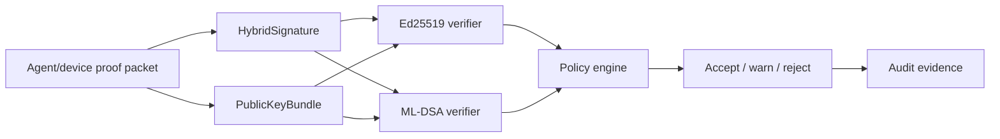

# IDEX OPEN CHALLENGE SUBMISSION

# Annexure-2

Technical architecture and implementation approach

| CIN | PAN | TAN |
| --- | --- | --- |
| U62011AP2025PTC120239 | ABQCS7152R | VPNS31351F |

| Applicant Entity | Contact |
| --- | --- |
| Syntriass Labs Private Limited | kattanaga5555@gmail.com |
| 12-50, SLV Market, 12 Ward, Dharmavaram, Ananthapur - 515671, Andhra Pradesh, India | +91 88864 68060 |

# Technical Architecture and Feasibility

## 1. Problem Statement

Defence identity systems must continue verifying today’s software agents, devices, and proof packets while preparing for post-quantum transition. A direct cutover from classical signatures to a new profile is operationally risky because field systems, embedded devices, audit workflows, and disconnected trust bundles cannot all migrate at once.

PQC Defence Identity addresses this as a hybrid verification problem. The verifier should answer: what identity produced the packet or proof, which signature components are present, whether Ed25519 verifies, whether ML-DSA verifies under the feature profile, whether the public-key bundle matches the claimed identity, what policy result applies, and what audit record explains the decision.

## 2. Technical Objective

| Objective | Implementation Mechanism |
| --- | --- |
| Support current compatibility | Ed25519 signing and verification remain available. |
| Support post-quantum transition | Feature-gated ML-DSA-65 signing and verification path. |
| Carry both verification modes | HybridSignature and PublicKeyBundle structures. |
| Avoid opaque migration behavior | Explicit policy classes for classical-only, PQC-present, hybrid-verified, warn, or reject. |
| Bind identity to computation | PCU IdentityContext carries principal, capabilities, delegation, expiry, and signature. |
| Bind identity to proof | ExecutionProof and NodeAttestation sign node/proof contents. |

```{=typst}
#pagebreak()
```

## 3. High-Level Architecture



## 4. Component Map

| Component | Repository Location | Role In Prototype |
| --- | --- | --- |
| PQC module | `nexus-pcu/src/pqc.rs` | Hybrid signature, keypair, public-key bundle, and feature-gated tests. |
| Cargo feature gate | `nexus-pcu/Cargo.toml` | Enables optional `fips203` and `fips204` dependencies through `pqc`. |
| PCU public exports | `nexus-pcu/src/lib.rs` | Exports HybridSignature, HybridKeyPair, PublicKeyBundle, IdentityContext, and ExecutionProof. |
| Identity context | `nexus-pcu/src/identity.rs` | Principal, capabilities, delegation chain, expiry, and signature validation. |
| PCU structure | `nexus-pcu/src/pcu.rs` | Embeds identity context into the computation unit. |
| Execution proof | `nexus-pcu/src/proof.rs` | Node attestation and proof verification path. |
| Classical crypto utilities | `nexus-pcu/src/crypto.rs` | Current Ed25519 key generation, signing, and verification path. |
| Fresh test output | `docs/idex-open-challenge-2026/06-pqc-defence-identity/final_4_documents/evidence_assets/pqc_defence_identity_test_output.txt` | Executed test results used in Annexure 4. |

```{=typst}
#pagebreak()
```

## 5. Hybrid Signature Format

The current implementation uses a versioned `HybridSignature` structure.

| Field | Purpose |
| --- | --- |
| `classical` | Ed25519 signature bytes for current interoperability. |
| `pqc` | Optional ML-DSA-65 signature bytes under the `pqc` feature. |
| `version` | Scheme version for future migration. |
| `is_hybrid()` | Indicates whether PQC material is present. |
| `size()` | Computes total signature size for budget and transport analysis. |
| `verify_classical()` | Verifies Ed25519 signature path. |
| `verify_pqc()` | Verifies ML-DSA path when feature and key material are present. |
| `verify_hybrid()` | Combines verification results according to transition policy. |

## 6. Public Key Bundle Design

The public-key bundle is the verifier-facing identity record. It allows old systems to inspect the Ed25519 key and newer systems to inspect the PQC key material when present.

| Field | Purpose |
| --- | --- |
| `classical` | Ed25519 verifying key bytes. |
| `pqc` | Optional ML-DSA public key bytes. |
| `version` | Key bundle version. |
| `classical_verifying_key()` | Reconstructs Ed25519 verifying key and rejects invalid key format. |
| `verify()` | Verifies supplied signature using available public key material. |
| `has_pqc()` | Indicates whether bundle contains PQC public key material. |

```{=typst}
#pagebreak()
```

## 7. Verification Policy Flow

1. Parse proof packet, identity record, or signed payload.
2. Load PublicKeyBundle from local trust bundle.
3. Verify Ed25519 component.
4. If `pqc` profile is enabled and key/signature are present, verify ML-DSA component.
5. Apply evaluator-selected policy: classical-only accept, hybrid accept, warn if PQC missing, reject if required PQC missing, or reject if both components fail.
6. Emit audit record with key metadata, signature mode, result, and reason.

| Policy Mode | Intended Use |
| --- | --- |
| Classical compatibility | Current systems where PQC profile is not required. |
| Hybrid preferred | Accept either verified component while recording mode. |
| PQC required | Accept only when the PQC component verifies. |
| Downgrade warning | Warn if expected PQC material is absent. |
| Strict reject | Reject when required key, version, or signature material is missing or invalid. |

## 8. PCU Identity Integration

The NEXUS PCU model already embeds identity in the computation. The iDEX work will extend this path with hybrid signature metadata and verification policy.

| Existing PCU Capability | PQC Defence Identity Extension |
| --- | --- |
| Principal ID | Bind principal to public-key bundle metadata. |
| Capability set | Carry permitted actions for device/agent proof packet. |
| Delegation chain | Extend signature profile and expiry verification. |
| Identity expiry | Add key/bundle validity window and revocation status. |
| Execution proof | Attach hybrid identity verification result to NodeAttestation audit. |

```{=typst}
#pagebreak()
```

## 9. Feature-Gated PQC Readiness

The repository intentionally keeps default builds classical-only for compatibility and build speed. PQC is enabled explicitly with `--features pqc`.

| Capability | Current Evidence |
| --- | --- |
| Optional PQC dependencies | `fips203` and `fips204` are optional in `nexus-pcu/Cargo.toml`. |
| Feature flag | `pqc = ["fips203", "fips204"]`. |
| ML-DSA verification path | `verify_pqc()` reconstructs ML-DSA public key and signature arrays. |
| Hybrid signing | `HybridKeyPair::sign()` adds ML-DSA signature when key is available. |
| Tamper fallback test | Feature-gated test verifies PQC path after classical component tampering. |

## 10. Audit Record Design

The proposed iDEX prototype will emit a compact decision record for every verification event.

| Audit Field | Purpose |
| --- | --- |
| `subject_id` | Agent, device, node, or proof-packet subject. |
| `bundle_version` | Public-key bundle version used for verification. |
| `signature_version` | Signature scheme version. |
| `classical_result` | Ed25519 verification result. |
| `pqc_result` | ML-DSA verification result if evaluated. |
| `policy_mode` | Classical, hybrid, PQC-required, warn, or strict reject. |
| `decision` | Accept, warn, or reject. |
| `reason_code` | Deterministic explanation for evaluator review. |

```{=typst}
#pagebreak()
```

## 11. Tests Conducted Before Packaging

| Test / Check | Command | Fresh Result |
| --- | --- | --- |
| NEXUS PCU PQC feature tests | `cargo test -p nexus-pcu --features pqc pqc -- --nocapture` | 7 passed, 0 failed. |
| Filtered lib tests | Same command | 37 filtered out because the test filter was `pqc`. |
| Filtered integration binaries | Same command | chaos/fuzz/property/replay selected 0 tests under the `pqc` filter. |

## 12. Risks and Mitigations

| Risk | Impact | Mitigation |
| --- | --- | --- |
| Cryptographic profile may change | Defence evaluator may require a specific approved profile. | Keep algorithm profile modular and document versioned envelope. |
| Feature-gated status | PQC is not network-wide active by default. | State as prototype evidence and integrate through selected identity flows under iDEX. |
| Key lifecycle not complete | Operational trust requires provisioning, rotation, and revocation. | Add key lifecycle plan and evaluator-approved trust bundle. |
| Downgrade risk | Adversary may remove PQC material if policy is weak. | Add policy modes that warn or reject when PQC is expected. |
| HSM/secure element not integrated | Private-key protection is not operationally complete. | Add HSM/secure element adapter as later hardening milestone. |
| Accreditation not claimed | Cannot present as certified cryptographic module. | Position as software prototype for transition planning. |

```{=typst}
#pagebreak()
```

## 13. Prototype Demonstration Plan

| Demo Step | What The Evaluator Sees |
| --- | --- |
| Generate hybrid keypair | Ed25519 and ML-DSA material generated under `pqc` feature. |
| Sign proof packet | HybridSignature carries classical and PQC components. |
| Verify classical path | Ed25519 verification succeeds for valid message. |
| Verify PQC path | ML-DSA verification succeeds when PQC material is present. |
| Tamper classical component | Verification can still pass through PQC in hybrid mode. |
| Tamper both components | Verification fails. |
| Inspect public key bundle | Bundle shows classical and optional PQC key material. |
| Apply policy | Classical-only, hybrid, PQC-required, warn, and reject modes produce explicit reason codes. |
| Export audit | Decision record contains signature mode, key metadata, result, and reason. |

## 14. Readiness Statement

PQC Defence Identity is feasible for a 12-month iDEX prototype because the repository already contains feature-gated ML-DSA integration, hybrid signature structures, public-key bundle verification, identity context, PCU identity binding, execution proof attestation, and a fresh passing PQC test run.

No certified cryptographic module status, HSM integration, secure element provisioning, defence key authority approval, or operational network enforcement is claimed in this submission.
