# IDEX OPEN CHALLENGE SUBMISSION

# Annexure-4

Supporting evidence, screenshots, repository locations, and artifact map

| CIN | PAN | TAN |
| --- | --- | --- |
| U62011AP2025PTC120239 | ABQCS7152R | VPNS31351F |

| Applicant Entity | Contact |
| --- | --- |
| Syntriass Labs Private Limited | kattanaga5555@gmail.com |
| 12-50, SLV Market, 12 Ward, Dharmavaram, Ananthapur - 515671, Andhra Pradesh, India | +91 88864 68060 |

# Supporting Evidence and Screenshots

## Company Identification Details

| Field | Details |
| --- | --- |
| Legal Entity Name | Syntriass Labs Private Limited |
| CIN | U62011AP2025PTC120239 |
| PAN | ABQCS7152R |
| TAN | VPNS31351F |
| Registered Office | 12-50, SLV Market, 12 Ward, Dharmavaram, Ananthapur - 515671, Andhra Pradesh, India |
| Contact Email | kattanaga5555@gmail.com |
| Contact Phone | +91 88864 68060 |
| GitHub Repository | `https://github.com/richardrich999888-rgb/NEXUS` |
| Submission Date | 17 May 2026 |

## 1. Applicant Resume Format

Applicant: K. Naga Sri Ganesh  
Company: Syntriass Labs Private Limited  
Role: Founder / Inventor  
Relevant focus: governed autonomy, proof-carrying computation, hybrid cryptographic identity, PCU identity binding, post-quantum transition planning, and defence-oriented audit evidence.

## 2. Prototype Evidence List

| Evidence Item | Repository / Artifact Location |
| --- | --- |
| PQC module | `nexus-pcu/src/pqc.rs` |
| Cargo PQC feature gate | `nexus-pcu/Cargo.toml` |
| PCU public exports | `nexus-pcu/src/lib.rs` |
| Capability identity | `nexus-pcu/src/identity.rs` |
| PCU identity binding | `nexus-pcu/src/pcu.rs` |
| Execution proof attestation | `nexus-pcu/src/proof.rs` |
| Classical crypto utilities | `nexus-pcu/src/crypto.rs` |
| Fresh test output | `docs/idex-open-challenge-2026/06-pqc-defence-identity/final_4_documents/evidence_assets/pqc_defence_identity_test_output.txt` |
| Evidence screenshots | `docs/idex-open-challenge-2026/06-pqc-defence-identity/final_4_documents/evidence_assets/` |
| Final documents | `docs/idex-open-challenge-2026/06-pqc-defence-identity/final_4_documents/` |

## 3. Validation Scope

Current validation is software-subsystem validation. The evidence supports feature-gated PQC tests, hybrid signature structures, public-key bundle verification, and PCU identity/proof integration points. It does not claim certified cryptographic module status, HSM integration, secure element provisioning, defence key authority approval, or network-wide PQC enforcement.

```{=typst}
#pagebreak()
```

## 4. Test Commands and Recorded Results

Primary command:

```bash
cargo test -p nexus-pcu --features pqc pqc -- --nocapture
```

Fresh local results:

- NEXUS PCU PQC feature tests: 7 passed, 0 failed.
- Filtered lib tests: 37 filtered out because the command selected tests containing `pqc`.
- Filtered integration binaries: chaos, fuzz, property, and replay selected 0 tests under the `pqc` filter.
- Run date: 17 May 2026.

Tested behaviors:

- Hybrid keypair generation.
- Classical signing and verification.
- Hybrid signature serialization.
- Public key bundle verification.
- Classical-only mode.
- Signature size under PQC feature.
- PQC component verification after classical component tampering.

```{=typst}
#pagebreak()
```

## Evidence Page 5 - Public Repository Reference

Purpose: give panel reviewers a direct path to inspect the source repository.

Status: GitHub repository reference embedded.

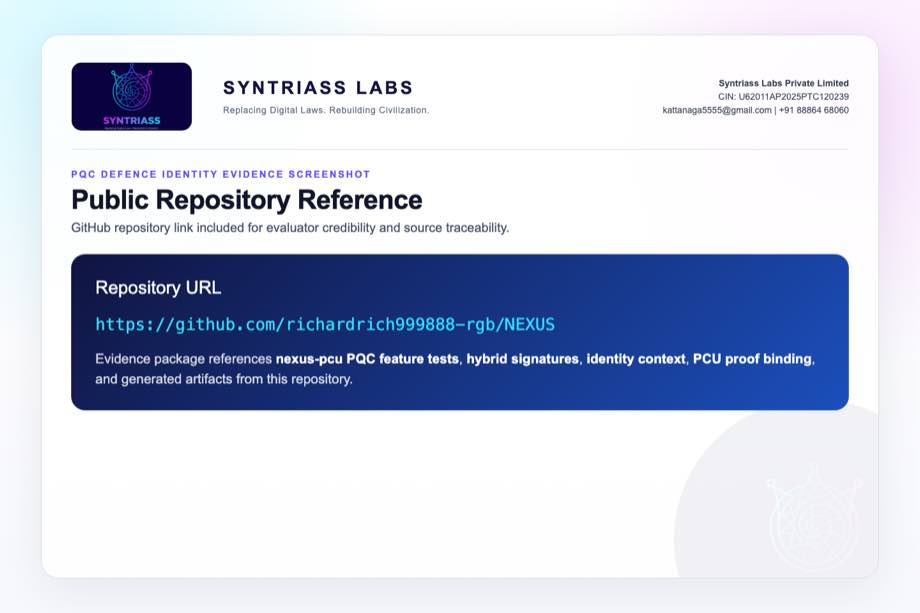

```{=typst}
#pagebreak()
```

## Evidence Page 6 - Fresh Test Output

Purpose: show that the feature-gated `nexus-pcu` PQC tests were run locally before proposal packaging.

Status: test output screenshot embedded.


```{=typst}
#pagebreak()
```

## Evidence Page 7 - PQC Feature Gate

Evidence source: `nexus-pcu/Cargo.toml`

Purpose: show optional `fips203` and `fips204` dependencies and the `pqc` feature gate.

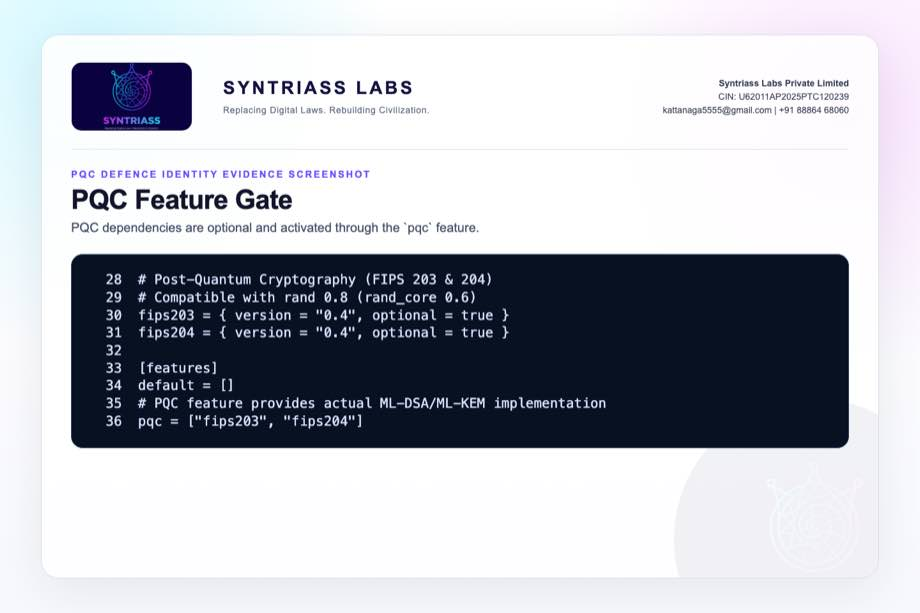

```{=typst}
#pagebreak()
```

## Evidence Page 8 - Public PCU Exports

Evidence source: `nexus-pcu/src/lib.rs`

Purpose: show exported HybridSignature, HybridKeyPair, PublicKeyBundle, IdentityContext, and ExecutionProof primitives.

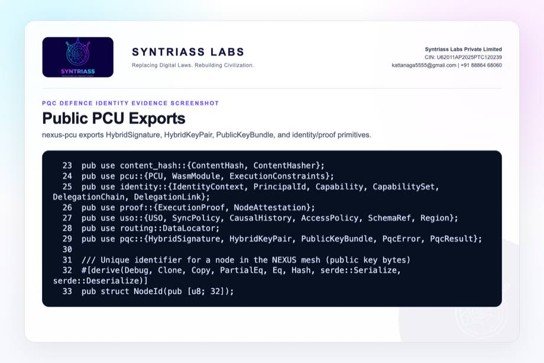

```{=typst}
#pagebreak()
```

## Evidence Page 9 - Hybrid Signature Structure

Evidence source: `nexus-pcu/src/pqc.rs`

Purpose: show Ed25519, optional ML-DSA, and version fields in the signature container.


```{=typst}
#pagebreak()
```

## Evidence Page 10 - Classical and Hybrid Constructors

Evidence source: `nexus-pcu/src/pqc.rs`

Purpose: show classical-only and hybrid signature constructors plus helper methods.

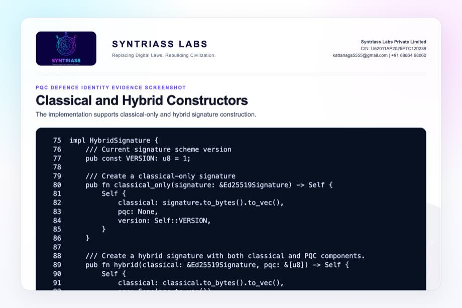

```{=typst}
#pagebreak()
```

## Evidence Page 11 - Classical Signature Verification

Evidence source: `nexus-pcu/src/pqc.rs`

Purpose: show Ed25519 length check, signature reconstruction, and verification.

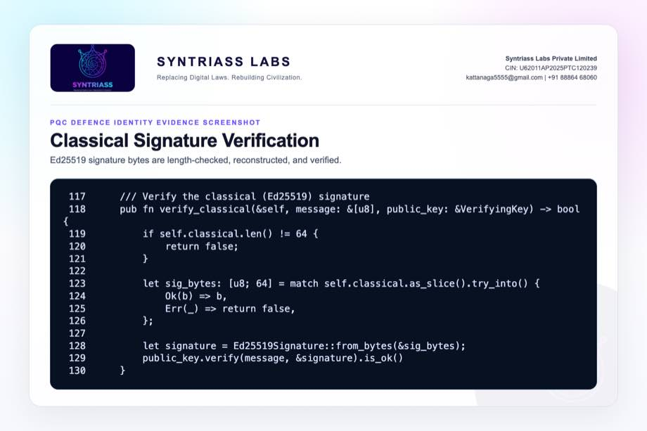

```{=typst}
#pagebreak()
```

## Evidence Page 12 - ML-DSA Verification Path

Evidence source: `nexus-pcu/src/pqc.rs`

Purpose: show feature-gated ML-DSA public key and signature verification path.


```{=typst}
#pagebreak()
```

## Evidence Page 13 - Hybrid Verification Policy

Evidence source: `nexus-pcu/src/pqc.rs`

Purpose: show combined classical/PQC verification policy in the transition implementation.

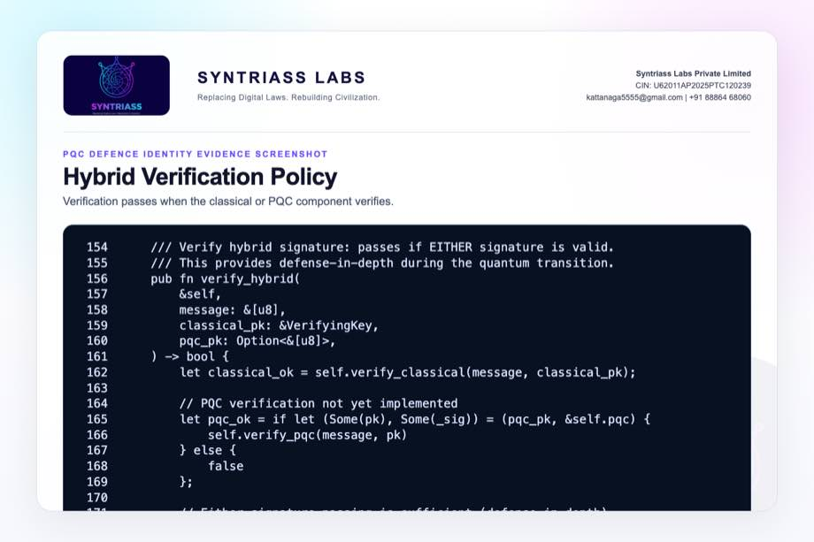

```{=typst}
#pagebreak()
```

## Evidence Page 14 - Hybrid Keypair Structure

Evidence source: `nexus-pcu/src/pqc.rs`

Purpose: show Ed25519 plus feature-gated ML-DSA key material.

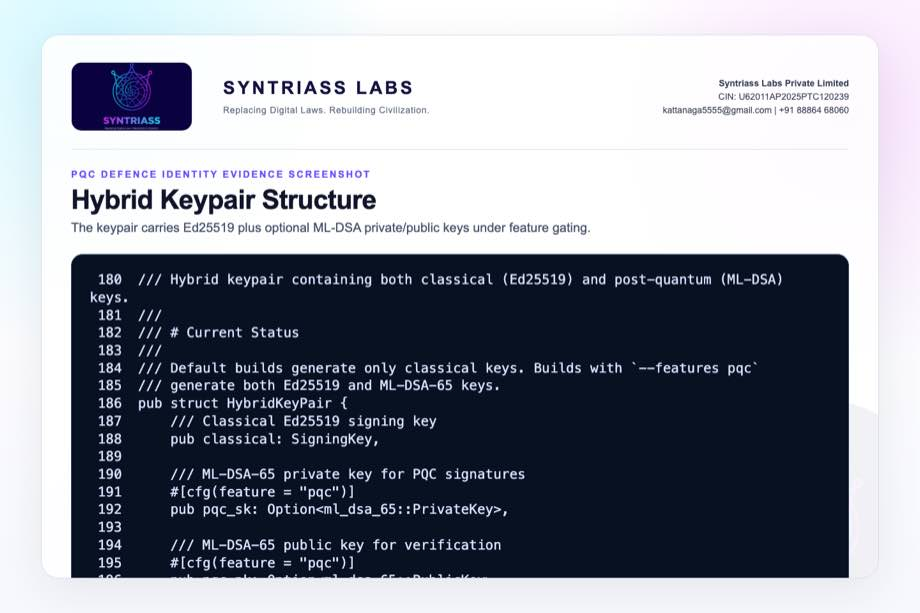

```{=typst}
#pagebreak()
```

## Evidence Page 15 - Key Generation

Evidence source: `nexus-pcu/src/pqc.rs`

Purpose: show Ed25519 generation and ML-DSA-65 generation when feature is enabled.


```{=typst}
#pagebreak()
```

## Evidence Page 16 - Signing Path

Evidence source: `nexus-pcu/src/pqc.rs`

Purpose: show Ed25519 signing plus optional ML-DSA signing.

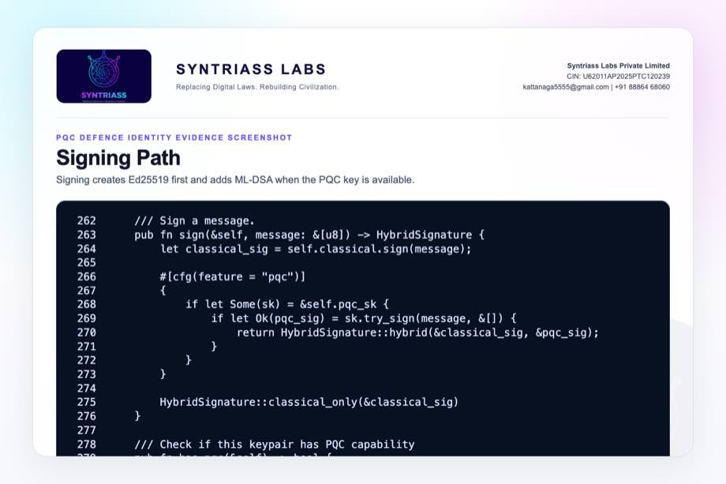

```{=typst}
#pagebreak()
```

## Evidence Page 17 - Public Key Bundle

Evidence source: `nexus-pcu/src/pqc.rs`

Purpose: show classical and optional PQC key bundle used by verifiers.


```{=typst}
#pagebreak()
```

## Evidence Page 18 - Keypair and Classical Verification Tests

Evidence source: `nexus-pcu/src/pqc.rs`

Purpose: show tests for keypair generation and classical signature verification.


```{=typst}
#pagebreak()
```

## Evidence Page 19 - Serialization and Bundle Tests

Evidence source: `nexus-pcu/src/pqc.rs`

Purpose: show tests for signature serialization and public-key bundle verification.


```{=typst}
#pagebreak()
```

## Evidence Page 20 - Classical-Only and Size Tests

Evidence source: `nexus-pcu/src/pqc.rs`

Purpose: show tests for classical-only behavior and feature-gated signature size.


```{=typst}
#pagebreak()
```

## Evidence Page 21 - PQC Tamper Fallback Test

Evidence source: `nexus-pcu/src/pqc.rs`

Purpose: show feature-gated test where PQC verification remains valid after classical signature tampering, then fails when both components are invalid.

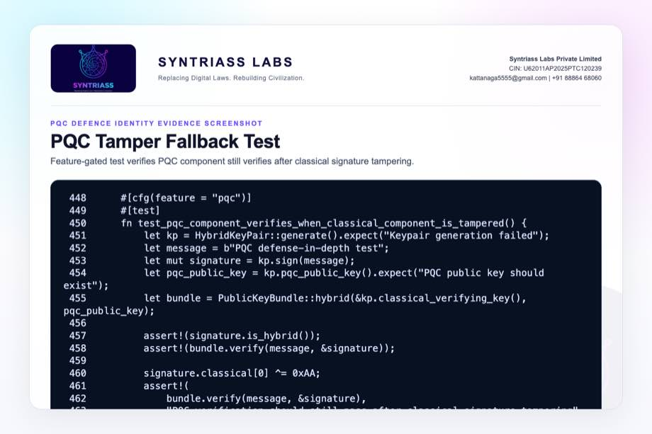

```{=typst}
#pagebreak()
```

## Evidence Page 22 - Principal and Capability Model

Evidence source: `nexus-pcu/src/identity.rs`

Purpose: show identity primitives for principal IDs, capabilities, constraints, and permission checks.


```{=typst}
#pagebreak()
```

## Evidence Page 23 - Delegation Chain Verification

Evidence source: `nexus-pcu/src/identity.rs`

Purpose: show expiry, continuity, signature verification, and canonical signing data for delegation links.


```{=typst}
#pagebreak()
```

## Evidence Page 24 - Embedded Identity Context

Evidence source: `nexus-pcu/src/identity.rs`

Purpose: show PCU identity context with principal, capabilities, delegation, expiry, signature, and permission check.

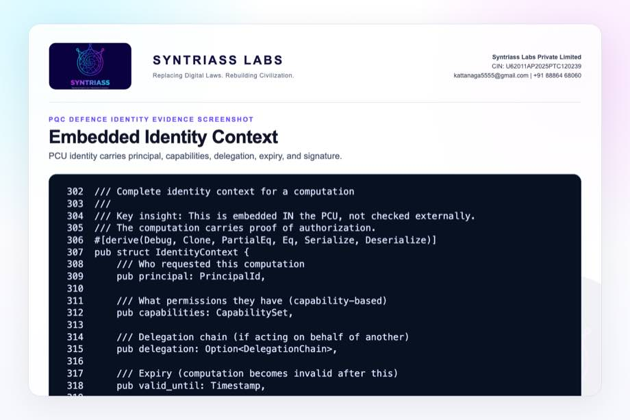

```{=typst}
#pagebreak()
```

## Evidence Page 25 - PCU Identity Binding

Evidence source: `nexus-pcu/src/pcu.rs`

Purpose: show PCU structure embedding identity context and execution constraints.

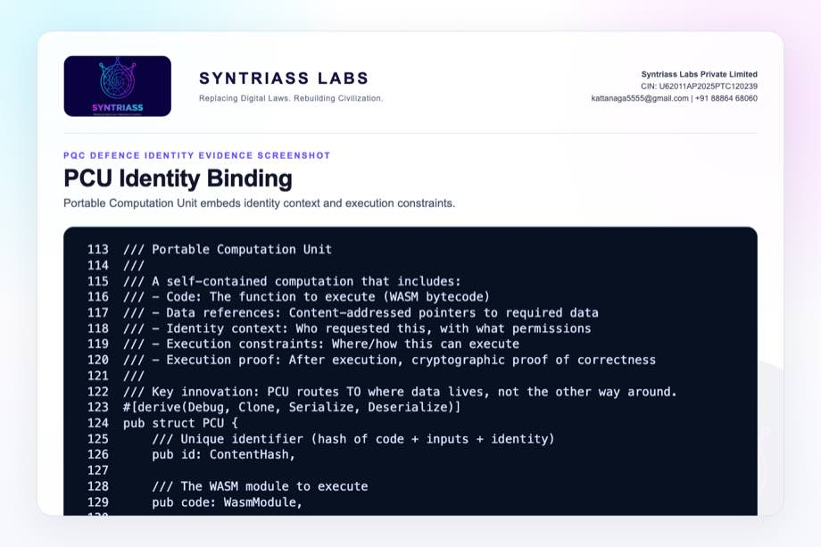

```{=typst}
#pagebreak()
```

## Evidence Page 26 - Execution Attestation

Evidence source: `nexus-pcu/src/proof.rs`

Purpose: show node attestation signing and verification over proof content.


```{=typst}
#pagebreak()
```

## Evidence Page 27 - Classical Crypto Utilities

Evidence source: `nexus-pcu/src/crypto.rs`

Purpose: show current Ed25519 key generation, signing, and verification utility path.

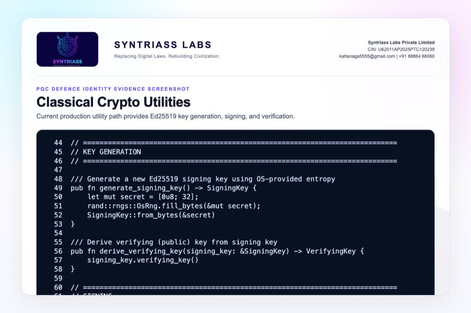

```{=typst}
#pagebreak()
```

## Evidence Page 28 - Reviewer Repository Map

Purpose: give panel reviewers a direct navigation map.

| Review Area | Path |
| --- | --- |
| Final proposal package | `docs/idex-open-challenge-2026/06-pqc-defence-identity/final_4_documents/` |
| Screenshot assets | `docs/idex-open-challenge-2026/06-pqc-defence-identity/final_4_documents/evidence_assets/` |
| PQC module | `nexus-pcu/src/pqc.rs` |
| Cargo feature gate | `nexus-pcu/Cargo.toml` |
| Identity context | `nexus-pcu/src/identity.rs` |
| PCU structure | `nexus-pcu/src/pcu.rs` |
| Execution proof | `nexus-pcu/src/proof.rs` |
| Classical crypto utilities | `nexus-pcu/src/crypto.rs` |

```{=typst}
#pagebreak()
```

## Evidence Page 29 - Claim-to-File Location Map

| Proposal Claim | Source Evidence |
| --- | --- |
| Hybrid signature structure exists | `nexus-pcu/src/pqc.rs`, `HybridSignature` |
| PQC feature gate exists | `nexus-pcu/Cargo.toml`, `[features] pqc` |
| Hybrid keypair generation exists | `HybridKeyPair::generate()` |
| ML-DSA signing path exists under feature | `HybridKeyPair::sign()` |
| Classical verification exists | `HybridSignature::verify_classical()` |
| ML-DSA verification path exists under feature | `HybridSignature::verify_pqc()` |
| Public-key bundle exists | `PublicKeyBundle` |
| PCU identity binding exists | `PCU.identity` and `IdentityContext` |
| Execution attestation exists | `NodeAttestation` and `ExecutionProof` |
| PQC tamper behavior is tested | `test_pqc_component_verifies_when_classical_component_is_tampered()` |

```{=typst}
#pagebreak()
```

## Evidence Page 30 - Test and Command Locations

| Test Area | Command / File |
| --- | --- |
| PQC feature tests | `cargo test -p nexus-pcu --features pqc pqc -- --nocapture` |
| Test implementation | `nexus-pcu/src/pqc.rs`, test module |
| Combined output artifact | `evidence_assets/pqc_defence_identity_test_output.txt` |
| Evidence screenshot generator | `generate_pqc_defence_identity_evidence_screenshots.mjs` |
| PDF builder | `build_syntriass_letterhead_problem6.mjs` |

```{=typst}
#pagebreak()
```

## Evidence Page 31 - Generated Artifact Locations

| Artifact Type | Location |
| --- | --- |
| Annexure 1 PDF | `01_SYNTRIASS_PQC_Defence_Identity_Annexure_1_Applicant_Details_and_Solution_Summary.pdf` |
| Annexure 2 PDF | `02_SYNTRIASS_PQC_Defence_Identity_Annexure_2_Technical_Architecture.pdf` |
| Annexure 3 PDF | `03_SYNTRIASS_PQC_Defence_Identity_Annexure_3_Advantages_and_Competencies.pdf` |
| Annexure 4 PDF | `04_SYNTRIASS_PQC_Defence_Identity_Annexure_4_Supporting_Evidence_and_Screenshots.pdf` |
| DOCX files | Same directory, matching `.docx` names. |
| Rendered HTML | `final_4_documents/html/` |
| Evidence screenshots | `final_4_documents/evidence_assets/*.jpg` |
| Test output | `final_4_documents/evidence_assets/pqc_defence_identity_test_output.txt` |

```{=typst}
#pagebreak()
```

## Evidence Page 32 - Screenshot Artifact Index

| Screenshot | File |
| --- | --- |
| GitHub repository | `evidence_assets/01_github_repository.jpg` |
| Fresh test output | `evidence_assets/02_test_output.jpg` |
| Feature gate and exports | `evidence_assets/03_feature_gate.jpg`, `04_lib_exports.jpg` |
| Hybrid signature screenshots | `evidence_assets/05_hybrid_signature_struct.jpg` through `09_hybrid_verification.jpg` |
| Hybrid keypair screenshots | `evidence_assets/10_hybrid_keypair_struct.jpg` through `13_public_key_bundle.jpg` |
| PQC tests | `evidence_assets/14_keypair_classical_tests.jpg` through `17_pqc_tamper_fallback_test.jpg` |
| Identity/proof integration | `evidence_assets/18_principal_capabilities.jpg` through `23_crypto_utilities.jpg` |

```{=typst}
#pagebreak()
```

## Evidence Page 33 - Defence Problem to Evidence Map

| Defence Problem | PQC Defence Identity Control | Evidence |
| --- | --- | --- |
| Classical-only identity risk | Hybrid signature envelope | Evidence pages 9-13. |
| Migration disruption | Public-key bundle with classical and optional PQC material | Evidence page 17. |
| Signature tamper scenario | Feature-gated tamper fallback test | Evidence page 21. |
| Identity/proof binding | PCU IdentityContext and NodeAttestation | Evidence pages 22-26. |
| Current compatibility | Ed25519 crypto utilities and classical verification tests | Evidence pages 11, 18, 27. |
| Readiness transparency | Feature gate, test output, and caveats | Evidence pages 6-7, 35-37. |

```{=typst}
#pagebreak()
```

## Evidence Page 34 - Prototype Work Package Locations

| Work Package | Existing Starting Point |
| --- | --- |
| Hybrid signature envelope | `HybridSignature` in `nexus-pcu/src/pqc.rs` |
| Hybrid keypair | `HybridKeyPair` in `nexus-pcu/src/pqc.rs` |
| Public-key bundle | `PublicKeyBundle` in `nexus-pcu/src/pqc.rs` |
| Feature-gated ML-DSA | `verify_pqc()` and `HybridKeyPair::generate()` |
| Identity integration | `IdentityContext` in `nexus-pcu/src/identity.rs` |
| Proof integration | `ExecutionProof` and `NodeAttestation` in `nexus-pcu/src/proof.rs` |
| Current classical path | `nexus-pcu/src/crypto.rs` |

```{=typst}
#pagebreak()
```

## Evidence Page 35 - Panel Review Checklist

| Reviewer Question | Where To Check |
| --- | --- |
| Were PQC tests actually run? | Evidence page 6 and output file `pqc_defence_identity_test_output.txt`. |
| Is PQC active by default? | No. It is feature-gated through `--features pqc`; see pages 7 and 36. |
| Is this certified cryptography? | No. It is prototype evidence and transition planning. |
| Does the code support hybrid key material? | Evidence pages 9-17. |
| Does it bind identity to PCU/proof? | Evidence pages 22-26. |
| Is the GitHub repository identified? | Evidence page 5 and repository coordinate page 37. |
| Are artifact locations included? | Evidence pages 28-32. |

```{=typst}
#pagebreak()
```

## Evidence Page 36 - Readiness Statement and Caveats

| Area | Position |
| --- | --- |
| Software subsystem readiness | Current evidence supports software subsystem TRL 3-4. |
| PQC feature tests | `nexus-pcu` reports 7 passed and 0 failed under `--features pqc`. |
| Default build | Classical-only by default for compatibility and build speed. |
| PQC enforcement | Not yet network-wide or packet-wide by default. |
| Cryptographic accreditation | Not claimed. Requires evaluator-approved profile and certification path. |
| Key lifecycle | Provisioning, revocation, rotation, and compromise response remain iDEX work. |
| HSM/secure element | Not integrated in current evidence. |
| Operational use | Defence key authority, policy approval, and deployment hardening remain required. |

```{=typst}
#pagebreak()
```

## Evidence Page 37 - Declaration and Repository Coordinates

Declaration:

PQC Defence Identity is submitted as a software-subsystem prototype for hybrid classical and post-quantum defence identity evaluation.

Repository coordinates:

- Public repository: `https://github.com/richardrich999888-rgb/NEXUS`
- Proposal folder: `docs/idex-open-challenge-2026/06-pqc-defence-identity/`
- Final documents: `docs/idex-open-challenge-2026/06-pqc-defence-identity/final_4_documents/`
- Evidence assets: `docs/idex-open-challenge-2026/06-pqc-defence-identity/final_4_documents/evidence_assets/`
- Test output: `docs/idex-open-challenge-2026/06-pqc-defence-identity/final_4_documents/evidence_assets/pqc_defence_identity_test_output.txt`
- PQC source: `nexus-pcu/src/pqc.rs`
- Identity source: `nexus-pcu/src/identity.rs`
- Proof source: `nexus-pcu/src/proof.rs`

Submission caveat:

- The package is prepared for prototype review and iDEX-funded validation planning.
- No certified cryptographic module status, operational key authority approval, HSM-backed deployment, secure element provisioning, or network-wide PQC enforcement is claimed.
- Cryptographic profile approval, lifecycle policy, hardware key protection, audit retention, and field integration remain required for operational use.
