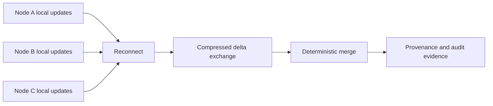

# Annexure - 2

Preferably on Company's letterhead (if available)

# 1. Proposed Technical Solution (Detailed)

## Technical Architecture & Approach

CAUSALUX Contested Sync enables disconnected nodes to update local state and later reconcile deterministically with provenance. It is designed for bandwidth-constrained and intermittently connected mission environments.

| Component | Role |
| --- | --- |
| Local state engine | Allows node-local updates during disconnection |
| Causal metadata | Tracks ordering, dependencies, and conflict context |
| USO evidence path | Anchors accepted updates into ordered audit evidence |
| VECTRA state tracking | Maintains vector-style synchronization context |
| `nexus-sync` transfer layer | Exchanges compact state deltas |
| Compression module | Reduces payload size for constrained links |
| Merge verifier | Rejects stale, replayed, or invalid updates and records provenance |

## Innovation

The innovation is combining deterministic disconnected merge, compact delta exchange, and provenance evidence for contested communication environments. The system is designed for state trust, not just file transfer.

## Implementation & Feasibility

The repository includes CAUSALUX, USO, VECTRA, `nexus-sync`, and compression-related components. The iDEX work will convert these into a demonstrable contested-sync prototype with deterministic merge tests and bandwidth measurement.

## Challenges & Mitigation

| Challenge | Mitigation |
| --- | --- |
| Conflict rules not matching mission semantics | Define scenario-specific merge policies and evaluator-visible conflict traces |
| Bandwidth assumptions too optimistic | Measure compressed and uncompressed payloads under repeatable constraints |
| Replay or stale update acceptance | Add freshness, sequence, and provenance checks |
| Field network behavior not represented | Start with controlled simulation and plan hardware/network-in-loop validation |

## Visuals & Supporting Data

## Any Other Relevant Details

Package-level test names must be verified against the final repository workspace before portal upload. Field bandwidth, packet loss, jamming, and mission-specific merge policies remain proposed validation work.
