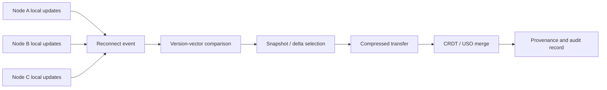

# IDEX OPEN CHALLENGE SUBMISSION

# Annexure-2

Technical architecture and implementation approach

| CIN | PAN | TAN |
| --- | --- | --- |
| U62011AP2025PTC120239 | ABQCS7152R | VPNS31351F |

| Applicant Entity | Contact |
| --- | --- |
| Syntriass Labs Private Limited | kattanaga5555@gmail.com |
| 12-50, SLV Market, 12 Ward, Dharmavaram, Ananthapur - 515671, Andhra Pradesh, India | +91 88864 68060 |

# Technical Architecture and Feasibility

## 1. Problem Statement

Defence information and autonomy systems cannot assume continuous high-bandwidth connectivity. Patrol units, autonomous vehicles, sensors, forward posts, command nodes, and edge compute systems may continue generating state while disconnected. Once links recover, naïve synchronization can replay too much data, overwrite valid local updates, accept stale packets, or hide the provenance of mission-state changes.

CAUSALUX Contested Sync addresses this as a disconnected state-coordination problem. The synchronizer should answer: what version did each node see, what operations happened independently, which updates are causally ordered, which updates conflict, what compact state can be exchanged, which snapshot is common, what merge rule applied, and what evidence explains the accepted state.

## 2. Technical Objective

| Objective | Implementation Mechanism |
| --- | --- |
| Operate during disconnection | Local node updates continue with causal metadata. |
| Detect ordering and conflict | Version vectors track happens-before and concurrent updates. |
| Merge without central authority | CRDTs and declared conflict policies provide deterministic convergence in software tests. |
| Reduce transfer volume | Snapshot negotiation, sync deltas, and compression avoid full replay where possible. |
| Preserve reviewer traceability | USO history, DAG ordering, operation IDs, and snapshot Merkle roots support audit. |
| Expose hardening gaps | Stale E2E tests and contested-network validation are documented as iDEX work. |

```{=typst}
#pagebreak()
```

## 3. High-Level Architecture



## 4. Component Map

| Component | Repository Location | Role In Prototype |
| --- | --- | --- |
| Version vectors | `causalux/src/version_vector.rs` | Causal ordering, conflict detection, merge context, and total operation count. |
| Causal DAG | `causalux/src/dag.rs` | Operation insertion, dependency checks, conflict handling, causal order, Merkle-root snapshot basis. |
| CRDT layer | `causalux/src/crdt.rs` | RGA text, counters, PN counters, OR-set, LWW map, and composite document convergence. |
| Hierarchical sync | `causalux/src/sync.rs` | Sync request/response, common snapshot, operations after snapshot, and savings calculation. |
| Snapshot manager | `causalux/src/snapshot.rs` | Compressed snapshots, common-snapshot negotiation, and old-operation trimming basis. |
| Sovereign envelope | `causalux/src/envelope.rs` | Encrypted operation envelope and wrong-key/revocation tests. |
| NEXUS sync engine | `nexus-sync/src/sync_engine.rs` | USO registry, signed causal operations, sync deltas, and remote merge. |
| CRDT-backed USO | `nexus-sync/src/crdt_uso.rs` | USO variants backed by CRDT merge behavior. |
| USO primitive | `nexus-pcu/src/uso.rs` | Sync policy, access policy, vector-clock history, operations, and merge. |
| Compression path | `nexus-compress/src/pcu_compress.rs`, `nexus-compress/src/uso_compress.rs` | Lossless compression/decompression and batch statistics. |

```{=typst}
#pagebreak()
```

## 5. Disconnected Synchronization Flow

1. A node receives or generates a local mission-state update.
2. The update is represented as a causal operation or USO mutation.
3. Local vector-clock or version-vector state is advanced.
4. The node may continue updating while disconnected from peers.
5. During reconnect, peers exchange version context and snapshot identifiers.
6. The sync layer selects Merkle-diff or hierarchical snapshot recovery depending on partition duration.
7. Compressed deltas or compressed snapshot material are exchanged.
8. CRDT/USO merge and declared conflict policy produce the converged state.
9. An audit record stores node, operation, version context, merge result, and caveats.

| Flow Step | Defence Value |
| --- | --- |
| Local update during partition | Allows continued operation without central link dependency. |
| Version-vector exchange | Shows whether one state dominates another or conflicts. |
| Common-snapshot selection | Reduces recovery cost after long partitions. |
| Compressed transfer | Supports constrained tactical links. |
| Deterministic merge | Avoids opaque “last packet wins” behavior. |
| Provenance export | Helps evaluators inspect what changed and why. |

## 6. Version Vector and Conflict Model

The version-vector implementation provides four relevant operations: increment a node clock, check happens-before ordering, detect conflict when neither vector dominates, and merge vectors by taking the maximum clock per node.

| Function | Defence Meaning |
| --- | --- |
| `increment(node_id)` | Records that a node has advanced local state. |
| `happens_before(other)` | Shows that one update set is causally included in another. |
| `conflicts_with(other)` | Flags concurrent divergence requiring merge or policy action. |
| `merge(other)` | Produces combined causal context after reconnect. |

```{=typst}
#pagebreak()
```

## 7. State Merge Model

The repository contains multiple CRDT types that can be mapped to defence mission-state categories.

| CRDT / State Type | Example Defence Use | Merge Behavior |
| --- | --- | --- |
| `GCounter` | Count sightings, acknowledgements, or completed observations. | Per-node counts merge by maximum and sum. |
| `PNCounter` | Track increments and decrements, such as resource estimates. | Positive and negative counters merge independently. |
| `ORSet` | Maintain observed entities, checkpoints, or confirmed items. | Observed-remove set with add-wins behavior. |
| `LWWMap` | Map keys to latest values where timestamp policy is accepted. | Last writer wins with node-id tie break. |
| `RGAText` | Collaborative notes, reports, or text fields. | Remote inserts are ordered deterministically. |
| `CRDTDocument` | Composite mission-state record. | Title, content, metadata, collaborators, and version count merge. |

## 8. Snapshot and Long-Partition Recovery

Long partitions should not require replaying complete history. CAUSALUX implements snapshots that carry state, Merkle root, version vector, operation count, timestamp, and compressed size. The synchronization layer can identify a common snapshot and transfer operations after that point, or request a newer snapshot when no common base exists.

| Snapshot Field | Use In Contested Sync |
| --- | --- |
| `id` | Identifies synchronization recovery point. |
| `state` | Captures point-in-time state. |
| `merkle_root` | Anchors operation set up to snapshot. |
| `version_vector` | Records causal state at snapshot time. |
| `operation_count` | Helps select recovery threshold. |
| `compressed_size` | Supports transfer budget calculations. |

```{=typst}
#pagebreak()
```

## 9. Compact Transfer and Compression

The compact transfer path combines sync deltas and VECTRA-backed compression. `nexus-compress` includes PCU and USO compression wrappers that retain original content hashes, original size, compressed size, compression ratio, access policy, sync policy, and Lamport timestamp.

| Compression Component | Current Evidence |
| --- | --- |
| `compress_data()` | Encodes a byte payload and preserves original content hash. |
| `decompress_data()` | Restores original bytes for lossless validation. |
| `CompressionStats` | Calculates ratio and space savings. |
| `CompressedUSO` | Carries compressed data plus access/sync policy and Lamport timestamp. |
| Batch compression | Computes aggregate original bytes, compressed bytes, and compressed count. |

## 10. Provenance and Audit Design

The proposed iDEX prototype will emit a compact audit record for each accepted update and each rejected or deferred update.

| Audit Field | Purpose |
| --- | --- |
| `node_id` | Node that submitted the update or sync response. |
| `operation_id` | Operation or USO update identifier. |
| `version_context` | Version vector or causal history at verification time. |
| `snapshot_id` | Common snapshot or downloaded snapshot used in recovery. |
| `transfer_mode` | Merkle diff, hierarchical snapshot, USO delta, or compressed batch. |
| `merge_policy` | CRDT type, conflict policy, or manual-review marker. |
| `decision` | Accepted, rejected, merged, deferred, or requires evaluator policy. |
| `reason_code` | Deterministic explanation for review. |

```{=typst}
#pagebreak()
```

## 11. Tests Conducted Before Packaging

| Test / Check | Command | Fresh Result |
| --- | --- | --- |
| CAUSALUX library and integration tests | `cargo test -p causalux-v2 --lib --tests -- --nocapture` | 59 library tests passed, 1 integration test passed. |
| NEXUS sync library tests | `cargo test -p nexus-sync --lib -- --nocapture` | 10 library tests passed. |
| PCU USO selected tests | `cargo test -p nexus-pcu uso -- --nocapture` | 10 library USO tests, 2 chaos tests, 3 fuzz tests passed. |
| Compression tests | `cargo test -p nexus-compress -- --nocapture` | 5 tests passed. |
| Combined selected evidence | Above commands | 90 selected checks passed, 0 failed in selected commands. |

## 12. Broader Run Caveats

| Finding | Impact | Proposed iDEX Mitigation |
| --- | --- | --- |
| CAUSALUX full doctest failure | One documentation example imports stale `ed25519_dalek::Keypair`. | Update doctest to current signing-key API and rerun full doctests. |
| nexus-sync E2E compile drift | Stale integration test references old PCU constructor and missing dev dependencies. | Modernize `integration_e2e.rs` to current PCU, compression, and bincode setup. |
| No radio/EW test | Current evidence is software simulation, not contested-link field validation. | Add network emulator and later hardware/network-in-loop validation. |
| Mission-specific merge policy | Generic CRDT policies may not fit all mission-state semantics. | Define evaluator-approved state schemas and conflict rules. |
| Security profile not accredited | Envelope and hash mechanisms are implementation evidence, not certification. | Document approved crypto profile and key lifecycle as a follow-on hardening item. |

```{=typst}
#pagebreak()
```

## 13. Prototype Demonstration Plan

| Demo Step | What The Evaluator Sees |
| --- | --- |
| Start three software nodes | Each node has initial mission state and independent node ID. |
| Simulate disconnection | Nodes stop exchanging updates but continue local state changes. |
| Apply divergent updates | Counters, sets, document fields, and USO state change independently. |
| Reconnect nodes | Nodes exchange version vectors and snapshot identifiers. |
| Select sync strategy | Short partition uses delta path; long partition uses snapshot-assisted path. |
| Transfer compact payloads | Compression statistics show original and transferred byte estimates. |
| Merge state | CRDT/USO merge produces converged state where policy permits. |
| Show conflict trace | Conflicts are accepted, rejected, merged, or marked for manual policy based on rule. |
| Export evidence | Audit record includes operation IDs, version context, transfer mode, result, and reason. |

## 14. Readiness Statement

CAUSALUX Contested Sync is feasible for a 12-month iDEX prototype because the repository already contains version vectors, CAUSALUX DAGs, CRDT merge types, snapshot management, hierarchical sync, encrypted operation envelopes, NEXUS sync engine, CRDT-backed USOs, USO causal history, compression wrappers, and fresh selected test evidence.

No physical-radio validation, EW/jamming validation, operational deployment, classified mission-data integration, or full updated E2E contested-sync validation is claimed in this submission. Those are proposed iDEX milestones.
