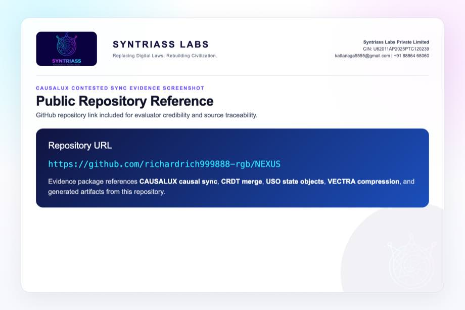
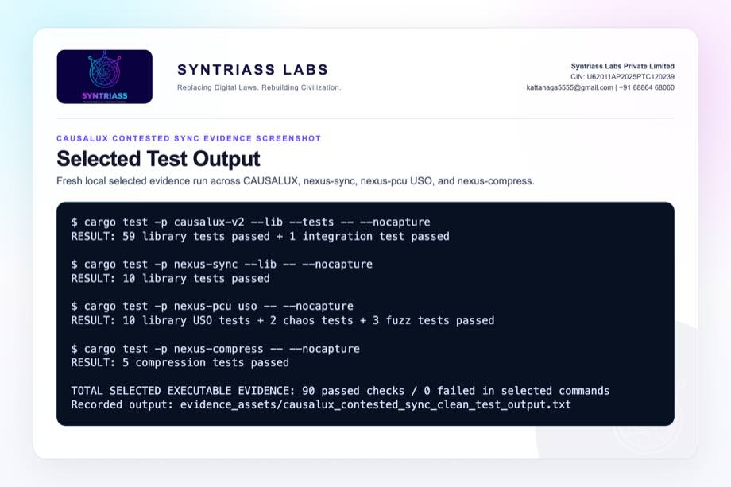
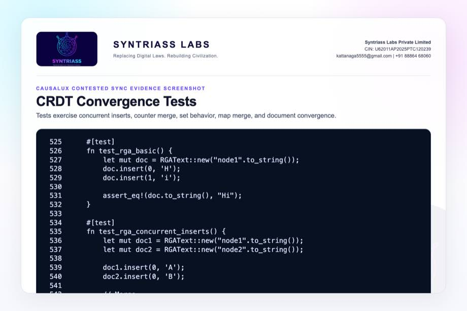
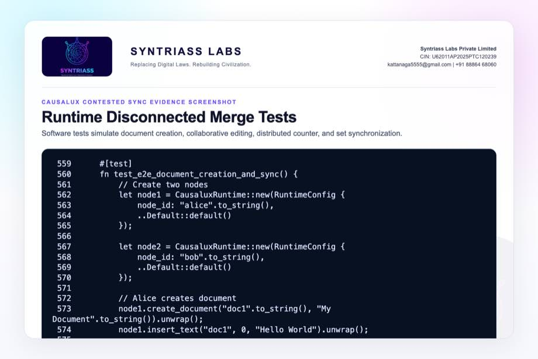
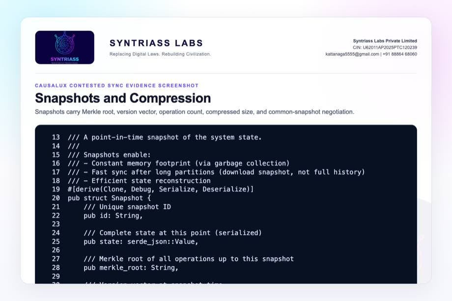
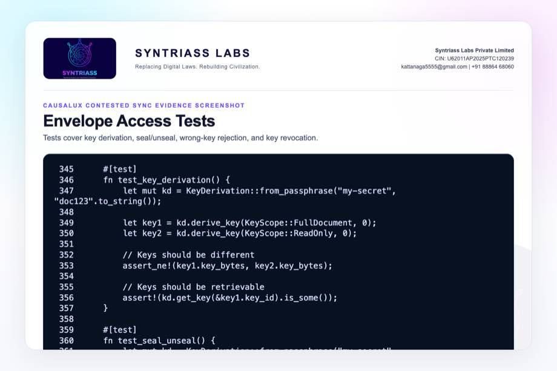
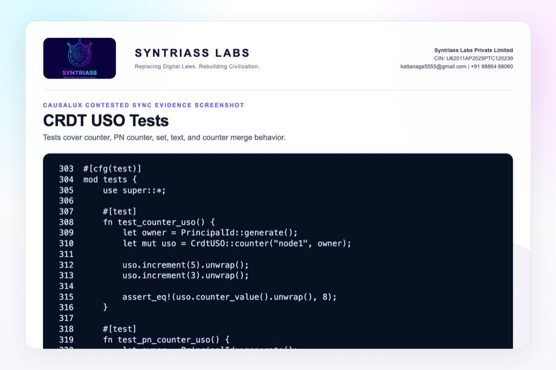
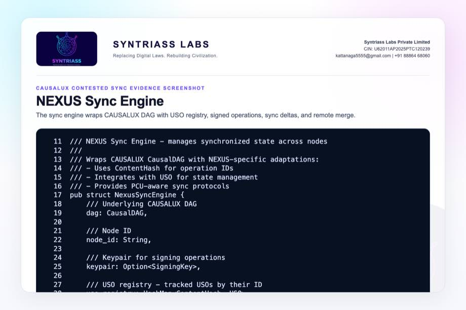
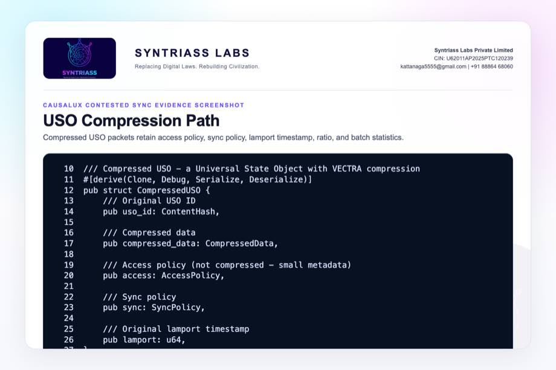

# IDEX OPEN CHALLENGE SUBMISSION

# Annexure-4

Supporting evidence, screenshots, repository locations, and artifact map

| CIN | PAN | TAN |
| --- | --- | --- |
| U62011AP2025PTC120239 | ABQCS7152R | VPNS31351F |

| Applicant Entity | Contact |
| --- | --- |
| Syntriass Labs Private Limited | kattanaga5555@gmail.com |
| 12-50, SLV Market, 12 Ward, Dharmavaram, Ananthapur - 515671, Andhra Pradesh, India | +91 88864 68060 |

# Supporting Evidence and Screenshots

## Company Identification Details

| Field | Details |
| --- | --- |
| Legal Entity Name | Syntriass Labs Private Limited |
| CIN | U62011AP2025PTC120239 |
| PAN | ABQCS7152R |
| TAN | VPNS31351F |
| Registered Office | 12-50, SLV Market, 12 Ward, Dharmavaram, Ananthapur - 515671, Andhra Pradesh, India |
| Contact Email | kattanaga5555@gmail.com |
| Contact Phone | +91 88864 68060 |
| GitHub Repository | `https://github.com/richardrich999888-rgb/NEXUS` |
| Submission Date | 17 May 2026 |

## 1. Applicant Resume Format

Applicant: K. Naga Sri Ganesh  
Company: Syntriass Labs Private Limited  
Role: Founder / Inventor  
Relevant focus: governed autonomy, distributed state synchronization, causal execution, CRDT merge systems, proof-carrying computation, compression-aware transfer, and defence-oriented audit evidence.

## 2. Prototype Evidence List

| Evidence Item | Repository / Artifact Location |
| --- | --- |
| CAUSALUX version vector | `causalux/src/version_vector.rs` |
| CAUSALUX causal DAG | `causalux/src/dag.rs` |
| CAUSALUX CRDT layer | `causalux/src/crdt.rs` |
| Hierarchical sync | `causalux/src/sync.rs` |
| Snapshot manager | `causalux/src/snapshot.rs` |
| Sovereign envelope | `causalux/src/envelope.rs` |
| NEXUS sync engine | `nexus-sync/src/sync_engine.rs` |
| CRDT-backed USO | `nexus-sync/src/crdt_uso.rs` |
| PCU USO primitive | `nexus-pcu/src/uso.rs` |
| Compression path | `nexus-compress/src/pcu_compress.rs`, `nexus-compress/src/uso_compress.rs` |
| Clean selected test output | `docs/idex-open-challenge-2026/07-causalux-contested-sync/final_4_documents/evidence_assets/causalux_contested_sync_clean_test_output.txt` |
| Full-run caveat output | `docs/idex-open-challenge-2026/07-causalux-contested-sync/final_4_documents/evidence_assets/causalux_contested_sync_test_output.txt` |
| Evidence screenshots | `docs/idex-open-challenge-2026/07-causalux-contested-sync/final_4_documents/evidence_assets/` |
| Final documents | `docs/idex-open-challenge-2026/07-causalux-contested-sync/final_4_documents/` |

## 3. Validation Scope

Current validation is software-subsystem validation. The evidence supports selected passing tests for CAUSALUX, nexus-sync library functions, PCU USO selected behavior, and compression. It does not claim physical-radio validation, EW/jamming validation, operational deployment, or fully modernized end-to-end contested-sync validation.

```{=typst}
#pagebreak()
```

## 4. Test Commands and Recorded Results

Primary selected commands:

```bash
cargo test -p causalux-v2 --lib --tests -- --nocapture
cargo test -p nexus-sync --lib -- --nocapture
cargo test -p nexus-pcu uso -- --nocapture
cargo test -p nexus-compress -- --nocapture
```

Fresh selected local results:

- CAUSALUX library and integration: 59 library tests passed, 1 integration test passed.
- NEXUS sync library: 10 tests passed.
- PCU USO selected path: 10 library tests, 2 chaos tests, and 3 fuzz tests passed.
- Compression: 5 tests passed.
- Combined selected executable evidence: 90 passed checks, 0 failed in selected commands.
- Run date: 17 May 2026.

Documented caveats from broader run:

- Full CAUSALUX doctest run has one stale documentation example failure.
- Full nexus-sync integration target has stale `integration_e2e.rs` compile failures.
- These are listed as iDEX hardening tasks rather than hidden from the proposal.

```{=typst}
#pagebreak()
```

## Evidence Page 5 - Public Repository Reference

Purpose: give panel reviewers a direct path to inspect the source repository.

Status: GitHub repository reference embedded.



```{=typst}
#pagebreak()
```

## Evidence Page 6 - Selected Test Output

Purpose: show the selected executable evidence run conducted before proposal packaging.

Status: clean selected test output screenshot embedded.



```{=typst}
#pagebreak()
```

## Evidence Page 7 - Full-Run Caveats

Purpose: show broader test caveats transparently, including stale doctest and stale E2E integration drift.

Status: caveat screenshot embedded.


```{=typst}
#pagebreak()
```

## Evidence Page 8 - Version Vector Causality

Evidence source: `causalux/src/version_vector.rs`

Purpose: show version-vector increment, happens-before, conflict detection, merge, and tests.


```{=typst}
#pagebreak()
```

## Evidence Page 9 - Hierarchical Sync Protocol

Evidence source: `causalux/src/sync.rs`

Purpose: show sync request, response, strategy, and apply-response structures.


```{=typst}
#pagebreak()
```

## Evidence Page 10 - Adaptive Sync and Bandwidth Savings

Evidence source: `causalux/src/sync.rs`

Purpose: show Merkle-diff versus hierarchical selection and bandwidth-savings test.


```{=typst}
#pagebreak()
```

## Evidence Page 11 - RGA Text CRDT

Evidence source: `causalux/src/crdt.rs`

Purpose: show replicated growable array text state and deterministic remote insert ordering.


```{=typst}
#pagebreak()
```

## Evidence Page 12 - Counter, Set, and Map CRDTs

Evidence source: `causalux/src/crdt.rs`

Purpose: show counter, positive-negative counter, observed-remove set, and last-writer map logic.


```{=typst}
#pagebreak()
```

## Evidence Page 13 - CRDT Convergence Tests

Evidence source: `causalux/src/crdt.rs`

Purpose: show tests for concurrent inserts, counters, observed-remove set, map merge, and document convergence.



```{=typst}
#pagebreak()
```

## Evidence Page 14 - Causal DAG Insert Path

Evidence source: `causalux/src/dag.rs`

Purpose: show idempotence, dependency checks, conflict handling, version-vector merge, state application, and snapshot trigger.


```{=typst}
#pagebreak()
```

## Evidence Page 15 - DAG Ordering and Dependency Tests

Evidence source: `causalux/src/dag.rs`

Purpose: show tests for DAG creation, insert, causal ordering, missing dependency, and idempotent insert behavior.


```{=typst}
#pagebreak()
```

## Evidence Page 16 - Runtime Disconnected Merge Tests

Evidence source: `causalux/src/runtime.rs`

Purpose: show software tests for document sync, collaborative editing, distributed counters, set operations, and metrics.



```{=typst}
#pagebreak()
```

## Evidence Page 17 - Snapshots and Compression

Evidence source: `causalux/src/snapshot.rs`

Purpose: show snapshot ID, state, Merkle root, version vector, compressed size, common-snapshot lookup, and tests.



```{=typst}
#pagebreak()
```

## Evidence Page 18 - Encrypted Operation Envelope

Evidence source: `causalux/src/envelope.rs`

Purpose: show operation envelope fields, seal/unseal path, routing metadata, and authenticated decryption error path.


```{=typst}
#pagebreak()
```

## Evidence Page 19 - Envelope Access Tests

Evidence source: `causalux/src/envelope.rs`

Purpose: show tests for key derivation, seal/unseal, wrong-key rejection, and key revocation.



```{=typst}
#pagebreak()
```

## Evidence Page 20 - CRDT-Backed USO Model

Evidence source: `nexus-sync/src/crdt_uso.rs`

Purpose: show USO type mapping and CRDT-backed merge behavior.


```{=typst}
#pagebreak()
```

## Evidence Page 21 - CRDT USO Tests

Evidence source: `nexus-sync/src/crdt_uso.rs`

Purpose: show tests for counter, PN counter, set, text, and counter merge.



```{=typst}
#pagebreak()
```

## Evidence Page 22 - NEXUS Sync Engine

Evidence source: `nexus-sync/src/sync_engine.rs`

Purpose: show CAUSALUX DAG wrapper, USO registry, signed operation creation, sync delta, and remote merge.



```{=typst}
#pagebreak()
```

## Evidence Page 23 - Sync Engine Tests

Evidence source: `nexus-sync/src/sync_engine.rs`

Purpose: show library tests for engine creation, USO registration, and signed USO update.


```{=typst}
#pagebreak()
```

## Evidence Page 24 - USO Sync Policy and Causal History

Evidence source: `nexus-pcu/src/uso.rs`

Purpose: show sync policy, access policy, causal history, vector clock, operation log, and happens-before model.


```{=typst}
#pagebreak()
```

## Evidence Page 25 - USO Merge and Serialization Tests

Evidence source: `nexus-pcu/src/uso.rs`

Purpose: show USO update, merge, serialization, sync policy, and causal-history tests.


```{=typst}
#pagebreak()
```

## Evidence Page 26 - PCU Compression Path

Evidence source: `nexus-compress/src/pcu_compress.rs`

Purpose: show content hash, original/compressed size, compression statistics, compression, and decompression.


```{=typst}
#pagebreak()
```

## Evidence Page 27 - USO Compression Path

Evidence source: `nexus-compress/src/uso_compress.rs`

Purpose: show compressed USO fields, data decompression, compression ratio, batch compression, and tests.



```{=typst}
#pagebreak()
```

## Evidence Page 28 - Reviewer Repository Map

Purpose: give panel reviewers a direct navigation map.

| Review Area | Path |
| --- | --- |
| Final proposal package | `docs/idex-open-challenge-2026/07-causalux-contested-sync/final_4_documents/` |
| Screenshot assets | `docs/idex-open-challenge-2026/07-causalux-contested-sync/final_4_documents/evidence_assets/` |
| Version vectors | `causalux/src/version_vector.rs` |
| CRDTs | `causalux/src/crdt.rs` |
| Sync protocol | `causalux/src/sync.rs` |
| Snapshot manager | `causalux/src/snapshot.rs` |
| NEXUS sync engine | `nexus-sync/src/sync_engine.rs` |
| PCU USO | `nexus-pcu/src/uso.rs` |
| Compression | `nexus-compress/src/pcu_compress.rs`, `nexus-compress/src/uso_compress.rs` |

```{=typst}
#pagebreak()
```

## Evidence Page 29 - Claim-to-File Location Map

| Proposal Claim | Source Evidence |
| --- | --- |
| Version-vector conflict context exists | `causalux/src/version_vector.rs`, `conflicts_with()` and tests. |
| CRDT merge types exist | `causalux/src/crdt.rs`, `GCounter`, `PNCounter`, `ORSet`, `LWWMap`, `RGAText`. |
| Causal DAG insert path exists | `causalux/src/dag.rs`, `CausalDAG::insert()`. |
| Snapshot-based recovery exists | `causalux/src/snapshot.rs`, `Snapshot` and `SnapshotManager`. |
| Hierarchical sync exists | `causalux/src/sync.rs`, `HierarchicalSync` and `AdaptiveSync`. |
| Runtime sync simulation exists | `causalux/src/runtime.rs`, end-to-end tests. |
| USO causal history exists | `nexus-pcu/src/uso.rs`, `CausalHistory`. |
| NEXUS sync integration exists | `nexus-sync/src/sync_engine.rs`. |
| Compression path exists | `nexus-compress/src/pcu_compress.rs`, `nexus-compress/src/uso_compress.rs`. |

```{=typst}
#pagebreak()
```

## Evidence Page 30 - Test and Command Locations

| Test Area | Command / File |
| --- | --- |
| CAUSALUX selected tests | `cargo test -p causalux-v2 --lib --tests -- --nocapture` |
| NEXUS sync selected library tests | `cargo test -p nexus-sync --lib -- --nocapture` |
| PCU USO selected tests | `cargo test -p nexus-pcu uso -- --nocapture` |
| Compression tests | `cargo test -p nexus-compress -- --nocapture` |
| Clean output artifact | `evidence_assets/causalux_contested_sync_clean_test_output.txt` |
| Broader caveat output | `evidence_assets/causalux_contested_sync_test_output.txt` |
| Evidence screenshot generator | `generate_causalux_contested_sync_evidence_screenshots.mjs` |
| PDF builder | `build_syntriass_letterhead_problem7.mjs` |

```{=typst}
#pagebreak()
```

## Evidence Page 31 - Generated Artifact Locations

| Artifact Type | Location |
| --- | --- |
| Annexure 1 PDF | `01_SYNTRIASS_CAUSALUX_Contested_Sync_Annexure_1_Applicant_Details_and_Solution_Summary.pdf` |
| Annexure 2 PDF | `02_SYNTRIASS_CAUSALUX_Contested_Sync_Annexure_2_Technical_Architecture.pdf` |
| Annexure 3 PDF | `03_SYNTRIASS_CAUSALUX_Contested_Sync_Annexure_3_Advantages_and_Competencies.pdf` |
| Annexure 4 PDF | `04_SYNTRIASS_CAUSALUX_Contested_Sync_Annexure_4_Supporting_Evidence_and_Screenshots.pdf` |
| DOCX files | Same directory, matching `.docx` names. |
| Rendered HTML | `final_4_documents/html/` |
| Evidence screenshots | `final_4_documents/evidence_assets/*.jpg` |
| Selected test output | `final_4_documents/evidence_assets/causalux_contested_sync_clean_test_output.txt` |
| Full-run caveat output | `final_4_documents/evidence_assets/causalux_contested_sync_test_output.txt` |

```{=typst}
#pagebreak()
```

## Evidence Page 32 - Screenshot Artifact Index

| Screenshot | File |
| --- | --- |
| GitHub repository | `evidence_assets/01_github_repository.jpg` |
| Selected test output | `evidence_assets/02_clean_test_output.jpg` |
| Full-run caveats | `evidence_assets/03_full_run_caveats.jpg` |
| Version vector and sync | `evidence_assets/04_version_vector.jpg` through `06_adaptive_sync_savings.jpg` |
| CRDT and DAG screenshots | `evidence_assets/07_rga_text_crdt.jpg` through `12_runtime_sync_tests.jpg` |
| Snapshot and envelope | `evidence_assets/13_snapshot_compression.jpg` through `15_envelope_tests.jpg` |
| USO and sync engine | `evidence_assets/16_crdt_uso_model.jpg` through `21_uso_merge_tests.jpg` |
| Compression | `evidence_assets/22_pcu_compression.jpg`, `23_uso_compression.jpg` |

```{=typst}
#pagebreak()
```

## Evidence Page 33 - Defence Problem to Evidence Map

| Defence Problem | CAUSALUX Contested Sync Control | Evidence |
| --- | --- | --- |
| Command-link loss | Offline local updates and later sync | Evidence pages 8, 16, 22. |
| State divergence | Version vectors and CRDT convergence | Evidence pages 8, 11-13. |
| Low-bandwidth reconnect | Snapshot, delta, and compression path | Evidence pages 9-10, 17, 26-27. |
| Missing provenance | DAG order, USO history, operation IDs, and snapshots | Evidence pages 14-15, 24-25. |
| Stale update risk | Causal context, dependency checks, and proposed hardening tests | Evidence pages 7, 14-15, 36. |
| Reviewer traceability | File map, artifact map, and test output | Evidence pages 28-37. |

```{=typst}
#pagebreak()
```

## Evidence Page 34 - Prototype Work Package Locations

| Work Package | Existing Starting Point |
| --- | --- |
| Disconnected node simulator | `causalux/src/runtime.rs` end-to-end sync tests. |
| Causal metadata | `causalux/src/version_vector.rs` and `nexus-pcu/src/uso.rs`. |
| Deterministic merge | `causalux/src/crdt.rs` and `nexus-sync/src/crdt_uso.rs`. |
| Long-partition recovery | `causalux/src/sync.rs` and `causalux/src/snapshot.rs`. |
| Compact transfer | `nexus-compress/src/pcu_compress.rs` and `nexus-compress/src/uso_compress.rs`. |
| Provenance export | `causalux/src/dag.rs`, `nexus-pcu/src/uso.rs`, and proposed audit exporter. |
| Stale E2E modernization | `nexus-sync/tests/integration_e2e.rs`. |

```{=typst}
#pagebreak()
```

## Evidence Page 35 - Panel Review Checklist

| Reviewer Question | Where To Check |
| --- | --- |
| Were tests actually run? | Evidence page 6 and output file `causalux_contested_sync_clean_test_output.txt`. |
| Are broader failures disclosed? | Evidence page 7 and output file `causalux_contested_sync_test_output.txt`. |
| Is this field-tested over military radios? | No. Software-subsystem evidence only; radio/network-in-loop is proposed work. |
| Does the repository include CRDT merge logic? | Evidence pages 11-13 and `causalux/src/crdt.rs`. |
| Does the repository include sync and snapshot logic? | Evidence pages 9-10 and 17. |
| Does the repository include compression evidence? | Evidence pages 26-27. |
| Is the GitHub repository identified? | Evidence page 5 and repository coordinate page 37. |
| Are artifact locations included? | Evidence pages 28-32. |

```{=typst}
#pagebreak()
```

## Evidence Page 36 - Readiness Statement and Caveats

| Area | Position |
| --- | --- |
| Software subsystem readiness | Current evidence supports software subsystem TRL 3-4. |
| Selected tests | 90 selected executable checks passed across CAUSALUX, nexus-sync library, PCU USO, and compression. |
| Full CAUSALUX run | One stale doctest failure due outdated documentation import. |
| Full nexus-sync run | Stale E2E integration test compile failures due API/dependency drift. |
| Field network validation | Not yet performed. Requires network emulator and hardware/network-in-loop work. |
| EW/jamming simulation | Not yet performed. Proposed under iDEX validation. |
| Mission-state policy | Requires evaluator-approved schemas and conflict rules. |
| Operational use | Requires security review, radio integration, performance characterization, and deployment hardening. |

```{=typst}
#pagebreak()
```

## Evidence Page 37 - Declaration and Repository Coordinates

Declaration:

CAUSALUX Contested Sync is submitted as a software-subsystem prototype for low-bandwidth disconnected state synchronization evaluation.

Repository coordinates:

- Public repository: `https://github.com/richardrich999888-rgb/NEXUS`
- Proposal folder: `docs/idex-open-challenge-2026/07-causalux-contested-sync/`
- Final documents: `docs/idex-open-challenge-2026/07-causalux-contested-sync/final_4_documents/`
- Evidence assets: `docs/idex-open-challenge-2026/07-causalux-contested-sync/final_4_documents/evidence_assets/`
- Clean selected test output: `docs/idex-open-challenge-2026/07-causalux-contested-sync/final_4_documents/evidence_assets/causalux_contested_sync_clean_test_output.txt`
- Full-run caveat output: `docs/idex-open-challenge-2026/07-causalux-contested-sync/final_4_documents/evidence_assets/causalux_contested_sync_test_output.txt`
- CAUSALUX source: `causalux/src/`
- NEXUS sync source: `nexus-sync/src/`
- PCU USO source: `nexus-pcu/src/uso.rs`
- Compression source: `nexus-compress/src/`

Submission caveat:

- The package is prepared for prototype review and iDEX-funded validation planning.
- No physical-radio validation, EW/jamming validation, operational deployment, or fully modernized end-to-end contested-sync validation is claimed.
- Network-in-loop testing, stale E2E modernization, mission-specific conflict policy, replay/stale-update tests, and field-integration planning remain required for operational use.
