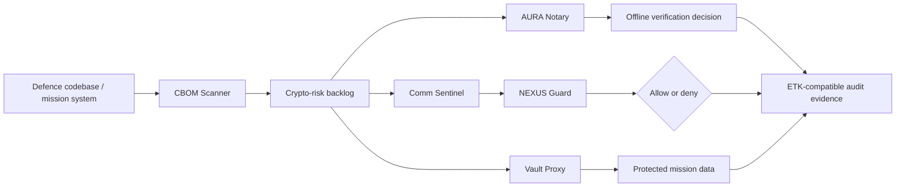

# Annexure - 2

Preferably on Company's letterhead (if available)

# 1. Proposed Technical Solution (Detailed)

## Technical Architecture & Approach

Syntriass Sovereign Trust Fabric is a modular trust layer for defence software, tactical messaging, data protection, and autonomous decision audit. The architecture is intentionally edge-first: it must operate locally, with intermittent connectivity, without requiring continuous cloud availability.

## Implementation Status Boundary

The following boundary is included to prevent overclaiming and to make evaluator review easier.

| Capability | Current NEXUS Status | iDEX Work Required |
| --- | --- | --- |
| CBOM Scanner | Implemented MVP with unit tests | Harden reports, add certificate parsing, produce evaluator-ready dashboard |
| Hybrid ML-DSA signatures | Implemented behind `nexus-pcu` `pqc` feature | Integrate into selected packet/audit flows and define key lifecycle |
| ML-KEM key exchange | `fips203` dependency present; no NEXUS KEM encapsulation/decapsulation implementation found | Implement ML-KEM key wrapping / exchange path and tests |
| SovereignEnvelope | Implemented in Causalux for encrypted CRDT operations using AES-256-GCM | Generalize to mission messages/files and bind sender identity/signature |
| Identity and delegation | Implemented as principal/capability/delegation primitives | Add device passport fields, stronger scope narrowing, revocation, and audit binding |
| NEXUS Guard | Implemented guarded execution foundation with denial tests | Integrate trust-fabric packet decisions and audit exporter |
| Vault Proxy | Proposed product module | Build controlled database/data-flow PoC |
| Comm Sentinel | Proposed product module | Build signed message envelope, replay cache, and revocation checks |
| AURA Notary | Prototype-aligned concept | Finalize packet format, offline verifier, and replay/tamper rejection tests |
| eBPF/XDP inline enforcement | Not claimed in NEXUS | Out of phase-one scope unless separately approved |

| Layer | Module | Role |
| --- | --- | --- |
| Discovery | CBOM Scanner | Inventories classical cryptographic dependencies, data artifacts, and PQC migration indicators |
| Data protection | Vault Proxy | Protects selected mission data flows using symmetric encryption and a PQC/hybrid key-wrapping migration interface |
| Tactical messaging | Comm Sentinel | Verifies signed command/telemetry envelopes, rejects replayed packets, and checks revocation state |
| Provenance | AURA Notary | Verifies offline mission packets, payload hashes, lineage, timestamps, and nonce freshness |
| Execution governance | NEXUS Guard | Applies deny-first execution control to high-consequence actions and emits audit evidence |
| Audit | ETK-compatible evidence | Records accepted and rejected decisions for evaluator review |
| PQC migration | `nexus-pcu` | Provides hybrid identity and signature evidence path for future ML-DSA enforcement |

## Proposed Workflow

1. CBOM Scanner runs on a defence software repository or controlled evaluation target.
2. Scanner produces a cryptographic bill of materials: classical crypto dependencies, PQC indicators, database artifacts, and migration priorities.
3. Vault Proxy protects selected data-at-rest or database write/read flows using envelope encryption and policy tokens.
4. Comm Sentinel validates command or telemetry messages before they reach the protected consumer.
5. AURA Notary verifies mission packets offline and rejects tampered, stale, or replayed packets.
6. NEXUS Guard blocks unauthorized high-consequence actions before execution.
7. ETK-compatible records capture accept/deny decisions for audit, replay, and evaluator inspection.

## Architecture Diagram

## Innovation

Most post-quantum proposals begin with algorithms. This proposal begins with the operational blocker: defence organisations cannot migrate what they have not inventoried. The CBOM Scanner creates the first evidence artifact, then the same trust fabric demonstrates concrete remediation modules for data protection, tactical messages, offline provenance, and governed execution.

The innovation is the integration of four assurance dimensions into one inspectable workflow:

- Cryptographic discovery and migration planning.
- Post-quantum-ready data and identity architecture.
- Offline tactical verification for contested environments.
- Deny-first execution governance with audit evidence.

## Implementation & Feasibility

Existing NEXUS assets provide a credible starting point:

- `tools/cbom_scanner/cbom_scan.py`: local CBOM scanner MVP.
- `tests/test_cbom_scanner.py`: unit tests for scanner detection, exclusions, CI output, and false-positive reduction.
- `nexus-pcu/src/pqc.rs`: hybrid Ed25519 plus ML-DSA-compatible PQC feature path.
- `causalux/src/envelope.rs`: AES-256-GCM SovereignEnvelope for encrypted causal operations.
- `nexus-executor`: ExecutionGuard and red-team denial evidence path.
- AURA/ETK/PCU concepts: provenance, proof, and audit primitives for mission packets and execution records.

The iDEX effort will convert these components into a cohesive evaluation prototype with hardened interfaces, limited but realistic demos, and evaluator-repeatable test scripts.

## Challenges & Mitigation

| Challenge | Risk | Mitigation |
| --- | --- | --- |
| PQC overclaim | Reviewers reject unsupported "quantum immune" claims | Use "PQC-ready", "hybrid migration path", and "prototype evidence"; avoid certification claims |
| False positives in CBOM scanning | Demo appears noisy or immature | Maintain exclusion rules, dependency-context matching, severity taxonomy, and human-review notes |
| Database compatibility | Proxy may not handle all SQL engines in phase one | Start with a controlled PostgreSQL/SQLite-compatible PoC and document adapter limits |
| Tactical message latency | Signature and replay checks may add delay | Benchmark message verification and define edge cache policy |
| Offline revocation | Revocation state may become stale under disconnection | Use signed revocation bundles, expiry windows, and fail-deny policy for high-risk classes |
| Key lifecycle | Demo keys are not operational key management | Define provisioning, rotation, revocation, and audit metadata as iDEX deliverables |
| Missing ML-KEM implementation | Current repo has dependency but no working KEM API | Implement and test ML-KEM encapsulation/decapsulation before claiming Vault key exchange |
| TRL inflation | System has software evidence but not field validation | State current TRL 3-4 and target TRL 5 only after controlled relevant-environment validation |

## Test And Demonstration Plan

| Demo | Success Condition |
| --- | --- |
| CBOM scan | Produces a source/config report with migration backlog and no fixture/private-key false positives |
| Vault Proxy | Protects selected mission record and denies read without valid local policy token |
| Comm Sentinel | Accepts valid signed message; rejects tampered, replayed, or revoked message |
| AURA Notary | Verifies valid mission packet offline; rejects modified payload or stale nonce |
| NEXUS Guard | Denies unauthorized high-consequence action before execution and emits denial audit |
| Integrated workflow | One scenario links CBOM discovery to remediation and audit evidence |

## Any Other Relevant Details

This proposal does not claim accredited cryptographic certification, classified-network deployment, or operational field qualification. The iDEX project is scoped to build and validate a controlled prototype suitable for evaluator demonstration and follow-on service hardening.
